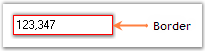

# Border Settings

Color and styles can be applied to the border of the IntegerTextBox control using the below properties.

* [Border3DStyle](https://help.syncfusion.com/cr/cref_files/windowsforms/Syncfusion.Shared.Base~Syncfusion.Windows.Forms.Tools.TextBoxExt~Border3DStyle.html)
* [BorderColor](https://help.syncfusion.com/cr/cref_files/windowsforms/Syncfusion.Shared.Base~Syncfusion.Windows.Forms.Tools.TextBoxExt~BorderColor.html)
* [BorderSides](https://help.syncfusion.com/cr/cref_files/windowsforms/Syncfusion.Shared.Base~Syncfusion.Windows.Forms.Tools.TextBoxExt~BorderSides.html)
* [BorderStyle](https://help.syncfusion.com/cr/cref_files/windowsforms/Syncfusion.Shared.Base~Syncfusion.Windows.Forms.Tools.IntegerTextBox_properties.html#)



this.integerTextBox1.Border3DStyle = System.Windows.Forms.Border3DStyle.Bump;
this.integerTextBox1.BorderColor = System.Drawing.Color.Red;
this.integerTextBox1.BorderSides = System.Windows.Forms.Border3DSide.All;
this.integerTextBox1.BorderStyle = System.Windows.Forms.BorderStyle.FixedSingle;


Me.integerTextBox1.Border3DStyle = System.Windows.Forms.Border3DStyle.Bump
Me.integerTextBox1.BorderColor = System.Drawing.Color.Red
Me.integerTextBox1.BorderSides = System.Windows.Forms.Border3DSide.All
Me.integerTextBox1.BorderStyle = System.Windows.Forms.BorderStyle.FixedSingle



 

A sample which demonstrates the Border Settings of IntegerTextBox control is available in the below sample installation path.

…\System Drive:\Users\Username\AppData\Local\Syncfusion\EssentialStudio\Version Number\Windows\Tools.Windows\Samples\Editor Controls\Editor Controls\CS
