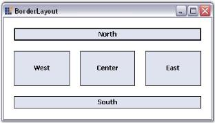
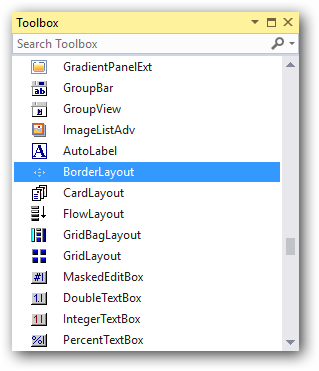
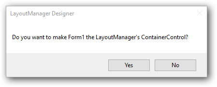
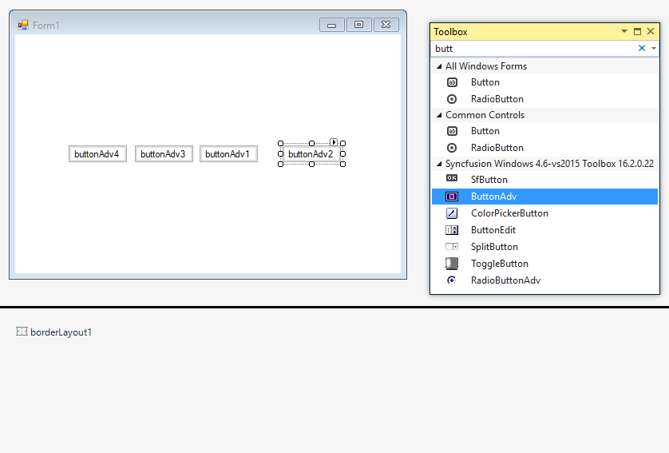
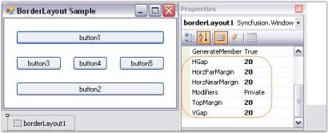
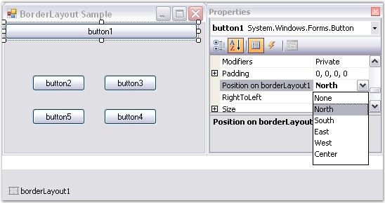
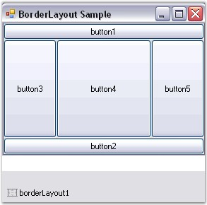

# BorderLayout in Windows Forms Layout Manager

`WinForms Border Layout` is a layout manager which allows the user to arrange and lay out the child controls along the borders and at the center, just like the .NET framework's built-in docking support.

>**NOTE**: WinForms Border Layout does not arrange the child components automatically like the other layout managers.

## Key features

* **Spacing**: Provides option to customize the horizontal and vertical gaps between child controls.

* **Position**: Provides options to set the direction of child controls such as north, south, east, west, or center.

* **Size**: Provides option to customize the size of the child controls in WinForms Border Layout.

## Getting started

This section describes how to add the `WinForms Border Layout` control in a Windows Forms application and overviews its basic functionalities.

## Assembly deployment

Refer to the [control dependencies](https://help.syncfusion.com/windowsforms/control-dependencies#borderlayout) section to get the list of assemblies or NuGet packages that need to be added as a reference to use the control in any application.

Find more details about installing the NuGet packages in a Windows Forms application in the following link:

[How to install NuGet packages](https://help.syncfusion.com/windowsforms/installation/install-nuget-packages)

## Creating a simple application with WinForms Border Layout

You can create a Windows Forms application with the WinForms Border Layout control as follows:

1. [Creating the project](#creating-the-project)
2. [Adding the control via designer](#adding-control-via-designer)
3. [Adding the control manually using code](#adding-control-manually-using-code)

## Creating the project

Create a new Windows Forms project in Visual Studio to display the WinForms Border Layout with basic functionalities.

## Adding control via designer

The WinForms Border Layout control can be added to the application by dragging it from the toolbox and dropping it in a designer view. The following required assembly reference will be added automatically:

* Syncfusion.Shared.Base.dll

To add the form as a container control of the WinForms Border Layout, click `Yes` in the popup form that appears automatically before the WinForms Border Layout gets added.

### Adding layout components

The child controls can be added to the layout by dragging them from the toolbox and dropping them in the designer view.

## Adding control manually using code

To add the control manually in C# or VB, follow the given steps:

**Step 1**: Add the following required assembly reference to the project:

* Syncfusion.Shared.Base.dll

**Step 2**: Include the namespace **Syncfusion.Windows.Forms.Tools**.



using Syncfusion.Windows.Forms.Tools;


Imports Syncfusion.Windows.Forms.Tools



**Step 3**: Create a `WinForms Border Layout` control instance and set `ContainerControl` as the form.



BorderLayout borderLayout1 = new BorderLayout();

this.borderLayout1.ContainerControl = this;


Dim borderLayout1 As BorderLayout = New BorderLayout()

Me.borderLayout1.ContainerControl = Me



### Adding layout components

The child controls can be added to the layout by simply adding them to the form, since the form is its container control.



ButtonAdv buttonAdv1 = new ButtonAdv();
ButtonAdv buttonAdv2 = new ButtonAdv();
ButtonAdv buttonAdv3 = new ButtonAdv();

this.buttonAdv1.Text = "buttonAdv1";
this.buttonAdv2.Text = "buttonAdv2";
this.buttonAdv3.Text = "buttonAdv3";

this.Controls.Add(this.buttonAdv1);
this.Controls.Add(this.buttonAdv2);
this.Controls.Add(this.buttonAdv3);


Dim buttonAdv1 As ButtonAdv = New ButtonAdv()
Dim buttonAdv2 As ButtonAdv = New ButtonAdv()
Dim buttonAdv3 As ButtonAdv = New ButtonAdv()

Me.buttonAdv1.Text = "buttonAdv1"
Me.buttonAdv2.Text = "buttonAdv2"
Me.buttonAdv3.Text = "buttonAdv3"

Me.Controls.Add(Me.buttonAdv1)
Me.Controls.Add(Me.buttonAdv2)
Me.Controls.Add(Me.buttonAdv3)



## Configuring WinForms Border Layout

The configuration settings for the WinForms Border Layout are described in this topic.

### Spacing

The horizontal and vertical gaps between the child controls can be set using the following properties.

<table>
<tr>
<th>WinForms Border Layout properties</th>
<th>Description</th>
</tr>
<tr>
<td>HGap</td>
<td>Gets or sets the horizontal spacing between the components.</td>
</tr>
<tr>
<td>VGap</td>
<td>Gets or sets the vertical spacing between the components.</td>
</tr>
</table>



this.borderLayout1.HGap = 10;

this.borderLayout1.VGap = 10;


Me.borderLayout1.HGap = 10

Me.borderLayout1.VGap = 10



## Configuring child controls

The child controls can be aligned to various positions (North, South, East, West, and Center) using the following property.

<table>
<tr>
<th>Child control property</th>
<th>Description</th>
</tr>
<tr>
<td>Position on WinForms Border Layout</td>
<td>Gets or sets the border position for a child component.</td>
</tr>
</table>

>**NOTE**: This property is added as an extended property in the properties window of the child control added to the WinForms Border Layout.



this.borderLayout1.SetPosition(this.btnNorth, Syncfusion.Windows.Forms.Tools.BorderPosition.North);


Me.borderLayout1.SetPosition(Me.btnNorth, Syncfusion.Windows.Forms.Tools.BorderPosition.North)



*Setting the position of button1 on WinForms Border Layout to "North"*

*Layout of all button controls using WinForms Border Layout*

>**NOTE**: WinForms Border Layout allows only one control to be aligned along a particular layout position, unlike the .NET Framework support.


[Creating a Simple Layout](/windowsforms/layoutmanagers/creating-a-simple-layout), [Margin Settings](/windowsforms/layoutmanagers/layout-manager-settings#margin-settings), [Border Layout - Configuring Child Controls](#configuring-child-controls), and [Configuring BorderLayout](#configuring-borderlayout).
