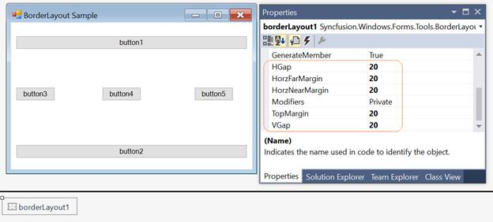
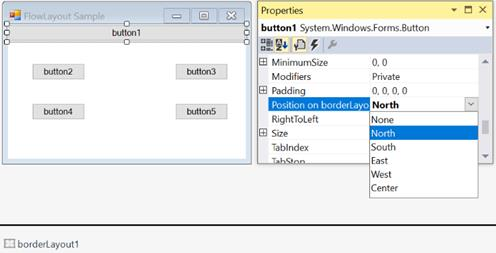
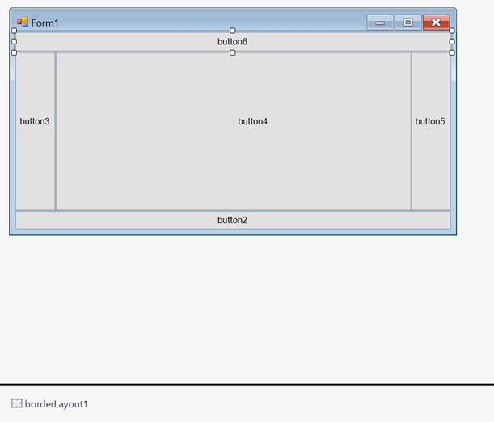

# Configuring BorderLayout in Windows Forms LayoutManagers

The configuration settings for the BorderLayout control have been given in this section.

## Spacing

The horizontal and vertical gaps between the child controls can be set using the following properties.

<table>

<tr>

<th>

BorderLayout properties</th><th>

Description</th></tr>

<tr>

<td>

HGap </td><td>

Gets or sets the horizontal spacing between the layout border and the components. </td></tr>

<tr>

<td>

VGap </td><td>

Gets or sets the vertical spacing between the layout border and the components. </td></tr>

</table>





this.borderLayout1.HGap = 10;

this.borderLayout1.VGap = 10;





Me.borderLayout1.HGap = 10

Me.borderLayout1.VGap = 10





## Configuring child controls	

The child controls can be aligned to various positions (North, South, East, West, and Center) using the following property.

<table>

<tr>
<th>
Child control property</th><th>
Description</th></tr>
<tr>
<td>

Position on borderLayout </td><td>
Gets or sets the border position for a child components. </td></tr>

</table>

N> This property is added as an extended property in the properties window of the child control added to BorderLayout.





this.borderLayout1.SetPosition(this.btnNorth, Syncfusion.Windows.Forms.Tools.BorderPosition.North);





Me.borderLayout1.SetPosition(Me.btnNorth, Syncfusion.Windows.Forms.Tools.BorderPosition.North)





