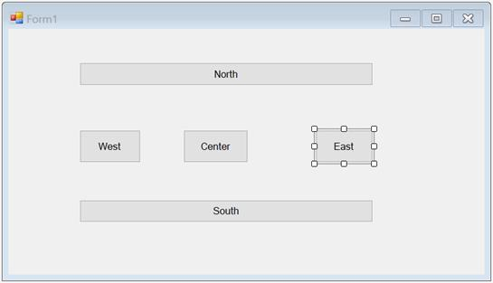

# Windows Forms LayoutManagers Overview

`BorderLayout` is a layout manager. It allows users arrange and layout the child controls along the borders to the center like .NET framework’s built-in docking support.

N> `BorderLayout` does not arrange the child components automatically like other layout managers.

## Key features

* **Spacing**: Provides an option to customize horizontal and vertical gaps between child controls.

* **Position**: Provides an option to set direction (North, South, East, West, or Center) to child controls.

* **Size**: Provides an option to customize the size of the child controls in BorderLayout.
