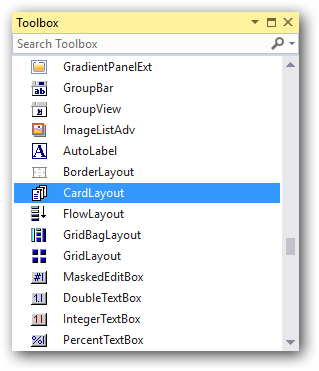
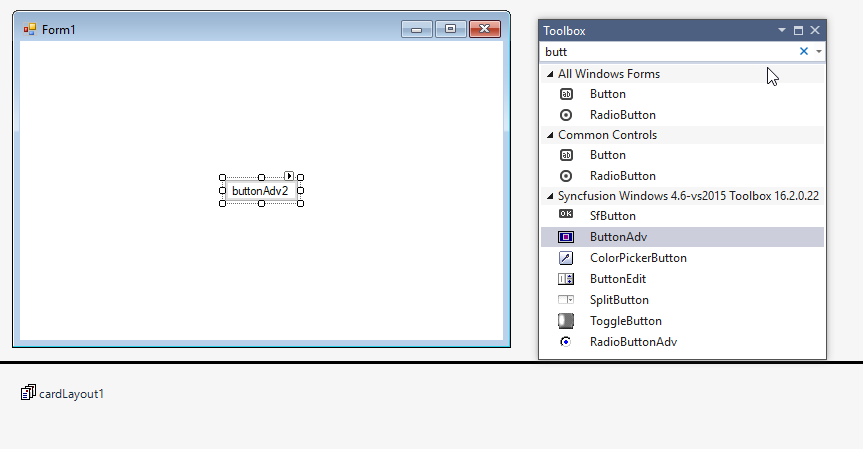
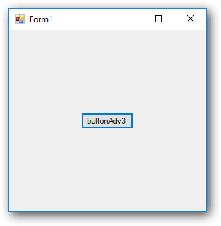
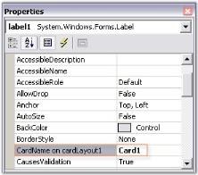
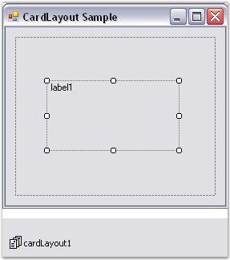
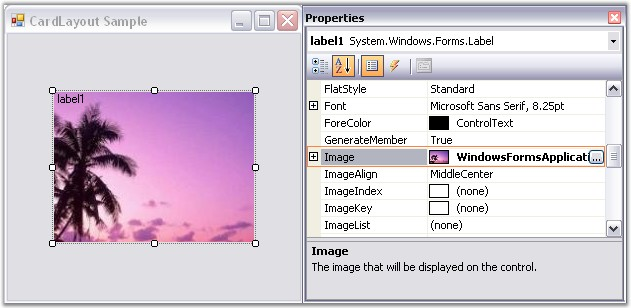
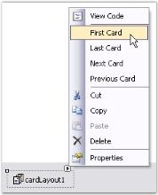
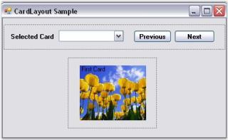
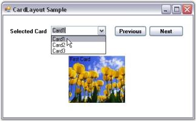

# CardLayout in Windows Forms Layout Manager

`CardLayout` is a Layout Manager that is applied to a Container, and components are added to the layout in a particular form and not between different forms. It treats each component in the Container as a card. Only one card is visible at a time, and the Container acts as a stack of cards. The first component added to a CardLayout object is the visible component when the Container is first displayed.

The Child component/card can either be made to fill or simply centered within the Container. Some common uses of a CardLayout are to create WizardControls and property pages.

N> The WizardControl uses the CardLayout component internally in it's implementation.

In it's simplest form, this Layout Manager can be used to automatically arrange the Child components in one or more rows, as given below.

N> CardLayout does not arrange the Child components automatically like the other Layout Managers.

## Key Features

**Card name** - Provides option to set a unique card name for child controls.

**Card index** - Provides options to get index of the previous or next card.

**Image** - Provides option to set images for the child controls.

**Layout mode** - Provides options to set layout modes such as default or fill.

**Getting started**

This section describes how to add `CardLayout` control in a Windows Forms application and overview of its basic functionalities.

## Assembly deployment

Refer [control dependencies](https://help.syncfusion.com/windowsforms/control-dependencies#cardlayout) section to get the list of assemblies or NuGet package needs to be added as reference to use the control in any application.

Please find more details regarding how to install the nuget packages in windows form application in the below link:
 
[How to install nuget packages](https://help.syncfusion.com/windowsforms/installation/install-nuget-packages)

**Creating simple application with CardLayout**

You can create the Windows Forms application with CardLayout control as follows:

1. [Creating project](#creating-the-project)
2. [Adding control via designer](#adding-control-via-designer)
3. [Adding control manually using code](#adding-control-manually-using-code)

**Creating the project**

Create a new Windows Forms project in the Visual Studio to display the CardLayout with basic functionalities.

## Adding control via designer

The CardLayout control can be added to the application by dragging it from the toolbox and dropping it in a designer view. The following required assembly references will be added automatically:

* Syncfusion.Shared.Base.dll

 

To add the form as a Container control of the CardLayout, click `Yes` in a popup form which appears automatically before CardLayout gets added.

 

**Adding Layout components through designer**

The child controls can be added to the layout by dragging it from the toolbox and dropping it in a designer view.

 

## Adding control manually using code

To add control manually in C#, follow the given steps:

**Step 1** - Add the following required assembly references to the project:

	* Syncfusion.Shared.Base.dll

**Step 2** - Include the namespaces **Syncfusion.Windows.Forms.Tools**.





using Syncfusion.Windows.Forms.Tools;





Imports Syncfusion.Windows.Forms.Tools



 

**Step 3** -  Create `CardLayout` control instance and set `ContainerControl` as form.





CardLayout cardLayout1 = new CardLayout();

this.cardLayout1.ContainerControl = this;





Dim cardLayout1 As CardLayout = New CardLayout()

Me.cardLayout1.ContainerControl = Me





**Adding Layout components through code**

The child controls can be added to the layout by simply adding it to the form, since the form is its container control.





ButtonAdv buttonAdv1 = new ButtonAdv();
ButtonAdv buttonAdv2 = new ButtonAdv();
ButtonAdv buttonAdv3 = new ButtonAdv();

this.buttonAdv1.Text = "buttonAdv1";
this.buttonAdv2.Text = "buttonAdv2";
this.buttonAdv3.Text = "buttonAdv3";

this.Controls.Add(this.buttonAdv1);
this.Controls.Add(this.buttonAdv2);
this.Controls.Add(this.buttonAdv3);





Dim buttonAdv1 As ButtonAdv = New ButtonAdv()
Dim buttonAdv3 As ButtonAdv = New ButtonAdv()
Dim buttonAdv3 As ButtonAdv = New ButtonAdv()

Me.buttonAdv1.Text = "buttonAdv1"
Me.buttonAdv2.Text = "buttonAdv2"
Me.buttonAdv3.Text = "buttonAdv3"

Me.Controls.Add(this.buttonAdv1)
Me.Controls.Add(this.buttonAdv2)
Me.Controls.Add(this.buttonAdv3)





 

## Configuring CardLayout

The configuration settings for the CardLayout have been discussed in this topic.

### Card names

By default, when a new Child control is added, the CardLayout will render a unique card name for it. This name can be modified by using the property given below.

<table>
<tr>
<th>
CardLayout property</th><th>
Description</th></tr>
<tr>
<td>
CardName</td><td>
Specifies the name of the card.</td></tr>
</table>





this.cardLayout1.SetCardName(this.label1, "Card1");





Me.cardLayout1.SetCardName(Me.label1, "Card1")





 

The methods associated with the above property are given below.

<table>
<tr>
<th>
Method</th><th>
Description</th></tr>
<tr>
<td>
GetCardName</td><td>
Returns the card name of a Child component.</td></tr>
<tr>
<td>
GetCardNames</td><td>
Returns an array containing the card names as strings.</td></tr>
<tr>
<td>
GetComponentFromName</td><td>
Returns an associated control given a card name. </td></tr>
<tr>
<td>
GetNewCardName</td><td>
Generates a new unique name for the card that could be added to this CardLayout. </td></tr>
<tr>
<td>
SetCardName</td><td>
Sets the card name for a Child component.</td></tr>
</table>

N> This property is added as an extended property in the properties window of the Child control added to the CardLayout.

### Card index

The index of the previous and next cards can be determined using the below given properties.

<table>
<tr>
<th>
CardLayout properties</th><th>
Description</th></tr>
<tr>
<td>
NextCardIndex</td><td>
Returns the index of the next card that will be shown when the Next() method gets called.</td></tr>
<tr>
<td>
PreviousCardIndex</td><td>
Returns the index of the previous card that will be shown when the Previous() method gets called.</td></tr>
</table>

### Aspect ratio

The aspect ratio can be set using the property given below.

<table>
<tr>
<th>
CardLayout property</th><th>
Description</th></tr>
<tr>
<td>
MaintainAspectRatio</td><td>
Indicates if the aspect ratio is to be maintained. The default value is set to `false`.</td></tr>
</table>





this.cardLayout1.SetMaintainAspectRatio(this.label1, true);





Me.cardLayout1.SetMaintainAspectRatio(Me.label1, True)





The methods associated with the above property are given below.

<table>
<tr>
<th>
Method</th><th>
Description</th></tr>
<tr>
<td>
GetMaintainAspectRatio</td><td>
Returns the value for maintaining aspect ratio based on the control's preferred size.</td></tr>
<tr>
<td>
SetMaintainAspectRatio</td><td>
Sets the value for maintaining aspect ratio based on the control's preferred size.</td></tr>
</table>

## Configuring Child controls

Deriving from the Layout Manager base, the CardLayout inherits all the functionality that the Layout Manager type exposes.

For example, when the CardLayout is added to a form, and a Panel control is added to it, then this Panel control acts as Card1, where the user can add the needed controls. Then another Panel control can be added which will act as Card2 and so on. During runtime, only one Card will be visible at a time. You can traverse through these cards by adding buttons and setting the appropriate code.

In the following screenshot, Panel control acts as the Container control and Label control acts as a card.

### Image settings

In the selected card, you can insert an image using the Child (Label) control property as shown below.

<table>
<tr>
<th>Child control property</th>
<th>Description</th>
</tr>
<tr>
<td>Image</td>
<td>Gets/sets the image that will be displayed on the control.</td>
</tr>
</table>

### Child control property description
Image - Gets/sets the image that will be displayed on the control.





this.label1.Image = ((System.Drawing.Bitmap)(resources.GetObject("label1.Image")));
 




Me.label1.Image = DirectCast((resources.GetObject("label1.Image")), System.Drawing.Bitmap)




 
  

#### Size

The preferred size and minimum size of the Child controls can be set using the PreferredSize and MinimumSize extended properties of the Child controls that are added to the CardLayout. Refer Child Control Settings to know about this topic.

#### Layout mode

The CardLayout provides two modes to layout the Child controls. The mode can be set using the property given below.

<table>
<tr>
<th>CardLayout property</th>
<th>Description</th>
</tr>
<tr>
<td>LayoutMode</td>
<td>Specifies the layout mode for the Child controls. The default value is set to 'Default'.  The options included are as follows.  Default and Fill.</td>
</tr>
</table>

When the layout mode of CardLayout is set to 'Default', the Child control is simply centered within the Container when the Container's size is bigger than the Child control's preferred size. However, if the Container's size is smaller than the Child controls's preferred size, the Child control's size will shrink down to its minimum size. When shrunk, you have an option to specify whether the preferred width/height aspect ratio should be maintained for that Child control, which is specified using the extended MaintainAspectRatio property of each Child.

When the layout mode is set to 'Fill', it simply resizes the Child control to fill the entire Container client area.





this.cardLayout1.LayoutMode = Syncfusion.Windows.Forms.Tools.CardLayoutMode.Fill;
 




Me.cardLayout1.LayoutMode = Syncfusion.Windows.Forms.Tools.CardLayoutMode.Fill





 
  

## Browsing through cards

This section discusses illustrates how to browse through the Cards (Child controls) that have been added to the CardLayout Manager.

### Through designer

The selected card can be displayed using the property given below, which simply takes the card name as input.

<table>
<tr>
<th>
CardLayout property</th><th>
Description</th></tr>
<tr>
<td>
SelectedCard</td><td>
Gets/sets the current card's name.</td></tr>
</table>





this.cardLayout1.SelectedCard = "Card1";





Me.cardLayout1.SelectedCard = "Card1"





  

You can also browse through the different cards using the methods given below.

<table>
<tr>
<th>
Methods</th><th>
Description</th></tr>
<tr>
<td>
First</td><td>
Shows the first card.</td></tr>
<tr>
<td>
Next</td><td>
Show the next card in the list.</td></tr>
<tr>
<td>
Previous</td><td>
Show the previous card in the list.</td></tr>
<tr>
<td>
Last</td><td>
Show the last card in the list.</td></tr>
</table>

N> The SmartTag feature (available only in Visual Studio 2005) can also be used to browse through the cards of the CardLayout.

### Through code

Drag and drop the ComboBox and the Previous and Next Buttons for viewing the selected card. Use the Previous() and Next() methods of the CardLayout to see the CardLayout in action inside the Previous and Next Button Clicks.





private void Previous_Click(object sender, System.EventArgs e)

{

this.cardLayout1.Previous();

}

private void Next_Click(object sender, System.EventArgs e)

{

this.cardLayout1.Next();

}





Private Sub Previous_Click(ByVal sender As Object, ByVal e As System.EventArgs)

Me.cardLayout1.Previous()

End Sub

Private Sub Next_Click(ByVal sender As Object, ByVal e As System.EventArgs)

Me.cardLayout1.Next()

End Sub





At run time, cards can be selected using the items in the ComboBox or by Button clicks.



[Creating a Simple Layout](/windowsforms/layoutmanagers/creating-a-simple-layout), [Configuring CardLayout](#configuring-cardlayout), [Configuring Child Controls](#configuring-child-controls), and [Child Control Settings.](/windowsforms/layoutmanagers/layout-manager-settings#child-control-settings)

