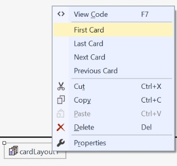
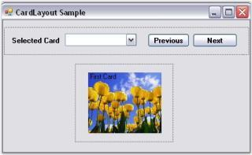
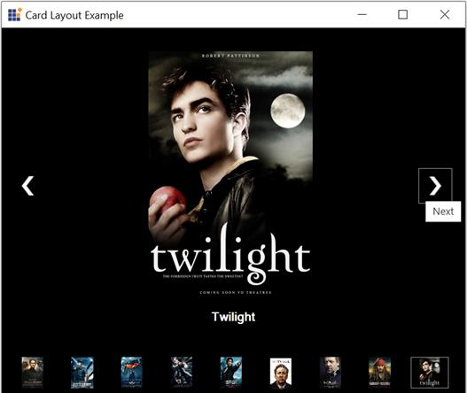

# Browsing Through Cards in Windows Forms LayoutManagers

This section explains how to browse through the cards (child controls) that have been added to the CardLayout manager.

## Through designer

The selected card can be displayed using the following property, which simply takes the card name as input.

<table>
<tr>
<th>
CardLayout Properties</th><th>
Description</th></tr>
<tr>
<td>
SelectedCard</td><td>
Specifies the current card’s name</td></tr>
</table>





this.cardLayout1.SelectedCard = "Card1";





Me.cardLayout1.SelectedCard = "Card1"





You can also browse through the different cards using the following methods.

<table>
<tr>
<th>
Methods</th><th>
Description</th></tr>
<tr>
<td>
First</td><td>
Shows the first card.</td></tr>
<tr>
<td>
Next</td><td>
Shows the next card in the list.</td></tr>
<tr>
<td>
Previous</td><td>
Shows the previous card in the list.</td></tr>
<tr>
<td>
Last</td><td>
Shows the last card in the list.</td></tr>
</table>

N> The SmartTag feature (available only in Visual Studio 2005) can also be used to browse through the cards of the CardLayout.

## Through code

Drag and drop the ComboBox, and the Previous and Next buttons for viewing a selected card. Use the Previous() and Next() methods of the CardLayout to see the CardLayout in action inside the Previous and Next Button clicks.





private void Previous_Click(object sender, System.EventArgs e)
{
	this.cardLayout1.Previous();
}

private void Next_Click(object sender, System.EventArgs e)
{
	this.cardLayout1.Next();
}





Private Sub Previous_Click(ByVal sender As Object, ByVal e As System.EventArgs)

Me.cardLayout1.Previous()

End Sub

Private Sub Next_Click(ByVal sender As Object, ByVal e As System.EventArgs)

Me.cardLayout1.Next()

End Sub





At run time, cards can be selected using the items in the ComboBox or by button clicks.

