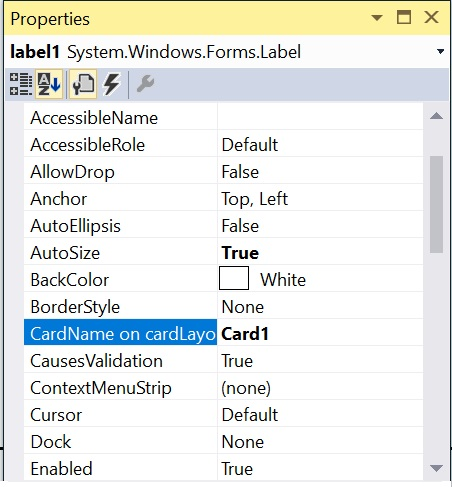
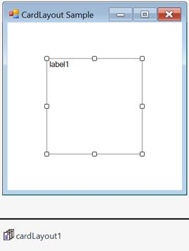
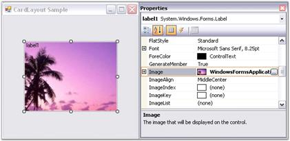
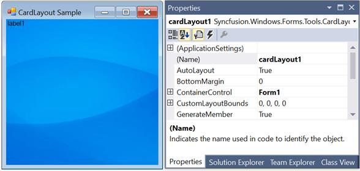

# Configuring CardLayout in Windows Forms LayoutManagers

The configuration settings for `CardLayout` have been given in this section.

## Card names

By default, when a new child control is added, the `CardLayout` will render a unique card name for it. This name can be modified using the following property.

<table>
<tr>
<th>
CardLayout Property</th><th>
Description</th></tr>
<tr>
<td>
CardName</td><td>
Specifies the name of the card.</td></tr>
</table>





this.cardLayout1.SetCardName(this.label1, "Card1");





Me.cardLayout1.SetCardName(Me.label1, "Card1")





The methods associated with the `CardName` property are as follows.

<table>
<tr>
<th>
Method</th><th>
Description</th></tr>
<tr>
<td>
GetCardName</td><td>
Returns the card name of a child component.</td></tr>
<tr>
<td>
GetCardNames</td><td>
Returns an array containing the card names as strings.</td></tr>
<tr>
<td>
GetComponentFromName</td><td>
Returns an associated control given a card name.</td></tr>
<tr>
<td>
GetNewCardName</td><td>
Generates a new unique name for a card that could be added to this CardLayout.</td></tr>
<tr>
<td>
SetCardName</td><td>
Sets the card name for a child component.</td></tr>
</table>

N> This property is added as an external property in the properties window of the child control added to the CardLayout.

## Card index

The index of the previous and next cards can be determined using the following properties.

<table>
<tr>
<th>
CardLayout properties</th><th>
Description</th></tr>
<tr>
<td>
NextCardIndex</td><td>
Indicates the index of the next card that will be shown when the Next() method gets called.</td></tr>
<tr>
<td>
PreviousCardIndex</td><td>
Indicates the index of the previous card that will be shown when the Previous() method gets called.</td></tr>
</table>

## Aspect ratio

The aspect ratio can be set using the following property.

<table>
<tr>
<th>
CardLayout Properties</th><th>
Description</th></tr>
<tr>
<td>
MaintainAspectRatio</td><td>
Indicates whether the aspect ratio to be maintained. The default value is `false`.</td></tr>
</table>





this.cardLayout1.SetMaintainAspectRatio(this.label1, true);





Me.cardLayout1.SetMaintainAspectRatio(Me.label1, True)





The methods associated with the `MaintainAspectRatio` property are as follows.

<table>
<tr>
<th>
Method</th><th>
Description</th></tr>
<tr>
<td>
GetMaintainAspectRatio</td><td>
Returns a value for maintaining aspect ratio based on the control's preferred size.</td></tr>
<tr>
<td>
SetMaintainAspectRatio</td><td>
Sets a value for maintaining aspect ratio based on the control's preferred size.</td></tr>
</table>

## Configuring child controls

It is derived from the layout manager base. The CardLayout inherits all the functionalities that the layout manager type exposes.

For example, when the CardLayout is added to a form and a panel control is added to it, this panel control acts as Card1, where users can add the needed controls. Then, another panel control can be added; it will act as Card2 and so on. During run time, only one card will be visible at a time. You can traverse through these cards by adding buttons and setting the appropriate code.

The following screenshot illustrates panel control acts as the container control and label control acts as a card.

### Image Settings

In a selected card, you can insert an image using the child(label) control property.

<table>
<tr>
<th>Child control property</th>
<th>Description</th></tr><tr>
<td>Image</td>
<td>Gets or sets the image that will be displayed on the control.</td>
</tr>
</table>





this.label1.Image = ((System.Drawing.Bitmap)(resources.GetObject("label1.Image")));





Me.label1.Image = DirectCast((resources.GetObject("label1.Image")), System.Drawing.Bitmap)





### Size

The preferred size and minimum size of the child controls can be set using the PreferredSize and MinimumSize extended properties of the child controls that are added to the CardLayout. Refer to the child Control settings to know about it.

## Layout mode

The CardLayout provides two modes to layout the child controls. The mode can be set using the following property.

<table>
<tr>
<th>
CardLayout properties</th><th>
Description</th></tr>
<tr>
<td>
LayoutMode  </td><td>
Specifies the layout mode for the child controls. The default value is set to `Default`.  The options included are as follows.  
	1. Default  
	2. Fill
</td></tr>
</table>

When the layout mode of CardLayout is set to `Default`, the child control is simply centered within the container when the container’s size is bigger than the child control’s preferred size. However, if the container’s size is smaller than the child controls’s preferred size, the child control’s size will shrink down to its minimum size. When shrunk, you have an option to specify whether the preferred width/height aspect ratio should be maintained for that child control, which is specified using the extended MaintainAspectRatio property of each child.

When the layout mode is set to `Fill`, it simply resizes the child control to fill the entire container client area.





this.cardLayout1.LayoutMode = Syncfusion.Windows.Forms.Tools.CardLayoutMode.Fill;





Me.cardLayout1.LayoutMode = Syncfusion.Windows.Forms.Tools.CardLayoutMode.Fill





