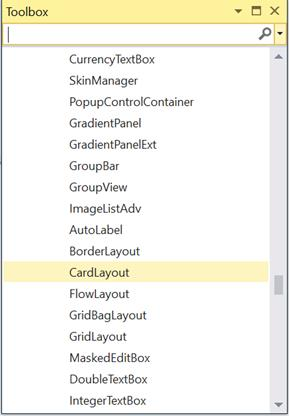

# Getting Started with Windows Forms CardLayout

This section explains how to add the `CardLayout` control in a Windows Forms application and overview its basic functionalities.

## Assembly deployment

Refer to the [Control Dependencies](https://help.syncfusion.com/windowsforms/control-dependencies#cardlayout) section to get the list of assemblies or details of NuGet package that needs to be added as reference to use the control in any application.

Refer to this [documentation](https://help.syncfusion.com/windowsforms/installation/install-nuget-packages) to find more details about installing NuGet packages in a Windows Forms application.

## Adding the CardLayout control via designer

1. Create a new Windows Forms application in Visual Studio.

2. Add the `CardLayout` control to an application by dragging it from the toolbox to design view. The following required dependent assembly will be added automatically:

    * Syncfusion.Shared.Base

3. To add the form as a container control of `CardLayout`, click `Yes` in popup, from which it appears automatically before the CardLayout is added.

### Adding layout components

The child controls can be added to layout by dragging it from the toolbox to designer view.

## Adding the CardLayout control via code

The `CardLayout` control can be created programmatically using the following steps:

1. Create a C# or VB application via Visual Studio.

2. Add the following assembly reference to the project:

    * Syncfusion.Shared.Base.dll.

3. Include the required namespace.






using Syncfusion.Windows.Forms.Tools;





Imports Syncfusion.Windows.Forms.Tools





{{ codesnippet1 | OrderList_Indent_Level_1 }}

4. Create an instance of the `CardLayout` control, and then set `ContainerControl` as form.






private Syncfusion.Windows.Forms.Tools.CardLayout cardLayout1;
this.cardLayout1 = new Syncfusion.Windows.Forms.Tools.CardLayout(this.components);
this.components = new System.ComponentModel.Container();
this.cardLayout1.ContainerControl = this;





Private cardLayout1 As Syncfusion.Windows.Forms.Tools.CardLayout
Me.cardLayout1 = New Syncfusion.Windows.Forms.Tools.CardLayout(Me.components)
Me.components = New System.ComponentModel.Container()
Me.cardLayout1.ContainerControl = Me





{{ codesnippet2 | OrderList_Indent_Level_1 }}

### Adding layout components

The child controls can be added to layout by simply adding it to the form since the form is its container control.

1. Add the main panel to layout by simply adding it to the form since the form is its container control.





//Add main panel
private System.Windows.Forms.Panel cardLayoutPanel;
this.cardLayoutPanel = new System.Windows.Forms.Panel();

//Add properties
this.cardLayoutPanel.BackColor = System.Drawing.Color.White;
this.cardLayoutPanel.Dock = System.Windows.Forms.DockStyle.Fill;
this.cardLayoutPanel.Size = new System.Drawing.Size(800, 450);

//Add to card layout
this.cardLayout1.ContainerControl = cardLayoutPanel;




'Add main panel
Private cardLayoutPanel As System.Windows.Forms.Panel
Me.cardLayoutPanel = New System.Windows.Forms.Panel()

'Add properties
Me.cardLayoutPanel.BackColor = System.Drawing.Color.White
Me.cardLayoutPanel.Dock = System.Windows.Forms.DockStyle.Fill
Me.cardLayoutPanel.Size = New System.Drawing.Size(800, 450)

'Add to card layout
Me.cardLayout1.ContainerControl = cardLayoutPanel




{{ codesnippet3 | OrderList_Indent_Level_1 }}

2. Add the child panel to layout by simply adding it to the main panel.





// Create an instance of three panels
private System.Windows.Forms.Panel panel1;
private System.Windows.Forms.Panel panel2;
private System.Windows.Forms.Panel panel3;

this.panel1 = new System.Windows.Forms.Panel();
this.panel2 = new System.Windows.Forms.Panel();
this.panel3 = new System.Windows.Forms.Panel();

//Set the size and image to panel1 
this.cardLayout1.SetPreferredSize(this.panel1, new System.Drawing.Size(586, 232));
this.panel1.BackgroundImage = ((System.Drawing.Image)(resources.GetObject("panel1.BackgroundImage")));

//Set the size and image to panel2
this.panel2.BackgroundImage = ((System.Drawing.Image)(resources.GetObject("panel2.BackgroundImage")));
this.cardLayout1.SetPreferredSize(this.panel2, new System.Drawing.Size(586, 232));

//Set the size and image to panel3
this.panel3.BackgroundImage = ((System.Drawing.Image)(resources.GetObject("panel3.BackgroundImage")));
this.cardLayout1.SetPreferredSize(this.panel3, new System.Drawing.Size(586, 232));

//Add the panels into the main panel
this.cardLayoutPanel.Controls.Add(this.panel1);
this.cardLayoutPanel.Controls.Add(this.panel2);
this.cardLayoutPanel.Controls.Add(this.panel3);




' Create an instance of three panels
Private panel1 As System.Windows.Forms.Panel
Private panel2 As System.Windows.Forms.Panel
Private panel3 As System.Windows.Forms.Panel

Me.panel1 = New System.Windows.Forms.Panel()
Me.panel2 = New System.Windows.Forms.Panel()
Me.panel3 = New System.Windows.Forms.Panel()

'Set the size and image to panel1 
Me.cardLayout1.SetPreferredSize(Me.panel1, New System.Drawing.Size(586, 232))
Me.panel1.BackgroundImage = (CType(resources.GetObject("panel1.BackgroundImage"), System.Drawing.Image))

'Set the size and image to panel2
Me.panel2.BackgroundImage = (CType(resources.GetObject("panel2.BackgroundImage"), System.Drawing.Image))
Me.cardLayout1.SetPreferredSize(Me.panel2, New System.Drawing.Size(586, 232))

'Set the size and image to panel3
Me.panel3.BackgroundImage = (CType(resources.GetObject("panel3.BackgroundImage"), System.Drawing.Image))
Me.cardLayout1.SetPreferredSize(Me.panel3, New System.Drawing.Size(586, 232))

'Add the panels into the main panel
Me.cardLayoutPanel.Controls.Add(Me.panel1)
Me.cardLayoutPanel.Controls.Add(Me.panel2)
Me.cardLayoutPanel.Controls.Add(Me.panel3)




{{ codesnippet4 | OrderList_Indent_Level_1 }}

3. Navigate to the next or previous card using the Next and Previous methods. At run time, a particular card can be selected using the `SelectedCard` property.





//For moving the next card
this.cardLayout1.Next();

//For moving the previous card
this.cardLayout1.Previous();

//For selecting a card
this.cardLayout1.SelectedCard = "image1";




'For moving the next card
Me.cardLayout1.Next()

'For moving the previous card
Me.cardLayout1.Previous()

'For selecting a card
Me.cardLayout1.SelectedCard = "image1"




{{ codesnippet5 | OrderList_Indent_Level_1 }}

