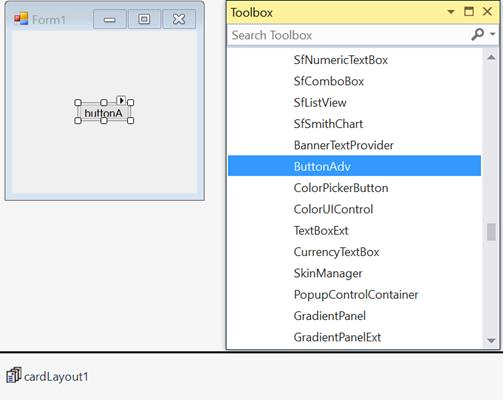

# Getting Started

This section explains how to add the `CardLayout` control in a Windows Forms application and overview its basic functionalities.

## Assembly deployment

Refer to the [control dependencies](https://help.syncfusion.com/windowsforms/control-dependencies#cardlayout) section to get the list of assemblies or NuGet package needs to be added as reference to use the control in any application.

Find more details about installing the nuget packages in a Windows Forms application in the following link: [How to install nuget packages](https://help.syncfusion.com/windowsforms/nuget-packages).

## Creating the project

Create a new Windows Forms project in Visual Studio to display the `CardLayout` with basic functionalities.

## Adding the CardLayout control through designer

The `CardLayout` control can be added to an application by dragging it from the toolbox to designer view. The following required assembly reference will be added automatically.

* Syncfusion.Shared.Base.dll

To add the form as a container control of `CardLayout`, click `Yes` in a pop-up, from which it appears automatically before the CardLayout is added.

### Adding layout components

The child controls can be added to layout by dragging it from the toolbox to designer view.

## Adding the CardLayout control through code

The `CardLayout` control can be created programmatically using the following steps:

**Step 1**: Create a C# or VB.NET application through Visual Studio.

**Step 2**: Add the following required assembly reference to the project

	Syncfusion.Shared.Base.dll.

**Step 3**: Include the required namespace.





using Syncfusion.Windows.Forms.Tools;





Imports Syncfusion.Windows.Forms.Tools





**Step 4**: Create an instance of the `CardLayout` control and set `ContainerControl` as form.





CardLayout cardLayout1 = new CardLayout();

this.cardLayout1.ContainerControl = this;





Dim cardLayout1 As CardLayout = New CardLayout()

Me.cardLayout1.ContainerControl = Me





### Adding layout components

The child controls can be added to the layout by simply adding it to the form since the form is its container control.





ButtonAdv buttonAdv1 = new ButtonAdv();
ButtonAdv buttonAdv2 = new ButtonAdv();
ButtonAdv buttonAdv3 = new ButtonAdv();

this.buttonAdv1.Text = "buttonAdv1";
this.buttonAdv2.Text = "buttonAdv2";
this.buttonAdv3.Text = "buttonAdv3";

//Set the background image of the form

this.BackgroundImage = Properties.Resources.splash0;
this.BackgroundImage = Properties.Resources.splash1;
this.BackgroundImage = Properties.Resources.splash2;

this.Controls.Add(this.buttonAdv1);
this.Controls.Add(this.buttonAdv2);
this.Controls.Add(this.buttonAdv3);





Dim buttonAdv1 As ButtonAdv = New ButtonAdv()
Dim buttonAdv3 As ButtonAdv = New ButtonAdv()
Dim buttonAdv3 As ButtonAdv = New ButtonAdv()

Me.buttonAdv1.Text = "buttonAdv1"
Me.buttonAdv2.Text = "buttonAdv2"
Me.buttonAdv3.Text = "buttonAdv3"

'Set the background image of the form

Me.BackgroundImage = My.Resources.splash0
Me.BackgroundImage = My.Resources.splash1
Me.BackgroundImage = My.Resources.splash2

Me.Controls.Add(this.buttonAdv1)
Me.Controls.Add(this.buttonAdv2)
Me.Controls.Add(this.buttonAdv3)





