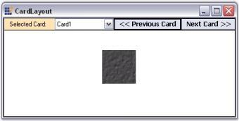

# Windows Forms LayoutManagers Overview

The `CardLayout` is a layout manager applied to a container. The components are added to a layout in a particular form and not in different forms. It treats each component in the container as a card. Only one card is visible at a time, and the container acts as a stack of cards. The first component added to a CardLayout object is the visible component when the container is displayed first.

The child component/card can be either made to fill or simply centered within the container. A common use of a CardLayout is to create WizardControls and property pages.

N> The WizardControl uses the CardLayout component internally in its implementation.

In its simplest form, this layout manager can be used to automatically arrange the child components in one or more rows.

N> `CardLayout` does not arrange the child components automatically like other layout managers.

## Key features

* **Card name**: Provides an option to set a unique card name to the child controls.

* **Card index**: Provides an option to get the index of the previous or next card.

* **Image**: Provides an option to set images to the child controls.

* **Layout mode**: Provides an option to set layout modes such as default or fill.

