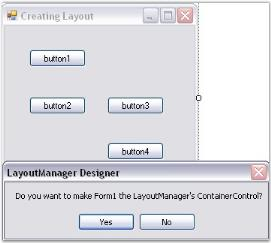
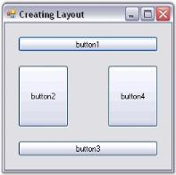

# Creating a Simple Layout in Windows Forms LayoutManagers

 This section discusses how a simple layout can be created using Layout Managers, which are discussed in the following topics.



[Overview](/windowsforms/layoutmanagers/overview)



## Through designer

This topic discusses how to create a simple layout for aligning Child controls through designer.

### Adding Child controls

* Populate the form with the necessary Child controls (here, we are using Buttons), by dragging and dropping them from the toolbox.

### Adding Layout Managers

The Layout Manager can be added before or after adding the Child controls to the Container control.

* The Layout Manager can be added to the form by just dragging and dropping the appropriate Layout Manager (for ex: BorderLayout) from the toolbox onto your form, which will be then be automatically added to the component tray.

### Setting Container control

* You can optionally drop the Child controls onto the Container control that you want to layout and the design time will automatically set the ContainerControl property in the Layout Manager.
* Form, Panel or any control that inherits the Container control can be set as a Container control for the Child controls that are added (here, form is set as the Container control).

N> The FlowLayout, CardLayout and GridLayout controls automatically arrange the Child controls of the Container control in a specific manner. When new controls are added, the Layout Manager will ensure that the old layout is not broken and that the existing controls are not messed up.

### Configuring Child controls

For BorderLayout and GridBagLayout, it is necessary to configure the Child controls by changing their extended properties via the property grid in the designer so that the Child controls can be aligned properly.

### Configuring Layout Manager

You can then configure the Layout Manager by changing its properties via the property grid in the designer.



[Through code](#through-code)



## Through code

The following steps will help you to create a simple layout for button controls, via code. Here the programmatic creation of the BorderLayout is discussed. Similarly other layouts can also be created.

* Create a new Visual C# or VB.NET application in Visual Studio .NET.
* Add the Syncfusion.Shared.Base and Syncfusion.Tools.Windows assemblies to your application.
* Include the required namespace.





using Syncfusion.Windows.Forms.Tools;





Imports Syncfusion.Windows.Forms.Tools





{{ codesnippet1 | OrderList_Indent_Level_1 }}

* Create variables for the Child controls (Buttons) and Layout Manager (Border Layout).






private System.Windows.Forms.Button btn1;

private System.Windows.Forms.Button btn2;

private System.Windows.Forms.Button btn3;

private System.Windows.Forms.Button btn4;

private System.Windows.Forms.Button btn5;

private Syncfusion.Windows.Forms.Tools.BorderLayout layout;





Private btn1 As System.Windows.Forms.Button

Private btn2 As System.Windows.Forms.Button

Private btn3 As System.Windows.Forms.Button

Private btn4 As System.Windows.Forms.Button

Private btn5 As System.Windows.Forms.Button

Private layout As Syncfusion.Windows.Forms.Tools.BorderLayout





{{ codesnippet2 | OrderList_Indent_Level_1 }}

* Declare instances for the Child controls (Buttons).






btn1 = new Button();

btn2 = new Button();

btn3 = new Button();

btn4 = new Button();

btn5 = new Button();





btn1 = New Button()

btn2 = New Button()

btn3 = New Button()

btn4 = New Button()

btn5 = New Button()





{{ codesnippet3 | OrderList_Indent_Level_1 }}

* Add the Child controls (Buttons) to the form.






this.Controls.AddRange(new Button[] {btn1,btn2,btn3,btn4,btn5});





Me.Controls.AddRange(New Button() {btn1,btn2,btn3,btn4,btn5})





{{ codesnippet4 | OrderList_Indent_Level_1 }}

* Declare an instance for the Layout Manager (Border Layout).






layout = new Syncfusion.Windows.Forms.Tools.BorderLayout();





layout = New Syncfusion.Windows.Forms.Tools.BorderLayout()





{{ codesnippet5 | OrderList_Indent_Level_1 }}

* Set the Container control for the Layout Manager (Border Layout).






this.layout.ContainerControl = this;

// To set the container control for a panel.

// this.layout.ContainerControl = this.panel1;





Me.layout.ContainerControl = Me

// To set the container control for a panel.

// Me.layout.ContainerControl = Me.panel1;





{{ codesnippet6 | OrderList_Indent_Level_1 }}

* Set the margin between the client rectangle and the layout rectangle.






this.layout.BottomMargin = 20;

this.layout.HorzFarMargin = 20;

this.layout.HorzNearMargin = 20;

this.layout.TopMargin = 20;





Me.layout.BottomMargin = 20

Me.layout.HorzFarMargin = 20

Me.layout.HorzNearMargin = 20

Me.layout.TopMargin = 20





{{ codesnippet7 | OrderList_Indent_Level_1 }}

* Set the spacing between the layout border and the components.






this.layout.HGap = 20;

this.layout.VGap = 20;





Me.layout.HGap = 20

Me.layout.VGap = 20





{{ codesnippet8 | OrderList_Indent_Level_1 }}

* Set the text and border position for the Child controls (Buttons).






this.btn1.Text = "One";

this.btn2.Text = "Two";

this.btn3.Text = "Three";

this.btn4.Text = "Four";

this.btn5.Text = "Five";

this.layout.SetPosition(this.btn1,Syncfusion.Windows.Forms.Tools.BorderPosition.North);

this.layout.SetPosition(this.btn2,Syncfusion.Windows.Forms.Tools.BorderPosition.South);

this.layout.SetPosition(this.btn3,Syncfusion.Windows.Forms.Tools.BorderPosition.East);

this.layout.SetPosition(this.btn4,Syncfusion.Windows.Forms.Tools.BorderPosition.West);

this.layout.SetPosition(this.btn5,Syncfusion.Windows.Forms.Tools.BorderPosition.Center);





Me.btn1.Text = "One"

Me.btn2.Text = "Two"

Me.btn3.Text = "Three"

Me.btn4.Text = "Four"

Me.btn5.Text = "Five"

Me.layout.SetPosition(Me.btn1,Syncfusion.Windows.Forms.Tools.BorderPosition.North)

Me.layout.SetPosition(Me.btn2,Syncfusion.Windows.Forms.Tools.BorderPosition.South)

Me.layout.SetPosition(Me.btn3,Syncfusion.Windows.Forms.Tools.BorderPosition.East)

Me.layout.SetPosition(Me.btn4,Syncfusion.Windows.Forms.Tools.BorderPosition.West)

Me.layout.SetPosition(Me.btn5,Syncfusion.Windows.Forms.Tools.BorderPosition.Center)





{{ codesnippet9 | OrderList_Indent_Level_1 }}

 



[Through designer](#through-designer)


