# FlowLayout in Windows Forms layout manager

`WinForms Flow Layout` is a layout manager which allows us to arrange the child components horizontally or vertically in a specific order, based on the settings. It is one of the most commonly used layout managers. Deriving from the `LayoutManager` class, the WinForms Flow Layout component was created to support simple horizontal and vertical flow and complex constraint-based WinForms Flow Layouts.

In its simplest form, this layout manager can be used to automatically arrange the child components in one or more rows, as shown below.

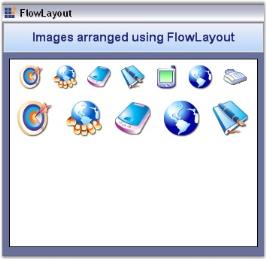

## Key features

* **Spacing**: Provides option to customize the horizontal and vertical gaps between child controls.

* **Layout mode**: Provides options to set the mode of arrangement of child controls such as horizontal or vertical.

* **Direction**: Provides option to reverse the direction of the flow arrangement of child controls.

* **AutoHeight**: Provides option to set AutoHeight if child controls exceed the given space in horizontal layout mode.

* **Alignment**: Provides option to customize the alignment such as Center, Near, Far, and ChildConstraints.

## Getting started

This section describes how to add the `WinForms Flow Layout` control in a Windows Forms application and overviews its basic functionalities.

## Assembly deployment

Refer to the [control dependencies](https://help.syncfusion.com/windowsforms/control-dependencies#flowlayout) section to get the list of assemblies or NuGet packages that need to be added as a reference to use the control in any application.

Find more details about installing the NuGet packages in a Windows Forms application in the following link:

[How to install NuGet packages](https://help.syncfusion.com/windowsforms/installation/install-nuget-packages)

## Creating a simple application with WinForms Flow Layout

You can create a Windows Forms application with the WinForms Flow Layout control as follows:

1. [Creating the project](#creating-the-project)
2. [Adding the control via designer](#adding-control-via-designer)
3. [Adding the control manually using code](#adding-control-manually-using-code)

## Creating the project

Create a new Windows Forms project in Visual Studio to display the WinForms Flow Layout with basic functionalities.

## Adding control via designer

The WinForms Flow Layout control can be added to the application by dragging it from the toolbox and dropping it in a designer view. The following required assembly reference will be added automatically:

* Syncfusion.Shared.Base.dll

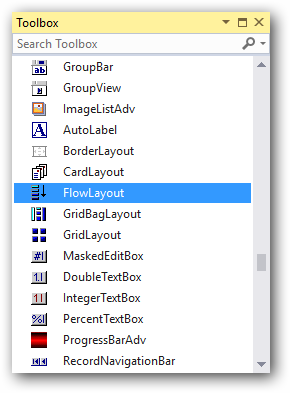

To add the form as a container control of the WinForms Flow Layout, click `Yes` in the popup form that appears automatically before the WinForms Flow Layout gets added.

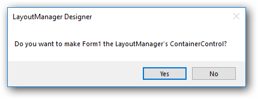

### Adding layout components

The child controls can be added to the layout by dragging them from the toolbox and dropping them in the designer view.

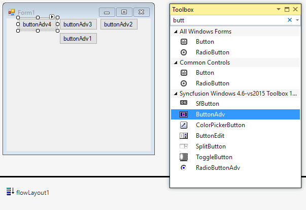

## Adding control manually using code

To add the control manually in C# or VB, follow the given steps:

**Step 1**: Add the following required assembly reference to the project:

* Syncfusion.Shared.Base.dll

**Step 2**: Include the namespace **Syncfusion.Windows.Forms.Tools**.



using Syncfusion.Windows.Forms.Tools;


Imports Syncfusion.Windows.Forms.Tools



**Step 3**: Create a `WinForms Flow Layout` control instance and set `ContainerControl` as the form.



FlowLayout flowLayout1 = new FlowLayout();

this.flowLayout1.ContainerControl = this;


Dim flowLayout1 As FlowLayout = New FlowLayout()

Me.flowLayout1.ContainerControl = Me



### Adding layout components

The child controls can be added to the layout by simply adding them to the form, since the form is its container control.



ButtonAdv buttonAdv1 = new ButtonAdv();
ButtonAdv buttonAdv2 = new ButtonAdv();
ButtonAdv buttonAdv3 = new ButtonAdv();
ButtonAdv buttonAdv4 = new ButtonAdv();

this.buttonAdv1.Text = "buttonAdv1";
this.buttonAdv2.Text = "buttonAdv2";
this.buttonAdv3.Text = "buttonAdv3";
this.buttonAdv4.Text = "buttonAdv4";

this.Controls.Add(this.buttonAdv1);
this.Controls.Add(this.buttonAdv2);
this.Controls.Add(this.buttonAdv3);
this.Controls.Add(this.buttonAdv4);


Dim buttonAdv1 As ButtonAdv = New ButtonAdv()
Dim buttonAdv2 As ButtonAdv = New ButtonAdv()
Dim buttonAdv3 As ButtonAdv = New ButtonAdv()
Dim buttonAdv4 As ButtonAdv = New ButtonAdv()

Me.buttonAdv1.Text = "buttonAdv1"
Me.buttonAdv2.Text = "buttonAdv2"
Me.buttonAdv3.Text = "buttonAdv3"
Me.buttonAdv4.Text = "buttonAdv4"

Me.Controls.Add(Me.buttonAdv1)
Me.Controls.Add(Me.buttonAdv2)
Me.Controls.Add(Me.buttonAdv3)
Me.Controls.Add(Me.buttonAdv4)



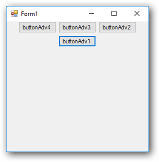

## Configuring WinForms Flow Layout

### Layout mode

The layout mode dictates the core function of a WinForms Flow Layout, whether to lay out the child controls horizontally or vertically. This property will be in effect for both scenarios.

<table>
<tr>
<th>WinForms Flow Layout property</th>
<th>Description</th>
</tr>
<tr>
<td>LayoutMode</td>
<td>Specifies the layout mode of the child controls. The default value is set to `Horizontal`. The options included are <code>Horizontal</code> and <code>Vertical</code>.</td>
</tr>
</table>



this.flowLayout1.LayoutMode = Syncfusion.Windows.Forms.Tools.FlowLayoutMode.Vertical;


Me.flowLayout1.LayoutMode = Syncfusion.Windows.Forms.Tools.FlowLayoutMode.Vertical



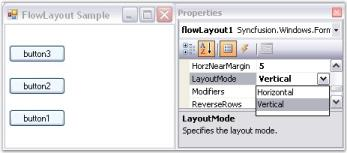

## ParticipateInLayout

child controls can be prevented from being laid out by the WinForms Flow layout manager. This can be done using the following methods.

<table>
<tr>
<th>Method</th>
<th>Description</th>
</tr>
<tr>
<td>GetParticipateInLayout</td>
<td>Indicates whether the component is in the layout list.</td>
</tr>
<tr>
<td>SetParticipateInLayout</td>
<td>Adds or removes the specified control from the layout list.</td>
</tr>
</table>

The following code can be used to add or remove the child control from the WinForms Flow Layout list programmatically.



this.flowLayout1.SetParticipateInLayout(this.button1, false);


Me.flowLayout1.SetParticipateInLayout(Me.button1, False)



## HGap and VGap

The horizontal and vertical gaps between the child controls can be set using the following properties.

<table>
<tr>
<th>WinForms Flow Layout property</th>
<th>Description</th>
</tr>
<tr>
<td>HGap</td>
<td>Gets or sets the horizontal spacing between the components.</td>
</tr>
<tr>
<td>VGap</td>
<td>Gets or sets the vertical spacing between the components.</td>
</tr>
</table>



this.flowLayout1.HGap = 20;

this.flowLayout1.VGap = 20;


Me.flowLayout1.HGap = 20

Me.flowLayout1.VGap = 20



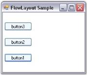

## AutoHeight

The height of the container control can be automatically increased when there is a lack of sufficient space to show the child components in the horizontal alignment mode. This is useful to enforce minimum heights on container controls and forms.

<table>
<tr>
<th>WinForms Flow Layout property</th>
<th>Description</th>
</tr>
<tr>
<td>AutoHeight</td>
<td>Specifies if the container's height should be enforced to the minimum when in horizontal alignment mode.</td>
</tr>
</table>



this.flowLayout1.AutoHeight = true;


Me.flowLayout1.AutoHeight = True



## Layout direction

WinForms Flow Layout allows you to lay out the child controls in the opposite direction (right to left or bottom to top).

<table>
<tr>
<th>WinForms Flow Layout property</th>
<th>Description</th>
</tr>
<tr>
<td>ReverseRows</td>
<td>Specifies to lay out the child controls in the reverse direction.</td>
</tr>
</table>



this.flowLayout1.ReverseRows = true;


Me.flowLayout1.ReverseRows = True



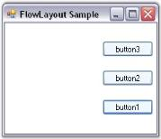

## Alignment

The `Alignment` property is where you specify whether the current layout logic should be simple or constraint-based.

>**NOTE**: Alignment is applied only along the direction of flow. For example, if the `LayoutMode` property is set to `Horizontal` and the `Alignment` property is set to `Center`, then the rows will be centered horizontally.

<table>
<tr>
<th>WinForms Flow Layout property</th>
<th>Description</th>
</tr>
<tr>
<td>Alignment</td>
<td>Specifies the alignment of layout components in the direction of flow. The options included are `Center`, `Near`, `Far`, and `ChildConstraints`.</td>
</tr>
</table>



this.flowLayout1.Alignment = Syncfusion.Windows.Forms.Tools.FlowAlignment.Near;


Me.flowLayout1.Alignment = Syncfusion.Windows.Forms.Tools.FlowAlignment.Near



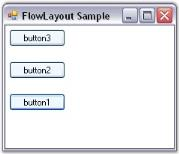

Once you specify the alignment of a WinForms Flow Layout as 'ChildConstraints', the layout manager will use a constraint-based layout logic based on the constraints specified on each child component. During design time, the constraints can be specified for each child control through the following extended property.

<table>
<tr>
<th>
WinForms Flow Layout property</th><th>
Description</th></tr>
<tr>
<td>
Constraints on WinForms Flow Layout</td><td>
Specifies the alignment of layout components in the direction of flow when the `Alignment` property is set to `ChildConstraints`.</td></tr>
</table>





this.flowLayout1.Alignment = Syncfusion.Windows.Forms.Tools.FlowAlignment.ChildConstraints;




Me.flowLayout1.Alignment = Syncfusion.Windows.Forms.Tools.FlowAlignment.ChildConstraints




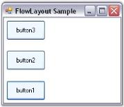 

>**NOTE**: Refer to the [Configuring Child Controls](#configuring-child-controls) topic to know about `HAlign`, `VAlign`, and other options provided by the Constraints on WinForms Flow Layout property.

## Configuring child controls

### Constraints on WinForms Flow Layout

Constrained WinForms Flow Layout is typically useful when creating resizable data entry forms filled with text boxes, check boxes, and so on. During design time, the constraints can be specified for each child control through its extended Constraints on WinForms Flow Layout property. The constraints in the WinForms Flow Layout are described below in detail.

#### Setting the constraints through designer

### HAlign and VAlign

The alignment of the child controls that have been placed within a row can be set using the properties given below. The alignment is done based upon the layout modes of the child controls.

<table>
<tr>
<th>child control constraints</th>
<th>Description</th>
</tr>
<tr>
<td>HAlign</td>
<td>Specifies the mode in which the child control should be laid out within a row. The options included are `Left`, `Right`, `Center`, and `Justify`.</td>
</tr>
<tr>
<td>VAlign</td>
<td>Specifies the mode in which the child control should be laid out within a column. The options included are `Top`, `Bottom`, `Center`, and `Justify`.</td>
</tr>
</table>

When the alignment is set to 'Justify', any extra space will be equally distributed across the other child controls that have been justified differently within that same row. However, when there is a lack of sufficient space, the justified child controls are shrunk proportionally based on their minimum size and preferred size settings (specifically, the difference between the two sizes).

>**NOTE**: The `Alignment` property should be set to `true` for the above properties to take effect.

*child controls with different HAlign settings*

>**NOTE**: In the figure above, the text boxes have auto labels associated with them.

### Layout participation

You can prevent a child control from participating in the layout using the below given property.

<table>
<tr>
<th>
child control constraint</th><th>
Description</th></tr>
<tr>
<td>
Active</td><td>
Specifies whether the child control should participate in the layout. The default value is set to `true`.</td></tr>
</table>

	
	
#### Line beginner

You can force a child control to always start at a new row by setting the below given property.

<table>
<tr>
<th>
child control constraint</th><th>
Description</th></tr>
<tr>
<td>
NewLine</td><td>
Specifies whether the child control should always be moved to the beginning of a new line. The default value is set to `false`.</td></tr>
</table>

	
#### Row height and column width

By default, rows are not adjusted to take into account the remaining vertical space in the horizontal layout mode or horizontal space in the vertical layout mode. This can be done using the properties given below.

<table>
<tr>
<th>
child control constraint</th><th>
Description</th></tr>
<tr>
<td>
ProportionalColWidth</td><td>
Specifies if proportional column widths should be used in the vertical layout. The default value is set to `false`.</td></tr>
<tr>
<td>
ProportionalRowHeight</td><td>
Specifies if proportional row heights should be used in the horizontal layout. The default value is set to `false`.</td></tr>
</table>

	
	
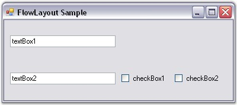
 
Two Proportionally Aligned Rows Split the Extra Horizontal Space Between Them

The methods associated with the above properties are given below.

<table>
<tr>
<th>
Methods</th><th>
Description</th></tr>
<tr>
<td>
GetConstraints</td><td>
Returns the constraints associated with the specified control.</td></tr>
<tr>
<td>
GetConstraintsRef</td><td>
Returns a reference to the constraints associated with the specified control.</td></tr>
<tr>
<td>
SetConstraints</td><td>
Specifies the constraints associated with the specified control.</td></tr>
</table>

	
In code, you can specify constraints through the SetConstraints() method. The FlowLayoutConstraints type defines the constraint that can be specified on a child component.

**Setting the constraints programmatically**

In the coding given below, the constraints are set to the particular control along with the constraint values like Active, HAlign, VAlign, NewLine, ProportionalColWidth and ProportionalRowHeight.





this.flowLayout1.SetConstraints(this.textBox1, new Syncfusion.Windows.Forms.Tools.FlowLayoutConstraints(true, Syncfusion.Windows.Forms.Tools.HorzFlowAlign.Justify, Syncfusion.Windows.Forms.Tools.VertFlowAlign.Center, false, false, false));





Me.flowLayout1.SetConstraints(Me.textBox1, New Syncfusion.Windows.Forms.Tools.FlowLayoutConstraints(True, Syncfusion.Windows.Forms.Tools.HorzFlowAlign.Justify, Syncfusion.Windows.Forms.Tools.VertFlowAlign.Center, False, False, False))





## Centering the child controls horizontally and vertically

This topic illustrates how to center the child controls both vertically and horizontally using the child constraints.

>**NOTE**: Constraints need to be used because the child controls will otherwise be centered either vertically or horizontally based on whether the layout mode is `Vertical` or `Horizontal`.

When the layout mode is `Horizontal`, set the `HAlign` property to `Center` and the `ProportionalRowHeight` property to `true` in the constraints for all the child controls. This will center the child controls vertically and horizontally as shown.



this.flowLayout1.SetConstraints(this.textBox1, new Syncfusion.Windows.Forms.Tools.FlowLayoutConstraints(true, Syncfusion.Windows.Forms.Tools.HorzFlowAlign.Center, Syncfusion.Windows.Forms.Tools.VertFlowAlign.Center, false, false, true));


Me.flowLayout1.SetConstraints(Me.textBox1, New Syncfusion.Windows.Forms.Tools.FlowLayoutConstraints(True, Syncfusion.Windows.Forms.Tools.HorzFlowAlign.Center, Syncfusion.Windows.Forms.Tools.VertFlowAlign.Center, False, False, True))



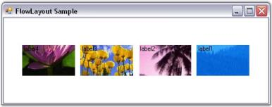

When the `ProportionalRowHeight` property is set to `true`, any extra space at the bottom will be equally distributed among all the available rows, thereby increasing the logical height of the rows. The child controls within these rows will then vertically align to the center of the row (since the `VAlign` property is set to `Center` by default), resulting in the layout seen above.

When resized to a smaller width, two rows are created as shown below.

## Enabling constrained WinForms Flow Layout on a container

This section will illustrate how Constrained WinForms Flow Layout can be used to implement complex form layout logic.

For example, create a 'User Info entry' panel with auto labels, textboxes and combobox to allow the user to enter personal information. This Container panel should also be capable of handling different widths by repositioning and resizing the child controls appropriately.

Steps to achieve the above layout and behavior are described below.

1. Place five text boxes and one combobox to represent the different data input controls in the panel.



// Declare the text boxes, combobox and panel controls.
private System.Windows.Forms.TextBox textBox5;
private System.Windows.Forms.TextBox textBox4;
private System.Windows.Forms.TextBox textBox3;
private System.Windows.Forms.TextBox textBox2;
private System.Windows.Forms.TextBox textBox1;
private System.Windows.Forms.ComboBox comboBox1;
private System.Windows.Forms.Panel panel1;

// Initialize the controls.
this.textBox1 = new System.Windows.Forms.TextBox();
this.textBox2 = new System.Windows.Forms.TextBox();
this.textBox3 = new System.Windows.Forms.TextBox();
this.textBox4 = new System.Windows.Forms.TextBox();
this.textBox5 = new System.Windows.Forms.TextBox();
this.comboBox1 = new System.Windows.Forms.ComboBox();
this.panel1 = new System.Windows.Forms.Panel();

// Add the controls to the panel control.
this.panel1.Controls.Add(this.textBox1);
this.panel1.Controls.Add(this.textBox2);
this.panel1.Controls.Add(this.textBox3);
this.panel1.Controls.Add(this.textBox4);
this.panel1.Controls.Add(this.textBox5);
this.panel1.Controls.Add(this.comboBox1);


' Declare the text boxes, combobox and panel controls.
Private textBox5 As System.Windows.Forms.TextBox
Private textBox4 As System.Windows.Forms.TextBox
Private textBox3 As System.Windows.Forms.TextBox
Private textBox2 As System.Windows.Forms.TextBox
Private textBox1 As System.Windows.Forms.TextBox
Private comboBox1 As System.Windows.Forms.ComboBox
Private panel1 As System.Windows.Forms.Panel

' Initialize the controls.
Me.textBox1 = New System.Windows.Forms.TextBox()
Me.textBox2 = New System.Windows.Forms.TextBox()
Me.textBox3 = New System.Windows.Forms.TextBox()
Me.textBox4 = New System.Windows.Forms.TextBox()
Me.textBox5 = New System.Windows.Forms.TextBox()
Me.comboBox1 = New System.Windows.Forms.ComboBox()
Me.panel1 = New System.Windows.Forms.Panel()

' Add the controls to the panel control.
Me.panel1.Controls.Add(Me.textBox1)
Me.panel1.Controls.Add(Me.textBox2)
Me.panel1.Controls.Add(Me.textBox3)
Me.panel1.Controls.Add(Me.textBox4)
Me.panel1.Controls.Add(Me.textBox5)
Me.panel1.Controls.Add(Me.comboBox1)



2. Add one auto label for each control and set the auto label's `LabeledControl` property to the corresponding control. Also, change the `Text` property of the auto label control appropriately and set the `AutoSize` property to `true`.



// Declare the auto label controls.
private Syncfusion.Windows.Forms.Tools.AutoLabel autoLabel1;
private Syncfusion.Windows.Forms.Tools.AutoLabel autoLabel2;
private Syncfusion.Windows.Forms.Tools.AutoLabel autoLabel3;
private Syncfusion.Windows.Forms.Tools.AutoLabel autoLabel4;
private Syncfusion.Windows.Forms.Tools.AutoLabel autoLabel5;
private Syncfusion.Windows.Forms.Tools.AutoLabel autoLabel6;

// Initialize the controls.
this.autoLabel1 = new Syncfusion.Windows.Forms.Tools.AutoLabel();
this.autoLabel2 = new Syncfusion.Windows.Forms.Tools.AutoLabel();
this.autoLabel3 = new Syncfusion.Windows.Forms.Tools.AutoLabel();
this.autoLabel4 = new Syncfusion.Windows.Forms.Tools.AutoLabel();
this.autoLabel5 = new Syncfusion.Windows.Forms.Tools.AutoLabel();
this.autoLabel6 = new Syncfusion.Windows.Forms.Tools.AutoLabel();

// Set their properties.
this.autoLabel1.AutoSize = true;
this.autoLabel1.LabeledControl = this.textBox1;
this.autoLabel1.Text = "First Name:";

this.autoLabel2.AutoSize = true;
this.autoLabel2.LabeledControl = this.textBox2;
this.autoLabel2.Text = "MI:";

this.autoLabel3.AutoSize = true;
this.autoLabel3.LabeledControl = this.textBox3;
this.autoLabel3.Text = "Last Name:";

this.autoLabel4.AutoSize = true;
this.autoLabel4.LabeledControl = this.textBox4;
this.autoLabel4.Text = "Address:";

this.autoLabel5.AutoSize = true;
this.autoLabel5.LabeledControl = this.textBox5;
this.autoLabel5.Text = "State";

this.autoLabel6.AutoSize = true;
this.autoLabel6.LabeledControl = this.comboBox1;
this.autoLabel6.Text = "Zip";


' Declare the auto label controls.
Private autoLabel1 As Syncfusion.Windows.Forms.Tools.AutoLabel
Private autoLabel2 As Syncfusion.Windows.Forms.Tools.AutoLabel
Private autoLabel3 As Syncfusion.Windows.Forms.Tools.AutoLabel
Private autoLabel4 As Syncfusion.Windows.Forms.Tools.AutoLabel
Private autoLabel5 As Syncfusion.Windows.Forms.Tools.AutoLabel
Private autoLabel6 As Syncfusion.Windows.Forms.Tools.AutoLabel

' Initialize the controls.
Me.autoLabel1 = New Syncfusion.Windows.Forms.Tools.AutoLabel()
Me.autoLabel2 = New Syncfusion.Windows.Forms.Tools.AutoLabel()
Me.autoLabel3 = New Syncfusion.Windows.Forms.Tools.AutoLabel()
Me.autoLabel4 = New Syncfusion.Windows.Forms.Tools.AutoLabel()
Me.autoLabel5 = New Syncfusion.Windows.Forms.Tools.AutoLabel()
Me.autoLabel6 = New Syncfusion.Windows.Forms.Tools.AutoLabel()

' Set their properties.
Me.autoLabel1.AutoSize = True
Me.autoLabel1.LabeledControl = Me.textBox1
Me.autoLabel1.Text = "First Name:"

Me.autoLabel2.AutoSize = True
Me.autoLabel2.LabeledControl = Me.textBox2
Me.autoLabel2.Text = "MI:"

Me.autoLabel3.AutoSize = True
Me.autoLabel3.LabeledControl = Me.textBox3
Me.autoLabel3.Text = "Last Name:"

Me.autoLabel4.AutoSize = True
Me.autoLabel4.LabeledControl = Me.textBox4
Me.autoLabel4.Text = "Address:"

Me.autoLabel5.AutoSize = True
Me.autoLabel5.LabeledControl = Me.textBox5
Me.autoLabel5.Text = "State"

Me.autoLabel6.AutoSize = True
Me.autoLabel6.LabeledControl = Me.comboBox1
Me.autoLabel6.Text = "Zip"



3. Now add the WinForms Flow Layout component and set the panel to be its `ContainerControl`. It will lay out the controls in the order in which they were added to the panel. Use the **Bring To Front** and **Send To Back** design time verbs to move the controls to the front or back of the layout order.

>**NOTE**: The WinForms Flow Layout will treat each control and its auto label pair as a single unit during layout.



// Declare the FlowLayout.
private Syncfusion.Windows.Forms.Tools.FlowLayout flowLayout1;

// Initialize the FlowLayout and set the panel control as its ContainerControl.
this.flowLayout1 = new Syncfusion.Windows.Forms.Tools.FlowLayout(this.components);

this.flowLayout1.ContainerControl = this.panel1;


' Declare the FlowLayout.
Private flowLayout1 As Syncfusion.Windows.Forms.Tools.FlowLayout

' Initialize the FlowLayout and set the panel control as its ContainerControl.
Me.flowLayout1 = New Syncfusion.Windows.Forms.Tools.FlowLayout(Me.components)

Me.flowLayout1.ContainerControl = Me.panel1



4. Now set some appropriate constraints on the input controls as follows.

* Select the **First Name** textbox and browse to the extended Constraints on WinForms Flow Layout property. Set the `HAlign` property to `Justify`, so that this control's width will be resized to fit any available empty horizontal space in the row. This also requires that you specify an appropriate preferred size for the control, such as `(100, 20)`.
* The **Middle Initial** textbox needs to be left aligned and not justified. This is the default constraint setting, so we don't need to make any changes to its constraints.
* Select the **Last Name** textbox and specify the same constraints as the **First Name** textbox.
* The **Address** textbox should always begin in a new row, so set the `NewLine` property to `true` in its constraints. Also, set the `HAlign` property to `Justify` and provide a preferred size.
* The **State** combobox and **Zip** textbox controls can also be left with the default constraints.



// Set the constraints for the text boxes.
this.flowLayout1.SetConstraints(this.textBox1, new Syncfusion.Windows.Forms.Tools.FlowLayoutConstraints(true, Syncfusion.Windows.Forms.Tools.HorzFlowAlign.Justify, Syncfusion.Windows.Forms.Tools.VertFlowAlign.Center, false, false, false));

this.flowLayout1.SetPreferredSize(this.textBox1, new System.Drawing.Size(100, 20));

this.flowLayout1.SetConstraints(this.textBox3, new Syncfusion.Windows.Forms.Tools.FlowLayoutConstraints(true, Syncfusion.Windows.Forms.Tools.HorzFlowAlign.Justify, Syncfusion.Windows.Forms.Tools.VertFlowAlign.Center, false, false, false));

this.flowLayout1.SetPreferredSize(this.textBox3, new System.Drawing.Size(100, 20));

this.flowLayout1.SetConstraints(this.textBox4, new Syncfusion.Windows.Forms.Tools.FlowLayoutConstraints(true, Syncfusion.Windows.Forms.Tools.HorzFlowAlign.Justify, Syncfusion.Windows.Forms.Tools.VertFlowAlign.Center, true, false, false));

this.flowLayout1.SetPreferredSize(this.textBox4, new System.Drawing.Size(100, 20));


' Set the constraints for the text boxes.
Me.flowLayout1.SetConstraints(Me.textBox1, New Syncfusion.Windows.Forms.Tools.FlowLayoutConstraints(True, Syncfusion.Windows.Forms.Tools.HorzFlowAlign.Justify, Syncfusion.Windows.Forms.Tools.VertFlowAlign.Center, False, False, False))

Me.flowLayout1.SetPreferredSize(Me.textBox1, New System.Drawing.Size(100, 20))

Me.flowLayout1.SetConstraints(Me.textBox3, New Syncfusion.Windows.Forms.Tools.FlowLayoutConstraints(True, Syncfusion.Windows.Forms.Tools.HorzFlowAlign.Justify, Syncfusion.Windows.Forms.Tools.VertFlowAlign.Center, False, False, False))

Me.flowLayout1.SetPreferredSize(Me.textBox3, New System.Drawing.Size(100, 20))

Me.flowLayout1.SetConstraints(Me.textBox4, New Syncfusion.Windows.Forms.Tools.FlowLayoutConstraints(True, Syncfusion.Windows.Forms.Tools.HorzFlowAlign.Justify, Syncfusion.Windows.Forms.Tools.VertFlowAlign.Center, True, False, False))

Me.flowLayout1.SetPreferredSize(Me.textBox4, New System.Drawing.Size(100, 20))



5. The panel itself should increase or decrease in height when the number of rows in the layout increases or decreases. To get this behavior, set the WinForms Flow Layout's `AutoHeight` property to `true`.



// Set the AutoHeight property of FlowLayout.
this.flowLayout1.AutoHeight = true;


' Set the AutoHeight property of FlowLayout.
Me.flowLayout1.AutoHeight = True



>**NOTE**: During run time, the input controls get resized and repositioned appropriately based on the constraints provided.

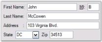

### AutoLabel control

The AutoLabel control is a label-derived control that lets you pair a label with any other control. Once paired, the AutoLabel will be automatically repositioned as the labeled control's position changes.

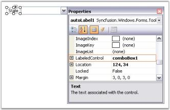

The AutoLabel control can be positioned relative to the top, left, bottom, or right of the labeled control. It can also be positioned at a custom distance from the labeled control specified via its `DX` and `DY` properties. When using relative positioning, you can also specify the gap between the label and the control.

The WinForms Flow Layout will always treat the `AutoLabel` and `LabeledControl` pair as a unit. You can use AutoLabels and WinForms Flow Layout together to implement complex and powerful form layouts.

>**NOTE**: Refer to AutoLabel under Editors Package for more details.

## Rearranging the controls laid out by WinForms Flow Layout

The WinForms Flow Layout manager arranges the controls in the order in which they are added into the container collection.

### Through designer

* You can rearrange the controls laid out by WinForms Flow Layout by right-clicking the control and selecting the **Bring To Front** or **Send To Back** verbs in the designer.

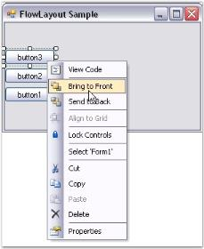

* Rearranging of the child controls of the WinForms Flow Layout can also be done by dragging and dropping them at design time.

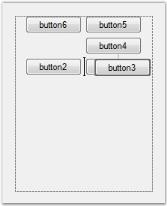

### Through code

You can also programmatically change the order of the controls laid out by the WinForms Flow Layout. This can be done using the following method.

* Set up a form with `Panel1` and drag the WinForms Flow Layout onto the `Panel1` which would act as the container control.

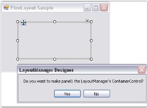

* Drag three more Panels onto the `Panel1`. The WinForms Flow Layout automatically arranges the child controls as shown below.

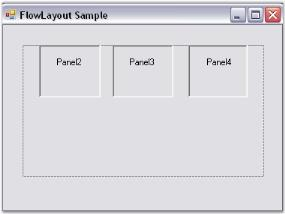

* Add a Button control for reordering the child controls of `Panel1`, and in the `Button_Click` event, add the following code:



private void button1_Click(object sender, System.EventArgs e)
{
    // Create a temporary collection of the Panel's controls.
    ArrayList panel = new ArrayList();

    foreach (Control ctrl in this.panel1.Controls)
    {
        panel.Add(ctrl);
    }

    this.panel1.Controls.Clear();

    // Reorder the panels.
    for (int i = panel.Count - 1; i >= 0; i--)
    {
        Panel pan = panel[i] as Panel;
        this.panel1.Controls.Add(pan);
    }

    // Apply layout logic to all its child controls.
    this.panel1.PerformLayout();
}


Private Sub button1_Click(ByVal sender As Object, ByVal e As System.EventArgs)
    ' Create a temporary collection of the Panel's controls.
    Dim panel As ArrayList = New ArrayList()

    For Each ctrl As Control In Me.panel1.Controls
        panel.Add(ctrl)
    Next ctrl

    Me.panel1.Controls.Clear()

    ' Reorder the panels.
    For i As Integer = panel.Count - 1 To 0 Step -1
        Dim pan As Panel = CType(IIf(TypeOf panel(i) Is Panel, panel(i), Nothing), Panel)
        Me.panel1.Controls.Add(pan)
    Next i

    ' Apply layout logic to all its child controls.
    Me.panel1.PerformLayout()
End Sub



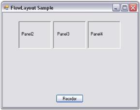

* At run time, when the **Reorder** button is clicked, the panels are rearranged in reverse order.

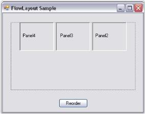


[Creating a Simple Layout](/windowsforms/layoutmanagers/creating-a-simple-layout), [Child Control Settings](/windowsforms/layoutmanagers/layout-manager-settings#child-control-settings), [Centering the Child Controls Horizontally and Vertically](/windowsforms/layoutmanagers/centering-the-child-controls-horizontally-and-vertically), [Rearranging the Controls laid out by GridLayout](/windowsforms/layoutmanagers/gridlayout/overview), and [Rearranging the Controls laid out by GridBagLayout](/windowsforms/layoutmanagers/gridbaglayout/overview).


