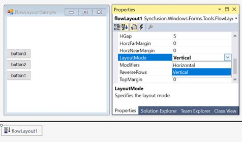
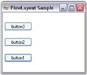
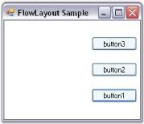
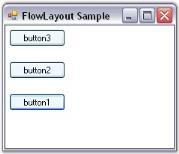
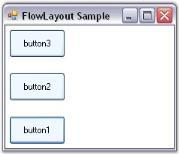

# Configuring FlowLayout in Windows Forms LayoutManagers

## Layout mode

The core function of FlowLayout is to layout the child controls either horizontally or vertically. The following property will be in effect for both the scenarios.

<table>
<tr>
<th>
FlowLayoutProperties</th><th>
Description</th></tr>
<tr>
<td>
LayoutMode</td><td>
Specifies the layout mode of the child controls. The default value is `Horizontal`. The options included are horizontal and vertical.</td></tr>
</table>





this.flowLayout1.LayoutMode = Syncfusion.Windows.Forms.Tools.FlowLayoutMode.Vertical;





Me.flowLayout1.LayoutMode = Syncfusion.Windows.Forms.Tools.FlowLayoutMode.Vertical





### ParticipateInLayout

Child controls can be prevented from being laid out using the FlowLayout manager. This can be done using the following methods.

<table>
<tr>
<th>
Methods</th><th>
Description</th></tr>
<tr>
<td>
GetParticipateInLayout</td><td>
Indicates whether the component is in the layout list.</td></tr>
<tr>
<td>
SetParticipateInLayout</td><td>
Adds or removes the specified control from the layout list.</td></tr>
</table>

The following code is used to add or remove the child control from the FlowLayout list programmatically.





this.flowLayout1.SetParticipateInLayout(this.button1,false);





Me.flowLayout1.SetParticipateInLayout(Me.button1,False)





## HGap and VGap

The horizontal and vertical gaps between the child controls can be set using the following properties.

<table>
<tr>
<th>
FlowLayoutProperty</th><th>
Description</th></tr>
<tr>
<td>
HGap</td><td>
Specifies the horizontal spacing between the layout border and the components.</td></tr>
<tr>
<td>
VGap</td><td>
Specifies the vertical spacing between the layout border and the components.</td></tr>
</table>





this.flowLayout1.HGap = 20;

this.flowLayout1.VGap = 20;





Me.flowLayout1.HGap = 20

Me.flowLayout1.VGap = 20





## AutoHeight

The height of the container control can be automatically increased when there is lack in space to show the child components in the horizontal alignment mode. This is used to enforce the minimum height on container controls and forms.

<table>
<tr>
<th>
FlowLayout Property</th><th>
Description</th></tr>
<tr>
<td>
AutoHeight</td><td>
Specifies whether the container’s height should be enforced to minimum when in horizontal alignment mode.</td></tr>
</table>





this.flowLayout1.AutoHeight = true;





Me.flowLayout1.AutoHeight = True





## Layout direction

The FlowLayout allows you layout the child controls in opposite direction (right to left or bottom to top).

<table>
<tr>
<th>
FlowLayout Property</th><th>
Description</th></tr>
<tr>
<td>
ReverseRows</td><td>
Specifies to layout rows in opposite direction(right to left or bottom to top).</td></tr>
</table>





this.flowLayout1.ReverseRows = true;





Me.flowLayout1.ReverseRows = True





## Alignment

The Alignment property is used to specify whether the current layout logic should be simple or constraint-based.

N> Alignment is applied only along the direction of flow. For example, if the LayoutMode property is set to ‘Horizontal’ and the Alignment property is set to ‘Center’, then the rows will be centered horizontally.

<table>
<tr>
<th>
FlowLayout Property</th><th>
Description</th></tr>
<tr>
<td>
Alignment</td><td>
Specifies the alignment of layout components in the direction of flow. The options included are Center, Near, Far, and ChildConstraints.</td></tr>
</table>





this.flowLayout1.Alignment = Syncfusion.Windows.Forms.Tools.FlowAlignment.Near;





Me.flowLayout1.Alignment = Syncfusion.Windows.Forms.Tools.FlowAlignment.Near





When you specify the alignment of FlowLayout as `ChildConstraints`, the layout manager uses a constraint-based layout logic based on the constraints specified on each child component. During design time, the constraints can be specified for each child control through the following extended property.

<table>
<tr>
<th>
FlowLayout property</th><th>
Description</th></tr>
<tr>
<td>
Constraints on flowLayout</td><td>
Specifies the alignment of layout components in the direction of flow when the alignment property is set to `ChildConstraints`.</td></tr>
</table>





this.flowLayout1.Alignment = Syncfusion.Windows.Forms.Tools.FlowAlignment.ChildConstraints;





Me.flowLayout1.Alignment = Syncfusion.Windows.Forms.Tools.FlowAlignment.ChildConstraints





