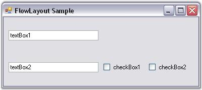
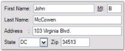
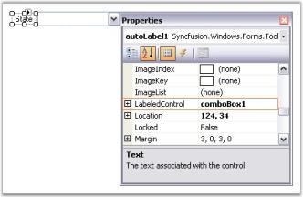
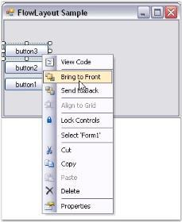
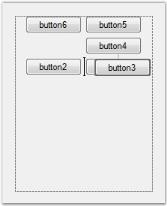
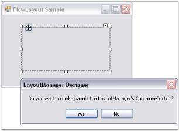
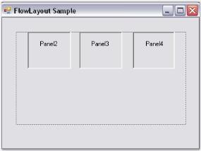
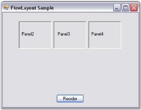
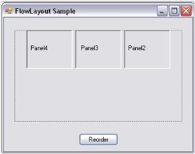

# Configuring Child Controls in Windows Forms LayoutManagers

## Constraints on FlowLayout

Constrained FlowLayout is typically used when creating resizable data entry forms filled with text boxes, check boxes, and so on. During design time, the constraints can be specified for each child control through its extended constraints on the flowLayout property. The constraints in FlowLayout are described as follows.

### Setting the constraints through designer

## HAlign and VAlign

The alignment of the child controls that have been placed within a row can be set using the following property. The alignment is done based on the layout modes of the child controls.

<table>
<tr>
<th>
Child control constraints</th><th>
Description</th></tr>
<tr>
<td>
HAlign</td><td>
Specifies the mode, in which the child control should be laid out within a row. The options included are Left, Right, Center, and Justify.</td></tr>
<tr>
<td>
VAlign</td><td>
Specifies the mode, in which the child control should be laid out within a column. The options included are Top, Bottom, Center, and Justify.</td></tr>
</table>

When the alignment is set to `Justify`, extra space will be equally distributed across the other child controls that have been justified differently within that same row. However, when there is lack in space, the justified child controls are shrunk proportionally based on their minimum size and preferred size settings (specifically, the difference between the two sizes).

N> The Alignment property should be set to `true` for the above properties to take effect.

N> In the above screenshot, the text boxes have auto labels associated with them.

### Layout participation

You can prevent a child control from participating in the layout using the following property.

<table>
<tr>
<th>
Child control constraint</th><th>
Description</th></tr>
<tr>
<td>
Active</td><td>
Specifies whether the child control should participate in the layout. The default value is set to `true`.</td></tr>
</table>

### Line beginner

You can force a child control to always start at a new row by setting the following property.

<table>
<tr>
<th>
Child control constraints</th><th>
Description</th></tr>
<tr>
<td>
NewLine</td><td>
Specifies whether this child should always be moved to the beginning of a new line. The default value is set to `false`.</td></tr>
</table>

### Row height and column width

By default, the rows are not adjusted to take into account the remaining vertical space in horizontal layout mode or horizontal space in the vertical layout mode. This can be done using the following properties.

<table>
<tr>
<th>
Child control constraints</th><th>
Description</th></tr>
<tr>
<td>
ProportionalColWidth</td><td>
Specifies if proportional column width should be used in the vertical layout. The default value is set to `false`.</td></tr>
<tr>
<td>
ProportionalRowHeight</td><td>
Specifies if proportional row height should be used in the horizontal layout. The default value is set to `false`.</td></tr>
</table>

The method associated with the above properties are given in the following table.

<table>
<tr>
<th>
Methods</th><th>
Description</th></tr>
<tr>
<td>
GetConstraints</td><td>
Returns the constraints associated with the specified control.</td></tr>
<tr>
<td>
GetConstraintsRef</td><td>
Returns a reference to the constraints associated with the specified control.</td></tr>
<tr>
<td>
SetConstraints</td><td>
Specifies the constraints associated with the specified control.</td></tr>
</table>

In code, you can specify the constraints using the SetConstraints() method. The FlowLayoutConstraints type defines the constraint that can be specified on a child component.

### Setting the constraints programmatically

In the following code sample, the constraints are set to a particular control along with the constraints value such as Active, HAlign, VAlign, NewLine, ProportionalColWidth, and ProportionalRowHeight.





this.flowLayout1.SetConstraints(this.textBox1, new Syncfusion.Windows.Forms.Tools.FlowLayoutConstraints(true, Syncfusion.Windows.Forms.Tools.HorzFlowAlign.Justify, Syncfusion.Windows.Forms.Tools.VertFlowAlign.Center, false, false, false));





Me.flowLayout1.SetConstraints(Me.textBox1, New Syncfusion.Windows.Forms.Tools.FlowLayoutConstraints(True, Syncfusion.Windows.Forms.Tools.HorzFlowAlign.Justify, Syncfusion.Windows.Forms.Tools.VertFlowAlign.Center, False, False, False))





## Centering the child controls horizontally and vertically

This topic explains how to center the child controls horizontally and vertically using child constraints.

N> Constraints need to be used because the child controls will be centered either vertically or horizontally based on the layout mode.

When the layout mode is `Horizontal`, set the HAlign property to `Center` and ProportionalRowHeight property to `true` in the constraints for all the child controls. This will center the child controls vertically and horizontally.





this.flowLayout1.SetConstraints(this.textBox1, new Syncfusion.Windows.Forms.Tools.FlowLayoutConstraints(true, Syncfusion.Windows.Forms.Tools.HorzFlowAlign.Center, Syncfusion.Windows.Forms.Tools.VertFlowAlign.Center, false, false, true));





Me.flowLayout1.SetConstraints(Me.textBox1, New Syncfusion.Windows.Forms.Tools.FlowLayoutConstraints(True, Syncfusion.Windows.Forms.Tools.HorzFlowAlign.Center, Syncfusion.Windows.Forms.Tools.VertFlowAlign.Center, False, False, True))





When the proportionalRowHeight property is set to `true`, extra space at the bottom will be equally distributed among all the available rows by increasing the logical height of the rows. The child controls within these rows will be vertically aligned to the center of the row (since the VAlign property is set to `center`, by default).

When resizing to a smaller width, two rows are created.

## Enabling constrained FlowLayout on a container

This section explains how the constrained FlowLayout can be used to improve complex form layout logic.

For example, create a ‘User Info entry’ panel with auto labels, text boxes, and combobox to allow users to enter personal information. This container panel should also be capable of handling different widths by repositioning and resizing the child controls appropriately.

### Steps to achieve the above layout and behavior

1. Place five text boxes and one combobox to represent different data input controls in the panel.






// Declare the text boxes, combobox and panel controls.

private System.Windows.Forms.TextBox textBox5;
private System.Windows.Forms.TextBox textBox4;
private System.Windows.Forms.TextBox textBox3;
private System.Windows.Forms.TextBox textBox2;
private System.Windows.Forms.TextBox textBox1;
private System.Windows.Forms.ComboBox comboBox1;
private System.Windows.Forms.Panel panel1;

// Initialize the controls.
this.textBox1 = new System.Windows.Forms.TextBox();
this.textBox2 = new System.Windows.Forms.TextBox();
this.textBox3 = new System.Windows.Forms.TextBox();
this.textBox4 = new System.Windows.Forms.TextBox();
this.textBox5 = new System.Windows.Forms.TextBox();
this.comboBox1 = new System.Windows.Forms.ComboBox();
this.panel1 = new System.Windows.Forms.Panel();

// Add the controls to the panel control.

this.panel1.Controls.Add(this.textBox1);
this.panel1.Controls.Add(this.textBox2);
this.panel1.Controls.Add(this.textBox3);
this.panel1.Controls.Add(this.textBox4);
this.panel1.Controls.Add(this.textBox5);
this.panel1.Controls.Add(this.comboBox1);





' Declare the text boxes, combobox and panel controls.

Private textBox5 As System.Windows.Forms.TextBox
Private textBox4 As System.Windows.Forms.TextBox
Private textBox3 As System.Windows.Forms.TextBox
Private textBox2 As System.Windows.Forms.TextBox
Private textBox1 As System.Windows.Forms.TextBox
Private comboBox1 As System.Windows.Forms.ComboBox
Private panel1 As System.Windows.Forms.Panel

' Initialize the controls.

Me.textBox1 = New System.Windows.Forms.TextBox()
Me.textBox2 = New System.Windows.Forms.TextBox()
Me.textBox3 = New System.Windows.Forms.TextBox()
Me.textBox4 = New System.Windows.Forms.TextBox()
Me.textBox5 = New System.Windows.Forms.TextBox()
Me.comboBox1 = New System.Windows.Forms.ComboBox()
Me.panel1 = New System.Windows.Forms.Panel()

' Add the controls to the panel control.

Me.panel1.Controls.Add(Me.textBox1)
Me.panel1.Controls.Add(Me.textBox2)
Me.panel1.Controls.Add(Me.textBox3)
Me.panel1.Controls.Add(Me.textBox4)
Me.panel1.Controls.Add(Me.textBox5)
Me.panel1.Controls.Add(Me.comboBox1)





{{ codesnippet1 | OrderList_Indent_Level_1 }}

2. Add one auto label for each control, and set the auto label’s LabeledControl property to the corresponding control. Then, change the Text property of the auto label control, and then set the AutoSize property to `true`.







// Declare the auto label controls.

private Syncfusion.Windows.Forms.Tools.AutoLabel autoLabel1;
private Syncfusion.Windows.Forms.Tools.AutoLabel autoLabel2;
private Syncfusion.Windows.Forms.Tools.AutoLabel autoLabel3;
private Syncfusion.Windows.Forms.Tools.AutoLabel autoLabel4;
private Syncfusion.Windows.Forms.Tools.AutoLabel autoLabel5;
private Syncfusion.Windows.Forms.Tools.AutoLabel autoLabel6;

// Initialize the controls.

this.autoLabel1 = new Syncfusion.Windows.Forms.Tools.AutoLabel();
this.autoLabel2 = new Syncfusion.Windows.Forms.Tools.AutoLabel();
this.autoLabel3 = new Syncfusion.Windows.Forms.Tools.AutoLabel();
this.autoLabel4 = new Syncfusion.Windows.Forms.Tools.AutoLabel();
this.autoLabel5 = new Syncfusion.Windows.Forms.Tools.AutoLabel();
this.autoLabel6 = new Syncfusion.Windows.Forms.Tools.AutoLabel();

// Set the properties.

this.autoLabel1.AutoSize = true;
this.autoLabel1.LabeledControl = this.textBox1;
this.autoLabel1.Text = "First Name:";

this.autoLabel2.AutoSize = true;
this.autoLabel2.LabeledControl = this.textBox2;
this.autoLabel2.Text = "MI:";

this.autoLabel3.AutoSize = true;
this.autoLabel3.LabeledControl = this.textBox3;
this.autoLabel3.Text = "Last Name:";

this.autoLabel4.AutoSize = true;
this.autoLabel4.LabeledControl = this.textBox4;
this.autoLabel4.Text = "Address:";

this.autoLabel5.AutoSize = true;
this.autoLabel5.LabeledControl = this.textBox5;
this.autoLabel5.Text = "State";

this.autoLabel6.AutoSize = true;
this.autoLabel6.LabeledControl = this.comboBox1;
this.autoLabel6.Text = "Zip";





' Declare the auto label controls.

Private autoLabel1 As Syncfusion.Windows.Forms.Tools.AutoLabel
Private autoLabel2 As Syncfusion.Windows.Forms.Tools.AutoLabel
Private autoLabel3 As Syncfusion.Windows.Forms.Tools.AutoLabel
Private autoLabel4 As Syncfusion.Windows.Forms.Tools.AutoLabel
Private autoLabel5 As Syncfusion.Windows.Forms.Tools.AutoLabel
Private autoLabel6 As Syncfusion.Windows.Forms.Tools.AutoLabel

' Initialize the controls.

Me.autoLabel1 = New Syncfusion.Windows.Forms.Tools.AutoLabel()
Me.autoLabel2 = New Syncfusion.Windows.Forms.Tools.AutoLabel()
Me.autoLabel3 = New Syncfusion.Windows.Forms.Tools.AutoLabel()
Me.autoLabel4 = New Syncfusion.Windows.Forms.Tools.AutoLabel()
Me.autoLabel5 = New Syncfusion.Windows.Forms.Tools.AutoLabel()
Me.autoLabel6 = New Syncfusion.Windows.Forms.Tools.AutoLabel()

' Set the properties.

Me.autoLabel1.LabeledControl = Me.textBox1
Me.autoLabel1.Text = "First Name:"

Me.autoLabel2.LabeledControl = Me.textBox2
Me.autoLabel2.Text = "MI:"

Me.autoLabel3.LabeledControl = Me.textBox3
Me.autoLabel3.Text = "Last Name:"

Me.autoLabel4.LabeledControl = Me.textBox4
Me.autoLabel4.Text = "Address:"

Me.autoLabel5.LabeledControl = Me.textBox5
Me.autoLabel5.Text = "State"

Me.autoLabel6.LabeledControl = Me.comboBox1
Me.autoLabel6.Text = "Zip"





{{ codesnippet2 | OrderList_Indent_Level_1 }}

3. Now, add the FlowLayout component, and set the panel to its container control. The FlowLayout will layout the controls in an order, in which they were added to the panel. Use the Bring To Front and Send To Back design time options to move the controls to the front or back to the layout order.

N> The FlowLayout treats each control and its auto label pair as a single unit during layout.







// Declare the FlowLayout.

private Syncfusion.Windows.Forms.Tools.FlowLayout flowLayout1;

// Initialize the Flowlayout, and set the panel control as its container control.

this.flowLayout1 = new Syncfusion.Windows.Forms.Tools.FlowLayout(this.components);

this.flowLayout1.ContainerControl = this.panel1;





' Declare the FlowLayout.

Private flowLayout1 As Syncfusion.Windows.Forms.Tools.FlowLayout

' Initialize the Flowlayout and set the panel control as it's Container control.

Me.flowLayout1 = New Syncfusion.Windows.Forms.Tools.FlowLayout(Me.components)

Me.flowLayout1.ContainerControl = Me.panel1





{{ codesnippet3 | OrderList_Indent_Level_1 }}

4. Now, set some appropriate constraints on the input controls as follows.

* Select the First Name textbox and browse to the extended constraints on the flowLayout property. Set the HAlign property to ‘Justify’, so that this control’s width will be resized to fit any available empty horizontal space in the row. This also requires that you specify an appropriate preferred size for the control, such as (100, 20).

* Align the middle initial text box to the left and not justify it. This is the default constraint setting, so you do not need to make any change to its constraints.

* Select the Last Name text box and specify the same constraints as the ‘First Name’ text box.

* The Address text box should always begin in a new row, so set the NewLine property to `true` in its constraints. Then, set the HAlign property to ‘Justify’, and provide a preferred size.

* The State combobox and Zip text box controls can also be left with the default constraints.







// Set the constraints for the text boxes.

this.flowLayout1.SetConstraints(this.textBox1, new Syncfusion.Windows.Forms.Tools.FlowLayoutConstraints(true, Syncfusion.Windows.Forms.Tools.HorzFlowAlign.Justify, Syncfusion.Windows.Forms.Tools.VertFlowAlign.Center, false, false, false));

this.flowLayout1.SetPreferredSize(this.textBox1, new System.Drawing.Size(100, 20));

this.flowLayout1.SetConstraints(this.textBox3, new Syncfusion.Windows.Forms.Tools.FlowLayoutConstraints(true, Syncfusion.Windows.Forms.Tools.HorzFlowAlign.Justify, Syncfusion.Windows.Forms.Tools.VertFlowAlign.Center, false, false, false));

this.flowLayout1.SetPreferredSize(this.textBox3, new System.Drawing.Size(100, 20));

this.flowLayout1.SetConstraints(this.textBox4, new Syncfusion.Windows.Forms.Tools.FlowLayoutConstraints(true, Syncfusion.Windows.Forms.Tools.HorzFlowAlign.Justify, Syncfusion.Windows.Forms.Tools.VertFlowAlign.Center, true, false, false));

this.flowLayout1.SetPreferredSize(this.textBox4, new System.Drawing.Size(100, 20));.Center, false, false, true));





' Set the constraints for the text boxes.

Me.flowLayout1.SetConstraints(Me.textBox1, New Syncfusion.Windows.Forms.Tools.FlowLayoutConstraints(True, Syncfusion.Windows.Forms.Tools.HorzFlowAlign.Justify, Syncfusion.Windows.Forms.Tools.VertFlowAlign.Center, False, False, False))

Me.flowLayout1.SetPreferredSize(Me.textBox1, New System.Drawing.Size(100, 20))

Me.flowLayout1.SetConstraints(Me.textBox3, New Syncfusion.Windows.Forms.Tools.FlowLayoutConstraints(True, Syncfusion.Windows.Forms.Tools.HorzFlowAlign.Justify, Syncfusion.Windows.Forms.Tools.VertFlowAlign.Center, False, False, False))

Me.flowLayout1.SetPreferredSize(Me.textBox3, New System.Drawing.Size(100, 20))

Me.flowLayout1.SetConstraints(Me.textBox4, New Syncfusion.Windows.Forms.Tools.FlowLayoutConstraints(True, Syncfusion.Windows.Forms.Tools.HorzFlowAlign.Justify, Syncfusion.Windows.Forms.Tools.VertFlowAlign.Center, True, False, False))

Me.flowLayout1.SetPreferredSize(Me.textBox4, New System.Drawing.Size(100, 20))





{{ codesnippet4 | OrderList_Indent_Level_1 }}

5. The panel itself should be increased or decreased in width when the number of rows in the layout increases or decreases. To get this behavior, set the FlowLayout’s AutoHeight property to `true`.







// Set the AutoHeight property of FlowLayout.

this.flowLayout1.AutoHeight = true;





' Set the AutoHeight property of FlowLayout.

Me.flowLayout1.AutoHeight = True





{{ codesnippet5 | OrderList_Indent_Level_1 }}

N> During run time, the input controls are resized and repositioned appropriately based on the constraints provided.

### AutoLabel Control

The AutoLabel control is a label-derived control; it allows you pair a label with any other control. After it has been paired, the AutoLabel will be automatically repositioned as the labeled control’s position changes.

The AutoLabel control can be positioned relative to the top, left, bottom, or right of the labeled control. It can also be positioned at a custom distance from the labeled control specified via its DX and DY properties. When using relative positioning, you can also specify the gap between the label and the control.

The FlowLayout will always treat the ‘AutoLabel-LabeledControl’ pair as a unit. You can use AutoLabels and FlowLayout together to implement complex and powerful form layouts.

N> Refer to AutoLabel under Editors Package for more details.

## Rearranging the controls laid out by FlowLayout

The FlowLayout manager arranges the controls in a way it is added into the container collection.

### Through Designer

Step 1. Rearrange the controls laid out by FlowLayout by right-clicking the control and selecting the Bring To Front or Send To Back options in the designer.

Step 2. Rearrange the child controls of the FlowLayout by dragging and dropping them at design time.

### Through Code

You can also programmatically change the order of the controls laid out by the Flow layout. This can be done using the following method.

Step 1. Set up a form with Panel1 and drag the FlowLayout to the Panel1, which would act as the container control.

Step 2. Drag another three Panels to the Panel1. The flow layout automatically arranges the child controls.

Step 3. Add the Button control for recording the child controls of Panel1, and in the Button_Click event, give data as in the following code snippet.







private void button1_Click(object sender, System.EventArgs e)
{
	// Create a temporary collection of Panel's controls.
	
	ArrayList panel = new ArrayList();

	foreach (Control ctrl in this.panel1.Controls)
	{
		panel.Add(ctrl);
	}
	
	this.panel1.Controls.Clear();

	// Reorder the panels.

	for (int i=panel.Count-1; i>=0; i--)
	{
	Panel pan = panel[i] as Panel;
	this.panel1.Controls.Add(pan);
	}

	// Apply layout logic to all it's Child controls.

	this.panel1.PerformLayout();
}





Private Sub button1_Click(ByVal sender As Object, ByVal e As System.EventArgs)

' Create a temporary collection of Panel's controls.

Dim panel As ArrayList = New ArrayList()

For Each ctrl As Control In Me.panel1.Controls

panel.Add(ctrl)

Next ctrl

Me.panel1.Controls.Clear()

'Reorder the panels.

For i As Integer = panel.Count - 1 To 0 Step -1 

Dim pan As Panel = CType(IIf(TypeOf panel(i) Is Panel, panel(i), Nothing), Panel)

Me.panel1.Controls.Add(pan)

Next i

'Apply layout logic to all its child controls.

Me.panel1.PerformLayout()

End Sub





{{ codesnippet6 | OrderList_Indent_Level_1 }}

Step 4. At run time, when clicking the Reorder button, the Panels 2, 3, and 4 will be rearranged in a different order.

