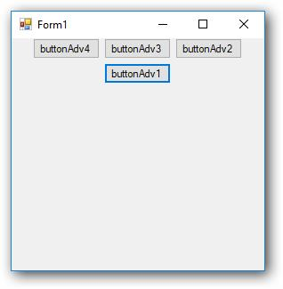

# Getting Started

This section explains how to add the `FlowLayout` control in a Windows Forms application and overview its basic functionalities.

## Assembly deployment

Refer to the [control dependencies](https://help.syncfusion.com/windowsforms/control-dependencies#flowlayout) section to get the list of assemblies or NuGet package that needs to be added as a reference to use the control in any application.

Find more details about installing the nuget packages in a Windows Forms application in the following link: [How to install nuget packages](https://help.syncfusion.com/windowsforms/nuget-packages).

## Creating the project

Create a new Windows Forms project in Visual Studio to display the `FlowLayout` with basic functionalities.

## Adding the FlowLayout control through designer

The `FlowLayout` control can be added to an application by dragging it from the toolbox to designer view. The following required assembly reference will be added automatically.

* Syncfusion.Shared.Base.dll

To add the form as a container control of the `FlowLayout`, click `Yes` in a pop-up, from which it appears automatically when FlowLayout is added.

### Adding layout components

The child controls can be added to layout by dragging it from the toolbox to designer view.

## Adding the FlowLayout control through code

To add control manually in C#, follow the given steps:

**Step 1**: Create a C# or VB.NET application through Visual Studio.

**Step 2**: Add the following required assembly reference to the project: 

	Syncfusion.Shared.Base.dll

**Step 3**: Include the required namespace.





using Syncfusion.Windows.Forms.Tools;





Imports Syncfusion.Windows.Forms.Tools





**Step 4**: Create a `FlowLayout` control instance and set `ContainerControl` as form.





FlowLayout flowLayout1 = new FlowLayout();

this.flowLayout1.ContainerControl = this;





Dim flowLayout1 As FlowLayout = New FlowLayout()

Me.flowLayout1.ContainerControl = Me





### Adding layout components

The child controls can be added to layout by simply adding it to the form since the form is its container control.





ButtonAdv buttonAdv1 = new ButtonAdv();
ButtonAdv buttonAdv2 = new ButtonAdv();
ButtonAdv buttonAdv3 = new ButtonAdv();
ButtonAdv buttonAdv4 = new ButtonAdv();

this.buttonAdv1.Text = "buttonAdv1";
this.buttonAdv2.Text = "buttonAdv2";
this.buttonAdv3.Text = "buttonAdv3";
this.buttonAdv4.Text = "buttonAdv4";

this.Controls.Add(this.buttonAdv1);
this.Controls.Add(this.buttonAdv2);
this.Controls.Add(this.buttonAdv3);
this.Controls.Add(this.buttonAdv4);





Dim buttonAdv1 As ButtonAdv = New ButtonAdv()
Dim buttonAdv3 As ButtonAdv = New ButtonAdv()
Dim buttonAdv3 As ButtonAdv = New ButtonAdv()
Dim buttonAdv4 As ButtonAdv = New ButtonAdv()

Me.buttonAdv1.Text = "buttonAdv1"
Me.buttonAdv2.Text = "buttonAdv2"
Me.buttonAdv3.Text = "buttonAdv3"
Me.buttonAdv4.Text = "buttonAdv3"

Me.Controls.Add(this.buttonAdv1)
Me.Controls.Add(this.buttonAdv2)
Me.Controls.Add(this.buttonAdv3)
Me.Controls.Add(this.buttonAdv4)





