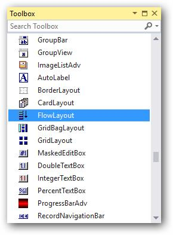
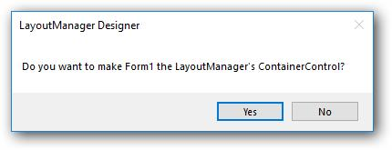
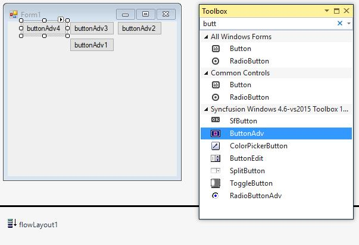
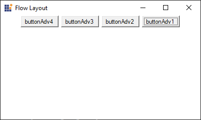
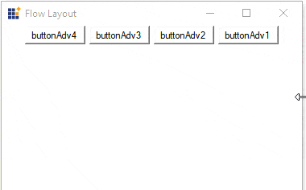

# Getting Started with WinForms Flow Layout

This section explains how to add the WinForms Flow Layout control in a Windows Forms application and overviews its basic functionalities.

## Assembly deployment

Refer to the [Control Dependencies](https://help.syncfusion.com/windowsforms/control-dependencies#flowlayout) section to get the list of assemblies or details of the NuGet package that needs to be added as a reference to use the control in any application.

Refer to this [documentation](https://help.syncfusion.com/windowsforms/installation/install-nuget-packages) to find more details about installing NuGet packages in a Windows Forms application.

## Adding the WinForms Flow Layout control via designer

1. Create a new Windows Forms application in Visual Studio.

2. Add the [WinForms Flow Layout](https://help.syncfusion.com/cr/windowsforms/Syncfusion.Windows.Forms.Tools.FlowLayout.html) control to an application by dragging it from the toolbox to design view. The following assembly will be added automatically:

    * Syncfusion.Shared.Base

3. To add the form as a container control of the WinForms Flow Layout, click **Yes** in the popup, from which it appears automatically when WinForms Flow Layout is added.

### Adding layout components

The child controls can be added to the layout by dragging them from the toolbox to the design view.

## Adding the WinForms Flow Layout control via code

To add the control manually in C# or VB, follow the given steps:

1. Create a C# or VB application in Visual Studio.

2. Add the following required assembly reference to the project:

    * Syncfusion.Shared.Base

3. Include the required namespace.




using Syncfusion.Windows.Forms.Tools;


Imports Syncfusion.Windows.Forms.Tools



{{ codesnippet1 | OrderList_Indent_Level_1 }}

4. Create a **WinForms Flow Layout** control instance, and then set `ContainerControl` as the form.




FlowLayout flowLayout1 = new FlowLayout();

flowLayout1.ContainerControl = this;


Dim flowLayout1 As FlowLayout = New FlowLayout()

Me.flowLayout1.ContainerControl = Me



{{ codesnippet2 | OrderList_Indent_Level_1 }}

### Adding layout components

The child controls can be added to the layout by simply adding them to the form since the form is its container control.



ButtonAdv buttonAdv1 = new ButtonAdv();
ButtonAdv buttonAdv2 = new ButtonAdv();
ButtonAdv buttonAdv3 = new ButtonAdv();
ButtonAdv buttonAdv4 = new ButtonAdv();

this.buttonAdv1.Text = "buttonAdv1";
this.buttonAdv2.Text = "buttonAdv2";
this.buttonAdv3.Text = "buttonAdv3";
this.buttonAdv4.Text = "buttonAdv4";

this.Controls.Add(this.buttonAdv1);
this.Controls.Add(this.buttonAdv2);
this.Controls.Add(this.buttonAdv3);
this.Controls.Add(this.buttonAdv4);


Dim buttonAdv1 As ButtonAdv = New ButtonAdv()
Dim buttonAdv2 As ButtonAdv = New ButtonAdv()
Dim buttonAdv3 As ButtonAdv = New ButtonAdv()
Dim buttonAdv4 As ButtonAdv = New ButtonAdv()

Me.buttonAdv1.Text = "buttonAdv1"
Me.buttonAdv2.Text = "buttonAdv2"
Me.buttonAdv3.Text = "buttonAdv3"
Me.buttonAdv4.Text = "buttonAdv4"

Me.Controls.Add(Me.buttonAdv1)
Me.Controls.Add(Me.buttonAdv2)
Me.Controls.Add(Me.buttonAdv3)
Me.Controls.Add(Me.buttonAdv4)



## Layout mode

To change the layout of child controls either horizontally or vertically, use the [LayoutMode](https://help.syncfusion.com/cr/windowsforms/Syncfusion.Windows.Forms.Tools.FlowLayout.html#Syncfusion_Windows_Forms_Tools_FlowLayout_LayoutMode) property.

* Horizontal




flowLayout1.LayoutMode = Syncfusion.Windows.Forms.Tools.FlowLayoutMode.Horizontal;


flowLayout1.LayoutMode = Syncfusion.Windows.Forms.Tools.FlowLayoutMode.Horizontal



{{ codesnippet3 | OrderList_Indent_Level_1 }}

* Vertical




flowLayout1.LayoutMode = Syncfusion.Windows.Forms.Tools.FlowLayoutMode.Vertical;


flowLayout1.LayoutMode = Syncfusion.Windows.Forms.Tools.FlowLayoutMode.Vertical



{{ codesnippet4 | OrderList_Indent_Level_1 }}

