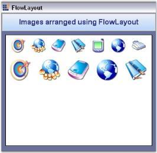

# Windows Forms LayoutManagers Overview

The `FlowLayout` is a layout manager. It allows users arrange the child components horizontally or vertically in a specific order based on the settings. FlowLayout is one of the most commonly used layout managers. By deriving from the LayoutManager class, the FlowLayout component is created to support simple horizontal and vertical flows and complex constraint-based FlowLayouts.

In its simplest form, this Layout Manager can be used to automatically arrange the child components in one or more rows.

## Key features

* **Spacing**: Provides an option to customize the horizontal and vertical gaps between the child controls.

* **Layout mode**: Provides an option to set the mode of arrangement of child controls such as horizontal or vertical.

* **Direction**: Provides an option to reverse the direction of the flow arrangement of the child controls.

* **AutoHeight**: Provides an option to set AutoHeight if the child controls exceed the given space in horizontal layout mode.

* **Alignment**: Provides an option to customize the alignment such as Center, Near, Far, and ChildConstraints.

