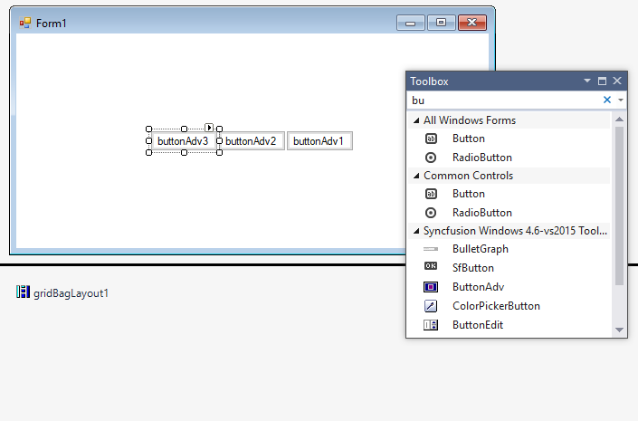
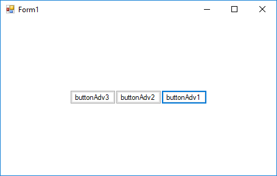
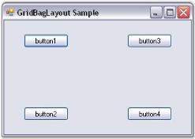
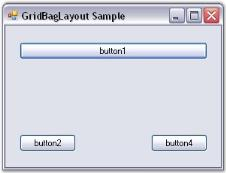
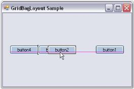

# GridBagLayout in Windows Forms Layout Manager

`GridBagLayout` is a Layout Manager which allows us to arrange the Child controls in a virtual grid of rows and columns. But, unlike the GridLayout, the size of the columns/rows can vary and the Child controls may span more than one cell.

GridBagLayout is also used to layout the following controls:

* Navigation Buttons of the Wizard control.
* Buttons of the Calculator control.

## Key features

**Anchor** - Provides option to set anchor direction for child controls.

**Cell span** - Provides options to customize row and column span of the child controls

**Fill type** - Provides option to set the position of child control such as horizontal, vertical, both or none.

**Getting started**

This section describes how to add `GridBagLayout` control in a Windows Forms application and overview of its basic functionalities.

## Assembly deployment

Refer [control dependencies](https://help.syncfusion.com/windowsforms/control-dependencies#gridbaglayout) section to get the list of assemblies or NuGet package needs to be added as reference to use the control in any application.
 
Please find more details regarding how to install the nuget packages in windows form application in the below link:
 
[How to install nuget packages](https://help.syncfusion.com/windowsforms/installation/install-nuget-packages)

**Creating simple application with GridBagLayout**

You can create the Windows Forms application with GridBagLayout control as follows:

1. [Creating project](#creating-the-project)
2. [Adding control via designer](#adding-control-via-designer)
3. [Adding control manually using code](#adding-control-manually-using-code)

**Creating the project**

Create a new Windows Forms project in the Visual Studio to display the GridBagLayout with basic functionalities.

## Adding control via designer

The GridBagLayout control can be added to the application by dragging it from the toolbox and dropping it in a designer view. The following required assembly references will be added automatically:

* Syncfusion.Shared.Base.dll

To add the form as a Container control of the GridBagLayout, a popup will appear automatically before it gets added.

**Adding Layout components through designer**

The child controls can be added to the layout by dragging it from the toolbox and dropping it in a designer view.

## Adding control manually using code

To add control manually in C#, follow the given steps:

**Step 1** - Add the following required assembly references to the project:

	* Syncfusion.Shared.Base.dll

**Step 2** - Include the namespaces **Syncfusion.Windows.Forms.Tools**.





using Syncfusion.Windows.Forms.Tools;





Imports Syncfusion.Windows.Forms.Tools



 

**Step 3** - Create `GridBagLayout` control instance and set `ContainerControl` as form.





GridBagLayout gridBagLayout1 = new GridBagLayout();

this.gridBagLayout1.ContainerControl = this;





Dim gridBagLayout1 As GridBagLayout = New GridBagLayout()

Me.gridBagLayout1.ContainerControl = Me





**Adding Layout components through code**

The child controls can be added to the layout by simply adding it to the form, since the form is its container control.





ButtonAdv buttonAdv1 = new ButtonAdv();
ButtonAdv buttonAdv2 = new ButtonAdv();
ButtonAdv buttonAdv3 = new ButtonAdv();

this.buttonAdv1.Text = "buttonAdv1";
this.buttonAdv2.Text = "buttonAdv2";
this.buttonAdv3.Text = "buttonAdv3";

this.Controls.Add(this.buttonAdv1);
this.Controls.Add(this.buttonAdv2);
this.Controls.Add(this.buttonAdv3);





Dim buttonAdv1 As ButtonAdv = New ButtonAdv()
Dim buttonAdv3 As ButtonAdv = New ButtonAdv()
Dim buttonAdv3 As ButtonAdv = New ButtonAdv()

Me.buttonAdv1.Text = "buttonAdv1"
Me.buttonAdv2.Text = "buttonAdv2"
Me.buttonAdv3.Text = "buttonAdv3"

Me.Controls.Add(this.buttonAdv1)
Me.Controls.Add(this.buttonAdv2)
Me.Controls.Add(this.buttonAdv3)





## Configuring Child controls

The GridBagLayout is completely configured through the GridBag Constraints set for each Child component. The number of rows and columns in the virtual grid is also derived from the specified constraints. The constraint for each Child component on the GridBagLayout can be specified through designer and programmatically.

**Setting the constraints through designer**

### GridPostX and GridPostY

The primary objective in setting the constraint for a Child control is usually to determine in which cell it should be laid out.

N> Multiple Child controls can occupy the same cell potentially overlapping each other.

<table>
<tr>
<th>
Child control constraints </th><th>
Description</th></tr>
<tr>
<td>
GridPostX</td><td>
Specifies the column in the virtual grid, where the component's layout bounds begin. The default value is set to -1.</td></tr>
<tr>
<td>
GridPostY</td><td>
Specifies the row in the virtual grid, where the component's layout bounds begin. The default value is set to -1.</td></tr>
</table>

The following screen shot shows four buttons with non-zero weights with the GridPostX and GridPostY setting as follows: (0, 0), (0, 1), (1 ,0), (1, 1), resulting in a 2 x 2 virtual grid.

### WeightX and WeightY

The next setting determines the weights for each row and column. The GridBagLayout determines the width and height of the rows based on the preferred size setting of the Child components. Then it allocates the extra horizontal and vertical space available between these columns and rows based on their weights. The weight of a row or column is basically the largest weight of all the Child components in that row or column.

<table>
<tr>
<td>
Child control constraints </td><td>
Description</td></tr>
<tr>
<td>
WeightX</td><td>
Specifies the weight of this component in containing the extra horizontal space. The default value is set to 'Null'.</td></tr>
<tr>
<td>
WeightY</td><td>
Specifies the weight of this component in containing the extra vertical space. The default value is set to 'Null'.</td></tr>
</table>

By default, the weights are set to 'Null', in which case, the available space is not distributed to the rows and columns at all. The virtual grid will simply be centered to the Container's client area, as shown below.

Following is another setting when the weights are different (the Child controls are set to Fill.Both).

In this screen shot, the WeightX and WeightY of button1 is (2, 1), button2 is (1, 2), button3 is (1, 1) and button4 is (1, 1). Based on these settings, the horizontal space is distributed between the 1st and 2nd column in the ratio 2:1 and the vertical space is distributed between the 2 rows in the ratio 2:1.

 

N> The GetLayoutWeights() method returns the row and column weights of the current layout.

### CellSpanX and CellSpanY

The Child controls by default span a single cell with these properties set to (1, 1). However, it can be made to span multiple rows and/or columns by changing these properties.

<table>
<tr>
<th>
Child control constraints </th><th>
Description</th></tr>
<tr>
<td>
CellSpanX</td><td>
Specifies the number of columns this component should span in the virtual grid. The default value is set to 'Null'.</td></tr>
<tr>
<td>
CellSpanY</td><td>
Specifies the number of rows this component should span in the virtual grid. The default value is set to 'Null'.</td></tr>
</table>

The below screen shot shows button1 spanning 2 columns (CellSpanX = 2 and Fill = Horizontal). This also results in button1 overlapping button3, which also occupies the (1, 0) cell.

#### Anchor

Once a Child control has been allocated the layout area (usually one or more cells) in the virtual grid, it may be anchored at the sides or the corners of that layout area. This can be done using the property given below.

<table>
<tr>
<th>
Child control constraint</th><th>
Description</th></tr>
<tr>
<td>
Anchor</td><td>
Specifies the justification of a component within it's available layout bounds (a cell in the virtual grid). The default value is set to 'Center'. The options includes are as follows.{{ '_Center_' | markdownify }}{{ '_North_' | markdownify }}{{ '_NorthEast_' | markdownify }}{{ '_East_' | markdownify }}{{ '_SouthEast_' | markdownify }}{{ '_South_' | markdownify }}{{ '_SouthWest_' | markdownify }}{{ '_West and_' | markdownify }}{{ '_NorthWest_' | markdownify }}</td></tr>
</table>

The following screenshot shows the same four buttons with different anchor settings. Button1 is set to 'NorthEast', button2 is set to 'South', button3 is set to 'East', and button4 is set to 'NorthWest'.

N> Anchoring is done within the Child control's layout area.

#### Fill

You can also make the cell fill its layout area using the below given property.

<table>
<tr>
<th>
Child control constraint</th><th>
Description</th></tr>
<tr>
<td>
Fill</td><td>
Specifies whether to resize a component when the component's layout bounds are larger than it's preferred size. The options included are as follows.{{ '_None_' | markdownify }}{{ '_Both_' | markdownify }}{{ '_Horizontal and_' | markdownify }}{{ '_Vertical_' | markdownify }}</td></tr>
</table>

The following screen shot shows the four buttons with different fill settings. In the following screen shot, button1 is set to 'Horizontal', button2 is set to 'Vertical' (with the Anchor property set to East), button3 is set to 'Both', and button4 is set to 'None'.

### IPadX and IPadY

The amount that should be added to the component's declared preferred size, when determining the preferred size for that component during layout can be specified using the properties given below.

<table>
<tr>
<th>
Child control constraints</th><th>
Description</th></tr>
<tr>
<td>
IpaddingX</td><td>
Specifies the pixels to be added to the size of the component when determining its overall width. The default value is set to 'Null'.</td></tr>
<tr>
<td>
IpaddingY</td><td>
Specifies the pixels to be added to the size of the component when determining its overall height. The default value is set to 'Null'.</td></tr>
</table>

For example, if IPadX property is set to '10', then the preferred width of the Child control will be increased by 10 from that of the declared preferred size.

### Insets rectangle

The padding that is to be added around the Child component can be specified using the property given below. Similar to the IPadding settings above, this space will be added to the Child control's preferred size when calculating the layout. However, unlike the IPadding settings, this will not increase the size of the Child control, but indicates the minimum padding to be applied around the Child control.

<table>
<tr>
<th>
Child control constraint</th><th>
Description</th></tr>
<tr>
<td>
Insets</td><td>
Specifies the extra space that the manager adds around a component's preferred bounds before layouting the component. The default value is set to 'Null'.</td></tr>
</table>

The buttons below are all of equal non-zero weights and set to Fill.Both. However, they have an Insets property of (5,5,5,5), giving it a padding of 5 pixels on all sides.

The methods associated with the above properties are given below.

<table>
<tr>
<th>
Methods</th><th>
Description</th></tr>
<tr>
<td>
GetConstraints</td><td>
Returns the constraints associated with the specified control.</td></tr>
<tr>
<td>
GetConstraintsRef</td><td>
Returns a reference to the constraints associated with the specified control.</td></tr>
<tr>
<td>
SetConstraints</td><td>
Specifies the constraints associated with the specified control.</td></tr>
</table>

In code, you can specify constraints through the SetConstraints() method. The GridBagConstraints type defines the constraint that can be specified on a Child component.

**Setting the constraints programmatically**

In the code given below, the GridBagLayout constraints can be set for the controls along with the constraint values for Insets, WeightX, WeightY, Anchor, Fill, GridPostX, GridPostY, IPadX and IPadY.

The value of the `GridBagConstraints` can be specified on a Child component as the below.

**GridBagConstraints(int gridPosX, int gridPosY, int cellSpanX, int cellSpanY, double weightX, double weightY, AnchorTypes anchor, FillType fill, Insets insets, int IPadX, int IPadY, bool isEmpty)** 





this.gridBayLayout.SetConstraints(this.button1, new Syncfusion.Windows.Forms.Tools.GridBagConstraints(0, 0, 3, 1, 1, 1, Syncfusion.Windows.Forms.Tools.AnchorTypes.Center, Syncfusion.Windows.Forms.Tools.FillType.Both, new Syncfusion.Windows.Forms.Tools.Insets(0, 0, 0, 0), 0, 0, false));





Me.gridBayLayout.SetConstraints(Me.button1, New Syncfusion.Windows.Forms.Tools.GridBagConstraints(0, 0, 3, 1, 1, 1, Syncfusion.Windows.Forms.Tools.AnchorTypes.Center, Syncfusion.Windows.Forms.Tools.FillType.Both, New Syncfusion.Windows.Forms.Tools.Insets(0, 0, 0, 0), 0, 0, False))




## Rearranging the controls laid out by GridBagLayout

Similar to the FlowLayout and GridLayout Managers, the Child controls of the GridBagLayout can also be rearranged by dragging and dropping them at design time.



[ Creating a Simple Layout](/windowsforms/layoutmanagers/creating-a-simple-layout), [Rearranging the Controls laid out by FlowLayout](/windowsforms/layoutmanagers/flowlayout#rearranging-the-controls-laid-out-by-flowlayout), and [Rearranging the Controls laid out by GridLayout.](/windowsforms/layoutmanagers/gridlayout#rearranging-the-controls-laid-out-by-gridlayout)

