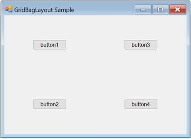
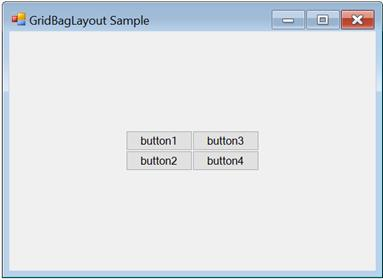
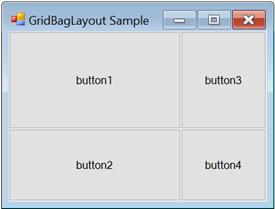
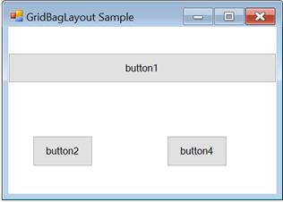
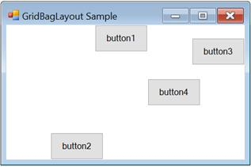
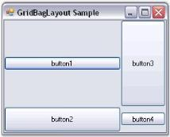
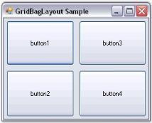
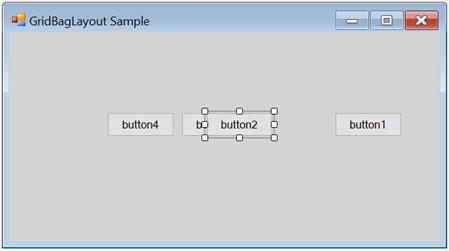

# Configuring Child Controls in Windows Forms LayoutManagers

The `GridBagLayout` is completely configured through the GridBag constraints set for each child component. The number of rows and columns in the virtual grid is also derived from the specified constraints. The constraints for each child component on the GridBagLayout can be specified through designer and programmatically.

## Through designer

This section explains how to set the `GridBagLayout` constraints to the controls in designer view.

### GridPostX and GridPostY

The primary objective in setting the constraint for a child control is usually to determine in which cell it should be laid out.

N> Multiple child controls can occupy a same cell potentially by overlapping each other.

<table>
<tr>
<th>
Child control constraints</th><th>
Description</th></tr>
<tr>
<td>
GridPostX</td><td>
Specifies the column in the virtual grid, where the component’s layout bounds begin. The default value is set to -1.</td></tr>
<tr>
<td>
GridPostY</td><td>
Specifies the row in the virtual grid, where the component’s layout bounds begin. The default value is set to -1.</td></tr>
</table>

The following screenshot illustrates the following four buttons with non-zero weights with the GridPostX and GridPostY settings: (0,0) (0,1) (1,0), and (1,1), which result in a 2x2 virtual grid.

### WeightX and WeightY

The next setting determines the weights for each row and column. The GridBagLayout determines the width and height of the rows based on the preferred size settings of the child components. Then, it allocates the extra horizontal and vertical spaces available between these columns and rows based on their weights. The weight of a row or column is basically the largest weight of all the child components in that row or column.

<table>
<tr>
<th>
Child control constraints</th><th>
Description</th></tr>
<tr>
<td>
WeightX</td><td>
Specifies the weight of this component in obtaining the extra horizontal space. The default value is set to ‘Null’.</td></tr>
<tr>
<td>
WeightY</td><td>
Specifies the weight of this component in obtaining the extra vertical space. The default value is set to ‘Null’.</td></tr>
</table>

By default, the weights are set to ‘Null’, in which the available space is not distributed to the rows and columns. The virtual grid will simply be centered to the container’s client area as shown in the following screenshot.

The following setting describes different weights (the child controls are set to Fill.Both).

In the following screenshot, the WeightX and WeightY of button 1 is (2,1), button 2 is (1,2), button 3 is (1,1), and button 4 is (1,1). Based on these settings, the horizontal space is distributed between the 1st and 2nd columns in the ratio 2:1, and the vertical space is distributed between the 2 rows in the ratio 2:1.

N> The GetLayoutWeights() method returns the row and column weights of the current layout.

### CellSpanX and CellSpanY

The child controls span a single cell with the properties set to (1,1) by default. However, it can be made to span multiple rows and/or columns by changing the following properties:

<table>
<tr>
<th>
Child control constraints</th><th>
Description</th></tr>
<tr>
<td>
CellSpanX</td><td>
Specifies the number of columns this component should span in the virtual grid. The default value is set to ‘Null’.</td></tr>
<tr>
<td>
CellSpanY</td><td>
Specifies the number of rows this component should span in the virtual grid. The default value is set to ‘Null’.</td></tr>
</table>

The following screenshot illustrates button 1 is spanning to two columns (CellSpanX = 2 and Fill = Horizontal). This also results in button 1 overlapping button 3, which also occupies the (1, 0) cell.

### Anchor

After a child control has been allocated to the layout area (usually one or more details) in the virtual grid, it may be anchored at the sides or the corners of that layout area. This can be done using the following property.

<table>
<tr>
<th>
Child Control Constraints</th><th>
Description</th></tr>
<tr>
<td>
Anchor</td><td>
Specifies the justification of a component within its available layout bounds (a cell in the virtual grid). The default value is set to the ‘center’. The options included are Center, North, NorthEast, East, SouthEast, South, SouthWest, West, and NorthWest.</td></tr>
</table>

The following screenshot illustrates the same four buttons with different anchor settings. Button 1 is set to ‘NorthEast’, button 2 is set to ‘South’, button 3 is set to ‘East’, and button 4 is set to ‘NorthWest’.

N> Anchoring is done within the child control’s layout area.

### Fill

You can also make the cell fill its layout area using the following property.

<table>
<tr>
<th>
Child control constraints</th><th>
Description</th></tr>
<tr>
<td>
Fill</td><td>
Specifies whether to resize a component when the component's layout bounds are larger than its preferred size. The options included are None, Both, Horizontal, and Vertical.</td></tr>
</table>

The following screenshot illustrates the four buttons with different fill settings. In the following screenshot, button 1 is set to ‘Horizontal’, button 2 is set to ‘Vertical’ (with the Anchor property set to East), button 3 is set to ‘Both’, and button 4 is set to ‘None’.

### IPadX and IPadY

The amount should be added to the component’s declared preferred size when determining the preferred size for the component, during which layout can be specified using the following properties.

<table>
<tr>
<th>
Child control constraints</th><th>
Description</th></tr>
<tr>
<td>
IPaddingX</td><td>
Specifies the amount in pixels to add to the size of the component when determining its overall width. The default value is set to 'Null'.</td></tr>
<tr>
<td>
IPaddingY</td><td>
Specifies the amount in pixels to add to the size of the component when determining its overall height. The default value is set to ‘Null’.</td></tr>
</table>

For example, if the IPadX property is set to ‘10’, then the preferred width of the child control will be increased by 10 from the declared preferred size.

### Insets rectangle

The padding to be added around the child component can be specified using the following property. Similar to the IPadding settings above, this space will be added to the child control’s preferred size when calculating the layout. Unlike the IPadding settings, this will not increase the size of the child control, but indicates the minimum padding to be applied around the child control.

<table>
<tr>
<th>
Child control constraints</th><th>
Description</th></tr>
<tr>
<td>
Insets  </td><td>
Specifies the extra space that the manager adds around a component's preferred bounds before layouting the component. The default value is set to 'Null'.</td></tr>
</table>

The buttons in the following screenshot are all of equal non-zero weights and set to Fill.Both. However, they have an Insets property of (5,5,5,5); it gives a padding of 5 pixels on all sides.

The methods associated with the above properties are given in the following table.

<table>
<tr>
<th>
Methods</th><th>
Description</th></tr>
<tr>
<td>
GetConstraints</td><td>
Returns the constraints associated with the specified control.</td></tr>
<tr>
<td>
GetConstraintsRef</td><td>
Returns a reference to the constraints associated with the specified control.</td></tr>
<tr>
<td>
SetConstraints</td><td>
Specifies the constraints associated with the specified control.</td></tr>
</table>

In code, you can specify constraints through the SetConstraints() method. The GridBagConstraints type defines the constraint that can be specified on a child component.

## Through Code

In the following code, the GridBagLayout constraints can be set for the controls along with the constraint values for Insets, WeightX, WeightY, Anchor, Fill, GridPostX, GridPostY, IPadX, and IPadY.

The value of the `GridBagConstraints` can be specified on a child component as shown in the following.

<table>
<tr>
<td>
GridBagConstraints(int gridPosX, int gridPosY, int cellSpanX, int cellSpanY, double weightX, double weightY, AnchorTypes anchor, FillType fill, Insets insets, int IPadX, int IPadY, bool isEmpty)  </td></tr>
</table>





this.gridBayLayout.SetConstraints(this.button1, new Syncfusion.Windows.Forms.Tools.GridBagConstraints(0, 0, 3, 1, 1, 1, Syncfusion.Windows.Forms.Tools.AnchorTypes.Center, Syncfusion.Windows.Forms.Tools.FillType.Both, new Syncfusion.Windows.Forms.Tools.Insets(0, 0, 0, 0), 0, 0, false));





Me.gridBayLayout.SetConstraints(Me.button1, New Syncfusion.Windows.Forms.Tools.GridBagConstraints(0, 0, 3, 1, 1, 1, Syncfusion.Windows.Forms.Tools.AnchorTypes.Center, Syncfusion.Windows.Forms.Tools.FillType.Both, New Syncfusion.Windows.Forms.Tools.Insets(0, 0, 0, 0), 0, 0, False))





## Rearranging the controls laid out by GridBagLayout

Similar to the FlowLayout and GridLayout Managers, the child controls of the GridBagLayout can also be rearranged by dragging and dropping them at design time.

