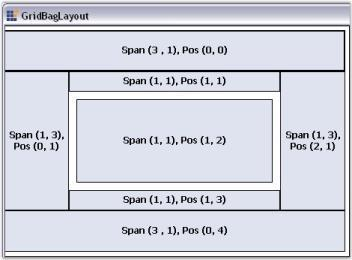

# Windows Forms LayoutManagers Overview

`GridBagLayout` is a layout manager. It allows you arrange the child controls in a virtual grid of rows and columns. But, unlike the GridLayout, the size of the columns/rows varies, and the child controls may span to more than one cell.

`GridBagLayout` is also used to layout the following controls:

* Navigation buttons of the Wizard control.
* Buttons of the Calculator control.

## Key features

* **Anchor**: Provides an option to set anchor direction for child controls.

* **Cell span**: Provides an option to customize row and column span of the child controls.

* **Fill type**: Provides an option to set the position of child control such as horizontal, vertical, both, or none.
