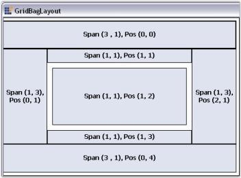

# About Syncfusion® Windows Forms GridBagLayout Control

`GridBagLayout` is a layout manager that arranges child controls in a virtual grid of rows and columns. Unlike `GridLayout`, the size of the rows and columns can vary, and child controls can span more than one cell.

`GridBagLayout` is also used to layout the following controls:

* Navigation buttons in the Wizard control.
* Buttons in the Calculator control.

## Key features

* **Anchor**: Provides an option to set anchor direction for child controls.

* **Cell span**: Provides an option to customize row and column span of the child controls.

* **Fill type**: Provides an option to set the position of child control such as horizontal, vertical, both, or none.
