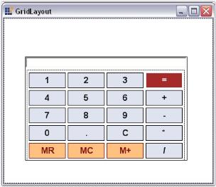
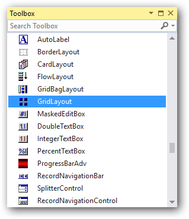
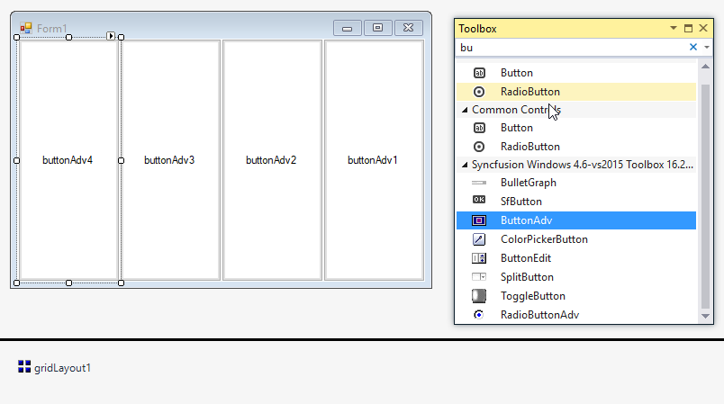

# GridLayout in Windows Forms Layout Manager

`GridLayout` is a Layout Manager that allows us to arrange the Child controls as in a grid containing rows and columns. Deriving from the Layout Manager base, the GridLayout inherits all the functionality that the Layout Manager type exposes. In its simplest form, this Layout Manager can be used to automatically arrange the Child components in one or more rows, as illustrated below.

## Key features

**Rows and columns** - Provides options to customize row and column span of the child controls

**HGap and VGap** - Provides option to set the gaps between child control such as horizontal and vertical direction

**Getting started**

This section describes how to add `GridLayout` control in a Windows Forms application and overview of its basic functionalities.

## Assembly deployment

Refer [control dependencies](https://help.syncfusion.com/windowsforms/control-dependencies#gridlayout) section to get the list of assemblies or NuGet package needs to be added as reference to use the control in any application.
 
Please find more details regarding how to install the nuget packages in windows form application in the below link:
 
[How to install nuget packages](https://help.syncfusion.com/windowsforms/installation/install-nuget-packages)

**Creating simple application with GridLayout**

You can create the Windows Forms application with GridLayout control as follows:

1. [Creating project](#creating-the-project)
2. [Adding control via designer](#adding-control-via-designer)
3. [Adding control manually using code](#adding-control-manually-using-code)

**Creating the project**

Create a new Windows Forms project in the Visual Studio to display the GridLayout with basic functionalities.

## Adding control via designer

The GridLayout control can be added to the application by dragging it from the toolbox and dropping it in a designer view. The following required assembly references will be added automatically:

* Syncfusion.Shared.Base.dll

To add the form as a Container control of the GridLayout, a popup will appear automatically before it gets added.

**Adding Layout components through designer**

The child controls can be added to the layout by dragging it from the toolbox and dropping it in a designer view.

## Adding control manually using code

To add control manually in C#, follow the given steps:

**Step 1** - Add the following required assembly references to the project:

	* Syncfusion.Shared.Base.dll

**Step 2** - Include the namespaces **Syncfusion.Windows.Forms.Tools**.





using Syncfusion.Windows.Forms.Tools;





Imports Syncfusion.Windows.Forms.Tools



 

**Step 3** - Create `GridLayout` control instance and set `ContainerControl` as form.





GridLayout gridLayout1 = new GridLayout();

this.gridLayout1.ContainerControl = this;





Dim gridLayout1 As GridLayout = New GridLayout()

Me.gridLayout1.ContainerControl = Me





**Adding layout components through code**

The child controls can be added to the layout by adding it to the form and adding them as a layout member using `SetParticipateInLayout` method.





ButtonAdv buttonAdv1 = new ButtonAdv();
ButtonAdv buttonAdv2 = new ButtonAdv();
ButtonAdv buttonAdv3 = new ButtonAdv();
ButtonAdv buttonAdv4 = new ButtonAdv();

this.buttonAdv1.Text = "buttonAdv1";
this.buttonAdv2.Text = "buttonAdv2";
this.buttonAdv3.Text = "buttonAdv3";
this.buttonAdv4.Text = "buttonAdv3";

this.Controls.Add(this.buttonAdv1);
this.Controls.Add(this.buttonAdv2);
this.Controls.Add(this.buttonAdv3);
this.Controls.Add(this.buttonAdv4);

this.gridLayout1.SetParticipateInLayout(this.button1, true);
this.gridLayout1.SetParticipateInLayout(this.button2, true);
this.gridLayout1.SetParticipateInLayout(this.button3, true);
this.gridLayout1.SetParticipateInLayout(this.button4, true);





Dim buttonAdv1 As ButtonAdv = New ButtonAdv()
Dim buttonAdv3 As ButtonAdv = New ButtonAdv()
Dim buttonAdv3 As ButtonAdv = New ButtonAdv()
Dim buttonAdv4 As ButtonAdv = New ButtonAdv()

Me.buttonAdv1.Text = "buttonAdv1"
Me.buttonAdv2.Text = "buttonAdv2"
Me.buttonAdv3.Text = "buttonAdv3"
Me.buttonAdv4.Text = "buttonAdv4"

Me.Controls.Add(this.buttonAdv1)
Me.Controls.Add(this.buttonAdv2)
Me.Controls.Add(this.buttonAdv3)
Me.Controls.Add(this.buttonAdv4)

Me.gridLayout1.SetParticipateInLayout(Me.button1, true);
Me.gridLayout1.SetParticipateInLayout(Me.button2, true);
Me.gridLayout1.SetParticipateInLayout(Me.button3, true);
Me.gridLayout1.SetParticipateInLayout(Me.button4, true);





## Configuring GridLayout

### Rows and columns

The GridLayout simply divides the available space into a number of rows and columns based on the number of Child controls. The number of rows and columns can be specified using the properties given below.

<table>
<tr>
<th>
GridLayout property</th><th>
Description</th></tr>
<tr>
<td>
Rows</td><td>
Specifies the number of rows in the grid.</td></tr>
<tr>
<td>
Columns</td><td>
Specifies the number of columns in the grid.</td></tr>
</table>

The Rows property usually dictates the number of columns (overriding the Columns property setting) based on the number of Child controls, unless the Rows property is set to 'Null' or less, in which case the Columns property will dictate the number of rows.

The following code snippet arranges the Child controls in one column and two rows.





this.gridLayout1.Rows = 2;

this.gridLayout1.Columns = 1;




Me.gridLayout1.Rows = 2

Me.gridLayout1.Columns = 1




## HGap and VGap

The horizontal and the vertical gap between the Child controls can be set using the properties given below.

<table>
<tr>
<th>
GridLayout property</th><th>
Description</th></tr>
<tr>
<td>
HGap</td><td>
Gets/sets the horizontal spacing between the components.</td></tr>
<tr>
<td>
VGap</td><td>
Gets/sets the vertical spacing between the components.</td></tr>
</table>




this.gridLayout1.HGap=10;

this.gridLayout1.VGap=10;




Me.gridLayout1.HGap=10

Me.gridLayout1.VGap=10





 

N> To include some margin space along the borders, refer_ Margin Settings.

## Configuring Child controls

The following settings can be used to configure the Child controls of the GridLayout Manager.

### ParticipateInLayout

To prevent a Child control from being laid out using the GridLayout Manager, the below given property can be used.

<table>
<tr>
<th>
Child control property</th><th>
Description</th></tr>
<tr>
<td>
ParticipateInLayout</td><td>
Specifies whether the Child control should participate in the GridLayout. The default value is set to `true`.</td></tr>
</table>

The methods associated with the above property are given below.

<table>
<tr>
<th>
Methods</th><th>
Description</th></tr>
<tr>
<td>
GetParticipateInLayout</td><td>
Indicates whether the component is in the layout list.</td></tr>
<tr>
<td>
SetParticipateInLayout</td><td>
Adds or removes the specified control from the layout list.</td></tr>
</table>

The following code can be used to add or remove the control from the GridLayout list programmatically.





this.gridLayout1.SetParticipateInLayout(this.button1,false);




Me.gridLayout1.SetParticipateInLayout(Me.button1,False)




## Rearranging the controls laid out by GridLayout

The Child controls of the GridLayout can be rearranged by dragging-and-dropping them at design time.



[Creating a Simple Layout](/windowsforms/layoutmanagers/creating-a-simple-layout), [Rearranging the Controls laid out by FlowLayout](/windowsforms/layoutmanagers/flowlayout#rearranging-the-controls-laid-out-by-flowlayout), and [Rearranging the Controls laid out by GridBagLayout](/windowsforms/layoutmanagers/gridbaglayout#rearranging-the-controls-laid-out-by-gridbaglayout).

