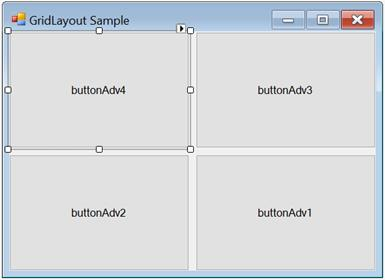
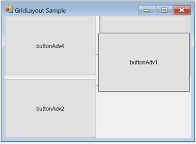

# Configuring GridLayout in Windows Forms LayoutManagers

The configuration settings for `GridLayout` have been given in this section.

## Rows and columns

The `GridLayout` simply divides the available space into a number of rows and columns based on the number of child controls. The number of rows and columns can be specified using the following properties.

<table>
<tr>
<th>
GridLayout property</th><th>
Description</th></tr>
<tr>
<td>
Rows</td><td>
Specifies the number of rows in the grid.</td></tr>
<tr>
<td>
Columns</td><td>
Specifies the number of columns in the grid.</td></tr>
</table>

The `Rows` property usually dictates the number of columns (overriding the columns property setting) based on the number of child controls unless the Rows property is set to ‘Null’ or less, so the `Columns` property will dictate the number of rows.

The following code snippet demonstrates how to arrange the child controls in one column and two rows.





this.gridLayout1.Rows = 2;

this.gridLayout1.Columns = 1;





Me.gridLayout1.Rows = 2

Me.gridLayout1.Columns = 1





### HGap and VGap

The horizontal and vertical gaps between the child controls can be set using the following properties.

<table>
<tr>
<th>
GridLayout property</th><th>
Description</th></tr>
<tr>
<td>
HGap</td><td>
Specifies the horizontal spacing between the layout border and the components.</td></tr>
<tr>
<td>
VGap</td><td>
Specifies the vertical spacing between the layout border and the components.</td></tr>
</table>





this.gridLayout1.HGap=10;

this.gridLayout1.VGap=10;





Me.gridLayout1.HGap=10

Me.gridLayout1.VGap=10





## Configuring child controls

The following settings can be used to configure the child controls of the GridLayout manager.

### ParticipateInLayout

To prevent a child control from being laid out using the GridLayout manager, use the following property.

<table>
<tr>
<th>
ChildControl property</th><th>
Description</th></tr>
<tr>
<td>
ParticipateInLayout</td><td>
Specifies whether the child control should participate in the GridLayout. The default value is set to `true`.</td></tr>
</table>

The methods associated with the above properties are given in the following table.

<table>
<tr>
<th>
Methods</th><th>
Description</th></tr>
<tr>
<td>
GetParticipateInLayout</td><td>
Indicates whether the component is in the layout list.</td></tr>
<tr>
<td>
SetParticipateInLayout</td><td>
Adds or removes the specified control from the layout list.</td></tr>
</table>

The following code is used to add or remove the control from the GridLayout list programmatically.





this.gridLayout1.SetParticipateInLayout(this.button1,false);





Me.gridLayout1.SetParticipateInLayout(Me.button1,False)





## Rearranging the controls laid out by GridLayout

The child controls of the GridLayout can be rearranged by dragging and dropping them at design time.

