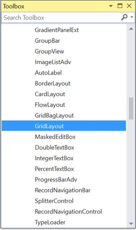
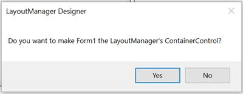
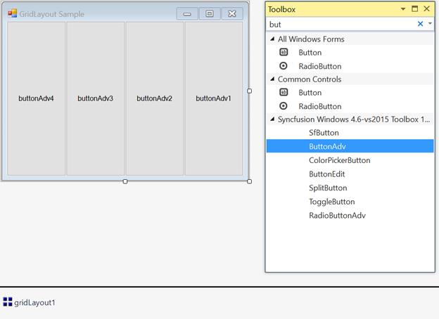

# Getting Started with Windows Forms GridLayout

This section explains how to add the `GridLayout` control in a Windows Forms application and overview its basic functionalities.

## Assembly deployment

Refer to the [control dependencies](https://help.syncfusion.com/windowsforms/control-dependencies#gridlayout) section to get the list of assemblies or NuGet package needs to be added as reference to use the control in any application.

Find more details about installing the nuget packages in a Windows Forms application in the following link: [How to install nuget packages](https://help.syncfusion.com/windowsforms/installation/install-nuget-packages).

## Creating the project

Create a new Windows Forms project in Visual Studio to display the GridLayout with basic functionalities.

## Through Designer

The `GridLayout` control can be added to an application by dragging it from the toolbox to designer view. The following required assembly reference will be added automatically.

* Syncfusion.Shared.Base.dll

A pop-up will appear automatically to add the form as a container control of the `GridLayout`.

### Adding layout components through designer

The child controls can be added to the layout by dragging it from the toolbox to designer view.

## Through code

The `GridLayout` control can be created programmatically using the following steps:

**Step 1**: Create a C# or VB.NET application through Visual Studio.

**Step 2**: Add the following required assembly reference to the project: 

	Syncfusion.Shared.Base.dll

**Step 3**: Include the required namespace.





using Syncfusion.Windows.Forms.Tools;





Imports Syncfusion.Windows.Forms.Tools





**Step 4**: Create a `GridLayout` control instance, and get the `ContainerControl` as form.





GridLayout gridLayout1 = new GridLayout();

this.gridLayout1.ContainerControl = this;





Dim gridLayout1 As GridLayout = New GridLayout()

Me.gridLayout1.ContainerControl = Me





### Adding layout components through code

The child controls can be added to the layout by adding them to the form as layout members using the `SetParticipateInLayout` method.





ButtonAdv buttonAdv1 = new ButtonAdv();
ButtonAdv buttonAdv2 = new ButtonAdv();
ButtonAdv buttonAdv3 = new ButtonAdv();
ButtonAdv buttonAdv4 = new ButtonAdv();

this.buttonAdv1.Text = "buttonAdv1";
this.buttonAdv2.Text = "buttonAdv2";
this.buttonAdv3.Text = "buttonAdv3";
this.buttonAdv4.Text = "buttonAdv3";

this.Controls.Add(this.buttonAdv1);
this.Controls.Add(this.buttonAdv2);
this.Controls.Add(this.buttonAdv3);
this.Controls.Add(this.buttonAdv4);

this.gridLayout1.SetParticipateInLayout(this.buttonAdv1, true);
this.gridLayout1.SetParticipateInLayout(this.buttonAdv2, true);
this.gridLayout1.SetParticipateInLayout(this.buttonAdv3, true);
this.gridLayout1.SetParticipateInLayout(this.buttonAdv4, true);





Dim buttonAdv1 As ButtonAdv = New ButtonAdv()
Dim buttonAdv3 As ButtonAdv = New ButtonAdv()
Dim buttonAdv3 As ButtonAdv = New ButtonAdv()
Dim buttonAdv4 As ButtonAdv = New ButtonAdv()

Me.buttonAdv1.Text = "buttonAdv1"
Me.buttonAdv2.Text = "buttonAdv2"
Me.buttonAdv3.Text = "buttonAdv3"
Me.buttonAdv4.Text = "buttonAdv4"

Me.Controls.Add(this.buttonAdv1)
Me.Controls.Add(this.buttonAdv2)
Me.Controls.Add(this.buttonAdv3)
Me.Controls.Add(this.buttonAdv4)

Me.gridLayout1.SetParticipateInLayout(Me.buttonAdv1, true)
Me.gridLayout1.SetParticipateInLayout(Me.buttonAdv2, true)
Me.gridLayout1.SetParticipateInLayout(Me.buttonAdv3, true)
Me.gridLayout1.SetParticipateInLayout(Me.buttonAdv4, true)





