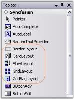

# Windows Forms LayoutManagers Overview

## Layout Manager

The Layout Manager is the base type of all components, providing a basic layout management Framework over which the individual managers build on. It provides fundamental information on the five layout managers included in this package which are listed below.

## BorderLayout

This Layout Manager will layout the Child controls along the borders and at the center, just like the .NET framework's built-in docking support.

## CardLayout

This Layout Manager shows one Child control at a time in a Container.

## FlowLayout

This Layout Manager will layout the Child components horizontally or vertically in a specific order, based on constraints. FlowLayout is one of the most commonly used Layout Managers.

## GridLayout

This Layout Manager will layout Child controls in the form of a grid containing rows and columns.

## GridBagLayout

This Layout Manager will layout the Child controls in a virtual grid of rows and columns. But, unlike the GridLayout, the size of the columns / rows can be varied and the children may span more than one cell.

## Container control

Container control is a control on which the Layout Manager is dropped or for which the layout is designed. All controls that inherit the System.Windows.Forms.ContainerControl can act as a Container control.

Windows Form and Panel controls are the most widely used Container controls.

## Child control

Child controls can be added to the Container control by just dragging and dropping the controls from the toolbox.

The Layout Managers can be associated with any Container control property. The Layout Managers will then automatically layout their Child controls based on specific constraints. They can also be used to layout the non-control-based components that are derived from a specific interface (LayoutItemBase) drawn within the Container.

N> The Container control will be referred by its property name as ContainerControl and it's children referred to as Child components (emphasizing the fact that the children need not be a control-derived class) in this document.



[BorderLayout](/windowsforms/layoutmanagers/borderlayout), [CardLayout](/windowsforms/layoutmanagers/cardlayout), [FlowLayout](/windowsforms/layoutmanagers/flowlayout), [GridLayout](/windowsforms/layoutmanagers/gridlayout), [GridBagLayout](/windowsforms/layoutmanagers/gridbaglayout)

