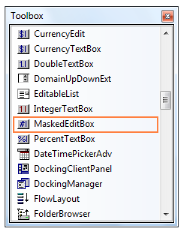
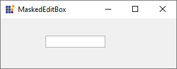

# Getting Started

This section briefly describes how to create a new Windows Forms project in Visual Studio, and add the **MaskedEditBox** control with its basic functionalities.

## Assembly deployment

Refer to the [control dependencies](https://help.syncfusion.com/windowsforms/control-dependencies#maskededitbox) section to get the list of assemblies or NuGet package details that need to be added as reference to use the control in any application.

[Click here](https://help.syncfusion.com/windowsforms/visual-studio-integration/nuget-packages) to find more details on how to install NuGet packages in a Windows Forms application.

## Adding the MaskedEditBox control via designer

The following steps describes how to create the **MaskedEditBox** control via designer.

1) Create a new Windows Forms application in Visual Studio.

2) The [MaskedEditBox](https://help.syncfusion.com/cr/windowsforms/Syncfusion.Shared.Base~Syncfusion.Windows.Forms.Tools.MaskedEditBox.html) control can be added to an application by dragging it from the toolbox to the design view. The following dependent assemblies will be added automatically.

* Syncfusion.Shared.Base

3) Set the symbols in [Mask](https://help.syncfusion.com/cr/windowsforms/Syncfusion.Shared.Base~Syncfusion.Windows.Forms.Tools.MaskedEditBox~Mask.html) property for the control. This property controls the behavior of control at run time.

If no mask is specified, the control will behave the same as a standard Windows Forms TextBox control.

## Adding the MaskedEditBox control via code

The following steps illustrate how to create an **MaskedEditBox** control programmatically.

1) Create a C# or VB application via Visual Studio.

2) Add the following assembly reference to the project.

* Syncfusion.Shared.Base

3) Include the required namespace.





using Syncfusion.Windows.Forms.Tools;





Imports Syncfusion.Windows.Forms.Tools





4) Create an instance of [MaskedEditBox](https://help.syncfusion.com/cr/windowsforms/Syncfusion.Shared.Base~Syncfusion.Windows.Forms.Tools.MaskedEditBox.html) control and add it to the form.



  
private Syncfusion.Windows.Forms.Tools.MaskedEditBox maskedEditBox1;
this.maskedEditBox1=new MaskedEditBox();
this.Controls.Add(this.maskedEditBox1);





Private maskedEditBox1 As Syncfusion.Windows.Forms.Tools.MaskedEditBox
Me.maskedEditBox1 = New MaskedEditBox()
Me.Controls.Add(Me.maskedEditBox1)





## Mask settings

You can set some common symbols for [Mask](https://help.syncfusion.com/cr/windowsforms/Syncfusion.Shared.Base~Syncfusion.Windows.Forms.Tools.MaskedEditBox~Mask.html) property. For example, the symbols are set as like "##:##".

N> The **#** symbol allows numeric entry only in that position.

Examples of some common masks are,

<table>
<tr>
<th>
Mask</th><th>
Usage</th></tr>
<tr>
<td>
###-##-####</td><td>
US Social security number mask( the '-' symbol is literal). Example 222-22-2222.</td></tr>
<tr>
<td>
(###) ### ####</td><td>
US Telephone number mask. Example (919) 481 1974.</td></tr>
<tr>
<td>
##/##/####</td><td>
Short date mask. Example 04/14/2005.</td></tr>
<tr>
<td>
##:##</td><td>
Short time mask. Example 12:24.</td></tr>
<tr>
<td>
>?<????????????</td><td>
First name or last name. The first letter is uppercase and the other letters are all lowercase. Example: Syncfusion.</td></tr>
</table>





// The mask string.
this.maskedEditBox1.Mask = ">?<???? ??????";
this.maskedEditBox1.Location = new System.Drawing.Point(70, 29);





' The mask string.
Me.maskedEditBox1.Mask = ">?<???? ??????"
Me.maskedEditBox1.Location = New System.Drawing.Point(70, 29);





