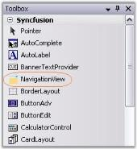
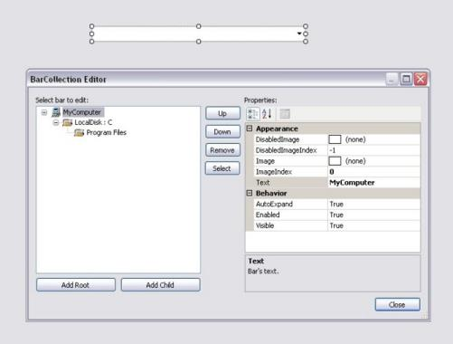
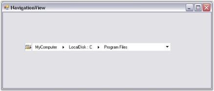

# Creating NavigationView in Windows Forms

Navigation View can be created in the following ways:

## Through designer

To create a NavigationView control, follow the given steps.

1. Drag the NavigationView control from the controls toolbox onto your form.

   

2. Add Parent Bars and Child Bars to the NavigationView control using the BarCollection Editor.

   

## Through code

To create a NavigationView control programmatically, follow the given steps.

3. Include the Tools Windows namespace to the .cs/.vb file.

    

	

        using Syncfusion.Windows.Forms.Tools;

    

	

        Imports Syncfusion.Windows.Forms.Tools

    

	 

4. Create an instance of the NavigationView control and add Parent Bars and Child Bars to it.

  	

	

        //Creating instance of NavigationView

        NavigationView navigationView4 = new NavigationView();

        // Creating instance of Bars 

		Syncfusion.Windows.Forms.Tools.Navigation.Bar root = new Syncfusion.Windows.Forms.Tools.Navigation.Bar();

		Syncfusion.Windows.Forms.Tools.Navigation.Bar ChildBar1 = new Syncfusion.Windows.Forms.Tools.Navigation.Bar();

		Syncfusion.Windows.Forms.Tools.Navigation.Bar ChildBar2 = new Syncfusion.Windows.Forms.Tools.Navigation.Bar();

		root.ImageIndex = 0;

		root.Text = "MyComputer";

		ChildBar1.ImageIndex = 1;

		ChildBar1.Text = "LocalDisk : C";

		ChildBar2.ImageIndex = 1;

		ChildBar2.Text = "Program Files";

		// Adding child bars into root

		ChildBar1.Bars.AddRange(new Syncfusion.Windows.Forms.Tools.Navigation.Bar[] {

		ChildBar2});

		root.Bars.AddRange(new Syncfusion.Windows.Forms.Tools.Navigation.Bar[] {

		ChildBar1});

		// Adding the root into NavigationView

		navigationView4.Bars.AddRange(new Syncfusion.Windows.Forms.Tools.Navigation.Bar[] {

		root});

		navigationView4.ImageList = this.imageList1;

		navigationView4.Location = new System.Drawing.Point(250, 300);

		navigationView4.Name = "navigationView";

		navigationView4.Size = new System.Drawing.Size(343, 21);

		navigationView4.TabIndex = 0;

		navigationView4.Text = "navigationView";

		// Setting the Visual Style into Vista

		navigationView4.VisualStyle = Syncfusion.Windows.Forms.Tools.Navigation.VisualStyles.Vista;

		this.Controls.Add(navigationView4);

    

	

        'Creating instance of NavigationView

		Dim navigationView4 As NavigationView = New NavigationView()

		' Creating instance of Bars 

		Dim root As Syncfusion.Windows.Forms.Tools.Navigation.Bar = New Syncfusion.Windows.Forms.Tools.Navigation.Bar()

		Dim ChildBar1 As Syncfusion.Windows.Forms.Tools.Navigation.Bar = New Syncfusion.Windows.Forms.Tools.Navigation.Bar()

		Dim ChildBar2 As Syncfusion.Windows.Forms.Tools.Navigation.Bar = New Syncfusion.Windows.Forms.Tools.Navigation.Bar()

		root.ImageIndex = 0

		root.Text = "MyComputer"

		ChildBar1.ImageIndex = 1

		ChildBar1.Text = "LocalDisk : C"

		ChildBar2.ImageIndex = 1

		ChildBar2.Text = "Program Files"

		' Adding child bars into root

		ChildBar1.Bars.AddRange(New Syncfusion.Windows.Forms.Tools.Navigation.Bar() { ChildBar2})

		root.Bars.AddRange(New Syncfusion.Windows.Forms.Tools.Navigation.Bar() { ChildBar1})

		' Adding the root into NavigationView

		navigationView4.Bars.AddRange(New Syncfusion.Windows.Forms.Tools.Navigation.Bar() { root})

		navigationView4.ImageList = Me.imageList1

		navigationView4.Location = New System.Drawing.Point(250, 300)

		navigationView4.Name = "navigationView"

		navigationView4.Size = New System.Drawing.Size(343, 21)

		navigationView4.TabIndex = 0

		navigationView4.Text = "navigationView"

		' Setting the Visual Style into Vista

		navigationView4.VisualStyle = Syncfusion.Windows.Forms.Tools.Navigation.VisualStyles.Vista

		Me.Controls.Add(navigationView4)

    

	

   

