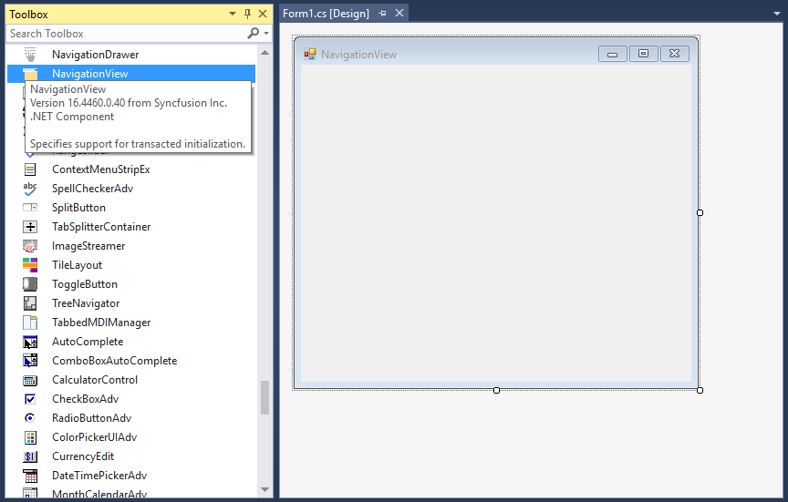
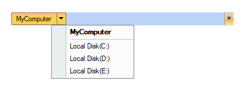
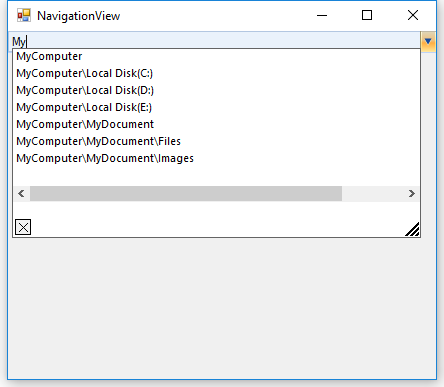

# Getting Started with Windows Forms NavigationView

## Assembly deployment

Refer to the [control dependencies](https://help.syncfusion.com/windowsforms/control-dependencies#navigationview) section to get the list of assemblies or NuGet package that needs to be added as a reference to use the control in any application.

You can find more details about installing the NuGet packages in a Windows Forms application in the following link:
 
[How to install nuget packages](https://help.syncfusion.com/windowsforms/visual-studio-integration/nuget-packages)

## Create a simple application with NavigationView

You can create a Windows Forms application with NavigationView control using the following steps:

## Create a project

Create a new Windows Forms project in Visual Studio to display the NavigationView control with breadcrumbs nodes.

## Add control via designer

The NavigationView control can be added to an application by dragging it from the toolbox to a designer view. The following required assembly references are added automatically to the project:

* Syncfusion.Grid.Base.dll
* Syncfusion.Grid.Windows.dll
* Syncfusion.Shared.Base.dll
* Syncfusion.Shared.Windows.dll
* Syncfusion.Tools.Base.dll
* Syncfusion.Tools.Windows.dll

## Add control manually using code

To add the control manually in C#, follow the given steps:

**1.**	Add the following required assembly references to the project: 

  * Syncfusion.Grid.Base.dll
  * Syncfusion.Grid.Windows.dll
  * Syncfusion.Shared.Base.dll
  * Syncfusion.Shared.Windows.dll
  * Syncfusion.Tools.Base.dll
  * Syncfusion.Tools.Windows.dll

**2.** Include the **Syncfusion.Windows.Forms.Tools namespace**. 

  
  
  using Syncfusion.Windows.Forms.Tools;
  
  
  Imports Syncfusion.Windows.Forms.Tools
  
   

**3.** Create a NavigationView instance, and add it to the window.

  
  
  NavigationView navigationView1 = new NavigationView();
  navigationView1.Width = 100;
  navigationView1.Height = 20;
  this.Controls.Add(navigationView1);
  
  
  Dim navigationView1 As New NavigationView()
  navigationView1.Width = 100
  navigationView1.Height = 20
  Me.Controls.Add(navigationView1)
  
  

## Add breadcrumb nodes

To add root bar, create a new instance to bar, and add it to the [Bars](https://help.syncfusion.com/cr/windowsforms/Syncfusion.Windows.Forms.Tools.NavigationView.html#Syncfusion_Windows_Forms_Tools_NavigationView_Bars) collection property in NavigationView. To add child bar, create an instance, and add it to the Bars collection property in its root bar.



Bar bar1 = new Bar();
Bar bar2 = new Bar();
Bar bar3 = new Bar();
Bar bar4 = new Bar();

bar1.Text = "MyComputer";
bar2.Text = "Local Disk(C:)";
bar3.Text = "Local Disk(D:)";
bar4.Text = "Local Disk(E:)";

// Adding root Bars
this.navigationView1.Bars.AddRange(new Bar[] { bar1 });
// Adding child Bars
bar1.Bars.AddRange(new Bar[] {bar2, bar3, bar4});

// Set selected Bar
this.navigationView1.SelectedBar = bar1;


Dim bar1 As Bar = New Bar()
Dim bar2 As Bar = New Bar()
Dim bar3 As Bar = New Bar()
Dim bar4 As Bar = New Bar()

bar1.Text = "MyComputer"
bar2.Text = "Local Disk(C:)"
bar3.Text = "Local Disk(D:)"
bar4.Text = "Local Disk(E:)"

' Adding root Bars
Me.navigationView1.Bars.AddRange(New Bar[] { bar1 })
' Adding child Bars
bar1.Bars.AddRange(New Bar[] {bar2, bar3, bar4})

' Set selected Bar 
Me.navigationView1.SelectedBar = bar1



## Edit mode

Selected path of navigation view can be changed by editing the text with valid navigation path.

