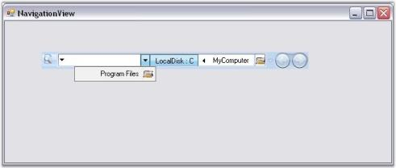

# Right to Left Support in Windows Forms NavigationView

NavigationView aligns the embedded child controls and images from right to left on setting the [RightToLeft](https://learn.microsoft.com/en-us/dotnet/api/system.windows.forms.control.righttoleft?redirectedfrom=MSDN&view=netframework-4.7.2#System_Windows_Forms_Control_RightToLeft) property to `true`.

