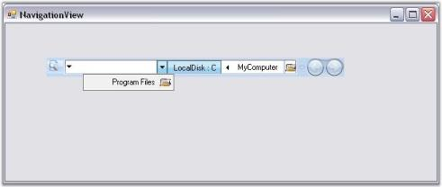

# Right to Left Support in Windows Forms NavigationView

NavigationView aligns the embedded child controls and images from right to left when the [RightToLeft](https://learn.microsoft.com/en-us/dotnet/api/system.windows.forms.control.righttoleft) property is set to `true`.




this.navigationView1.RightToLeft = System.Windows.Forms.RightToLeft.Yes;




Me.navigationView1.RightToLeft = System.Windows.Forms.RightToLeft.Yes




