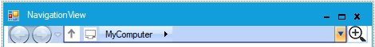

# Show/Hide History Button in Windows Forms NavigationView

History Button is used to access the History page. If enable [ShowHistoryButtons](https://help.syncfusion.com/cr/windowsforms/Syncfusion.Windows.Forms.Tools.NavigationView.html#Syncfusion_Windows_Forms_Tools_NavigationView_ShowHistoryButtons), it will be appeared on NavigationView Control.

