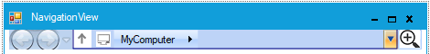

# Show/Hide History Button in Windows Forms NavigationView

The History Button is used to access the History page. The [ShowHistoryButtons](https://help.syncfusion.com/cr/windowsforms/Syncfusion.Windows.Forms.Tools.NavigationView.html#Syncfusion_Windows_Forms_Tools_NavigationView_ShowHistoryButtons) property is used to show or hide the History Button on the NavigationView control. The default value of this property is `true`.




this.navigationView1.ShowHistoryButtons = false;




Me.navigationView1.ShowHistoryButtons = False




