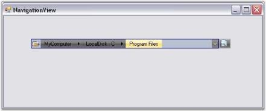

# Visual Styles in Windows Forms NavigationView

Visual Styles enhance the appearance of the NavigationView control. NavigationView supports the following visual styles: Office 2007 and Vista.

## Edit mode support

You can switch to an editable NavigationView path, allowing the user to quickly reach a location, by clicking on the text area of the NavigationView and typing the path.

