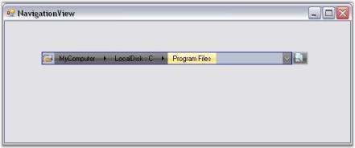
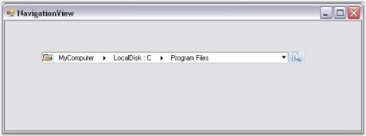
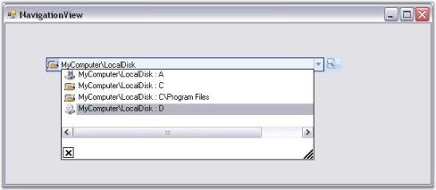

# Visual Styles in Windows Forms NavigationView

Visual Styles enhance the appearance of the NavigationView control. NavigationView supports the following visual styles: Office 2007, Vista, and Metro.

The `VisualStyle` property of the NavigationView control is used to set the desired visual style. The following code example sets the Office 2007 visual style.




this.navigationView1.VisualStyle = Syncfusion.Windows.Forms.Tools.Navigation.VisualStyles.Office2007;




Me.navigationView1.VisualStyle = Syncfusion.Windows.Forms.Tools.Navigation.VisualStyles.Office2007




## Edit mode support

You can switch to an editable NavigationView path by clicking on the text area of the NavigationView and typing the path. This allows the user to quickly reach a location.

