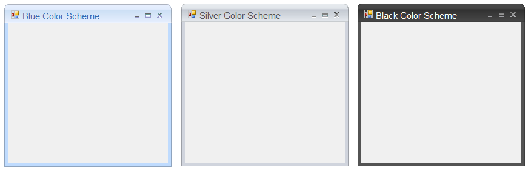
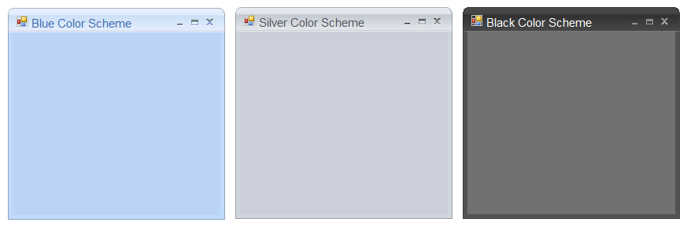

# Color Schemes in Windows Forms Office2007Form

Office2007Form supports following office color schemes which can be edited through the `ColorScheme` property.

* Blue
* Silver
* Black
* Managed





//To set Blue color scheme

this.ColorScheme = Office2007Theme.Blue;





'To set Blue color scheme

Me.ColorScheme = Office2007Theme.Blue





To apply the Managed color scheme `ApplyManagedColors` function is used as in the below code snippet.





//To set Managed color scheme.

this.ColorScheme = Office2010Theme.Managed;

Office2007Colors.ApplyManagedColors(this, Color.DarkMagenta);





'To set Managed color scheme.

Me.ColorScheme = Office2010Theme.Managed

Office2007Colors.ApplyManagedColors(this, Color.DarkMagenta);





## Background color for Office2007Form

The background color of the Office2007Form can be same, as the color scheme applied to the Form. `UseOffice2007SchemeBackColor` property has to be `true`, to make this effective.





this.UseOffice2007SchemeBackColor = true;





Me.UseOffice2007SchemeBackColor = True





## Applying color schemes

Office2007Form now have the ability to apply or not to apply AeroTheme on Forms with a glassy effect. This can be done by [ApplyAeroTheme](https://help.syncfusion.com/cr/windowsforms/Syncfusion.Windows.Forms.Office2007Form.html#Syncfusion_Windows_Forms_Office2007Form_ApplyAeroTheme) property.

AeroTheme support is available for Office2007Form when used in Vista machine. Earlier, ColorSchemes cannot be applied to Office2007Form when AeroTheme was enabled. Now ColorSchemes can be applied by disabling AeroTheme on Office2007Form.





// Disables Aero Theme on Office2007Form.

this.ApplyAeroTheme = false;





‘Disables Aero Theme on Office2007Form.

Me.ApplyAeroTheme = false;




