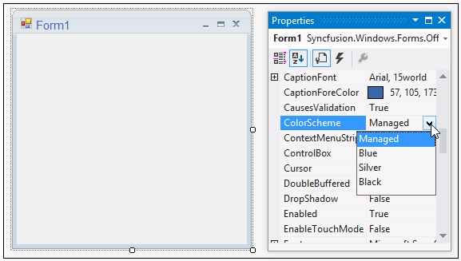
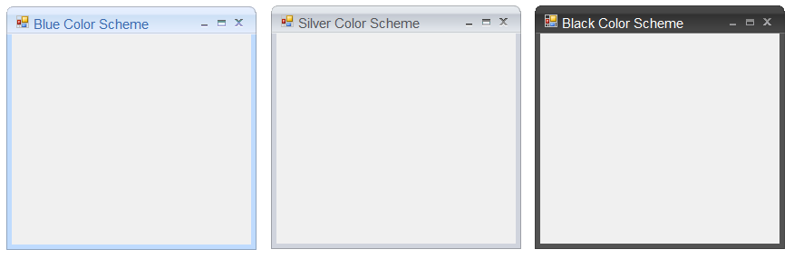
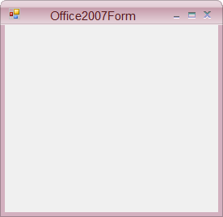
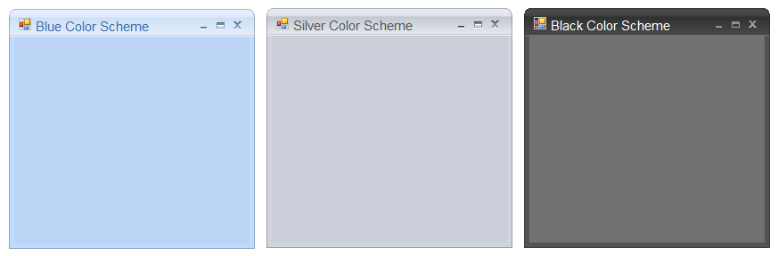

# Configure Color Schemes in Windows Forms Office2007Form

Office2007Form supports the following Office color schemes, which can be edited through the [ColorScheme](https://help.syncfusion.com/cr/windowsforms/Syncfusion.Windows.Forms.Office2007Form.html#Syncfusion_Windows_Forms_Office2007Form_ColorScheme) property.

* Blue
* Silver
* Black
* Managed

## Table of contents

* [Apply a built-in color scheme](#apply-a-built-in-color-scheme)
* [Managed color scheme](#managed-color-scheme)
* [Background color for Office2007Form](#background-color-for-office2007form)
* [Applying color schemes](#applying-color-schemes)
* [See also](#see-also)

Ensure the `Syncfusion.Windows.Forms` namespace is imported (see [Getting Started](Getting-Started.md)).

## Apply a built-in color scheme





// To set the Blue color scheme

this.ColorScheme = Office2007Theme.Blue;





' To set the Blue color scheme

Me.ColorScheme = Office2007Theme.Blue





## Managed color scheme

To apply the `Managed` color scheme, the [`ApplyManagedColors`](https://help.syncfusion.com/cr/windowsforms/Syncfusion.Windows.Forms.Office2007Colors.html#Syncfusion_Windows_Forms_Office2007Colors_ApplyManagedColors_System_Windows_Forms_Form_System_Drawing_Color_) method is used, as in the following code snippet. The first argument must be the owner `Form`.





// To set the Managed color scheme

this.ColorScheme = Office2007Theme.Managed;

Office2007Colors.ApplyManagedColors(this, Color.DarkMagenta);





' To set the Managed color scheme

Me.ColorScheme = Office2007Theme.Managed

Office2007Colors.ApplyManagedColors(Me, Color.DarkMagenta)





## Background color for Office2007Form

The background color of the Office2007Form can match the color scheme applied to the form. Set the [`UseOffice2007SchemeBackColor`](https://help.syncfusion.com/cr/windowsforms/Syncfusion.Windows.Forms.Office2007Form.html#Syncfusion_Windows_Forms_Office2007Form_UseOffice2007SchemeBackColor) property to `true` to make this effective.





this.UseOffice2007SchemeBackColor = true;





Me.UseOffice2007SchemeBackColor = True





## Applying color schemes

Office2007Form can apply or skip the Aero theme on forms with a glassy effect. This is controlled by the [`ApplyAeroTheme`](https://help.syncfusion.com/cr/windowsforms/Syncfusion.Windows.Forms.Office2007Form.html#Syncfusion_Windows_Forms_Office2007Form_ApplyAeroTheme) property.

Aero theme support is available for Office2007Form when used on a Vista machine (or later). Earlier, color schemes could not be applied to Office2007Form when Aero theme was enabled. Now color schemes can be applied by disabling Aero theme on Office2007Form.





// Disables Aero theme on Office2007Form.

this.ApplyAeroTheme = false;





' Disables Aero theme on Office2007Form.

Me.ApplyAeroTheme = False





## See also

* [About the Office2007Form control](Overview.md)
* [Getting Started with Windows Forms Office2007 Form](Getting-Started.md)
* [Office2007Form Customization in Windows Forms](Customization.md)
* [How to Enable Shadow in Windows Forms Office2007Form](FAQ/How-to-enable-shadow-of-the-Office2007Form.md)
* [Office2007Form API reference](https://help.syncfusion.com/cr/windowsforms/Syncfusion.Windows.Forms.Office2007Form.html)
