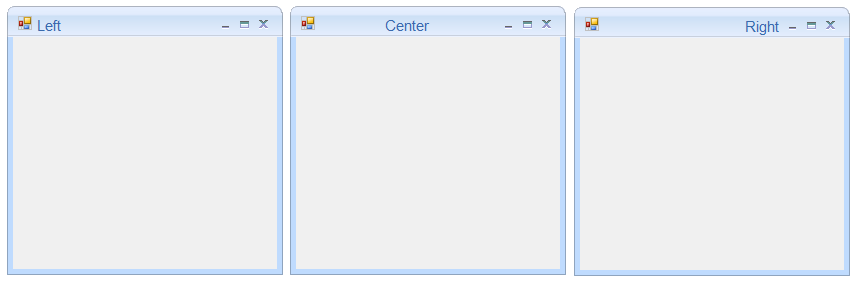
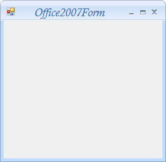
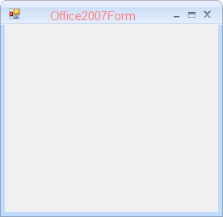
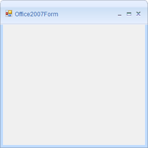
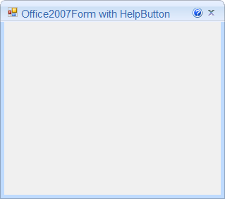
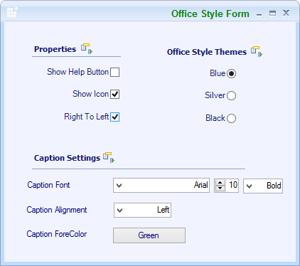
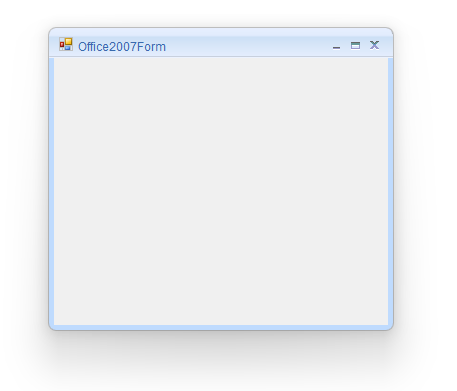

# Office2007Form Customization in Windows Forms

The Office2007Form caption and other UI elements can be customized through the properties documented in this section. Ensure the `Syncfusion.Windows.Forms` namespace is imported (see [Getting Started](Getting-Started.md)).

## Table of contents

* [Caption alignment](#caption-alignment)
* [Caption font](#caption-font)
* [Caption fore color](#caption-fore-color)
* [Caption bar height](#caption-bar-height)
* [Help button support](#help-button-support)
* [Right to left](#right-to-left)
* [Rounded corner](#rounded-corner)
* [Disabling Office2007Style](#disabling-office2007style)
* [See also](#see-also)

## Caption alignment

The form caption can be aligned to the left, right, or center by using the [CaptionAlign](https://help.syncfusion.com/cr/windowsforms/Syncfusion.Windows.Forms.Office2007Form.html#Syncfusion_Windows_Forms_Office2007Form_CaptionAlign) property.





this.CaptionAlign = System.Windows.Forms.HorizontalAlignment.Center;





Me.CaptionAlign = System.Windows.Forms.HorizontalAlignment.Center





## Caption font

The Office2007Form's caption font can be customized through the [CaptionFont](https://help.syncfusion.com/cr/windowsforms/Syncfusion.Windows.Forms.Office2007Form.html#Syncfusion_Windows_Forms_Office2007Form_CaptionFont) property.





this.CaptionFont = new System.Drawing.Font("Comic Sans MS", 15F, System.Drawing.FontStyle.Bold, System.Drawing.GraphicsUnit.Point, ((byte)(0)));





Me.CaptionFont = New System.Drawing.Font("Comic Sans MS", 15F, System.Drawing.FontStyle.Bold, System.Drawing.GraphicsUnit.Point, CByte(0))





## Caption fore color

The color of the caption text can be customized using the [CaptionForeColor](https://help.syncfusion.com/cr/windowsforms/Syncfusion.Windows.Forms.Office2007Form.html#Syncfusion_Windows_Forms_Office2007Form_CaptionForeColor) property.





// Applies the color to caption text.

this.CaptionForeColor = Color.Pink;





' Applies the color to caption text.

Me.CaptionForeColor = Color.Pink





## Caption bar height

The [CaptionBarHeight](https://help.syncfusion.com/cr/windowsforms/Syncfusion.Windows.Forms.Office2007Form.html#Syncfusion_Windows_Forms_Office2007Form_CaptionBarHeight) property customizes the caption bar height.





this.CaptionBarHeight = 50;





Me.CaptionBarHeight = 50





### Retain the caption bar height on maximized mode

By default, the height of the caption bar is reduced when the form is in maximized state. It can be retained in both normal and maximized states by setting the [CaptionBarHeightMode](https://help.syncfusion.com/cr/windowsforms/Syncfusion.Windows.Forms.Office2007Form.html#Syncfusion_Windows_Forms_Office2007Form_CaptionBarHeightMode) property to `SameAlwaysOnMaximize`.





this.CaptionBarHeightMode = Syncfusion.Windows.Forms.Enums.CaptionBarHeightMode.SameAlwaysOnMaximize;





Me.CaptionBarHeightMode = Syncfusion.Windows.Forms.Enums.CaptionBarHeightMode.SameAlwaysOnMaximize





## Help button support

[HelpButton](https://help.syncfusion.com/cr/windowsforms/Syncfusion.Windows.Forms.Localization.Localizer.EditResourceIdentifiers.LanguageColoringConfigurationDialog.html#Syncfusion_Windows_Forms_Localization_Localizer_EditResourceIdentifiers_LanguageColoringConfigurationDialog_HelpButton) property is used to show the `HelpButton` in the caption box of the Form.





// Displays the HelpButton in the caption box of the Form.

this.HelpButton = true;





' Displays the HelpButton in the caption box of the Form.

Me.HelpButton = True





## Right to left

Right-to-left support can be enabled using the following properties in Office2007Form.





this.RightToLeftLayout = true;
this.RightToLeft = System.Windows.Forms.RightToLeft.Yes;





Me.RightToLeftLayout = True
Me.RightToLeft = System.Windows.Forms.RightToLeft.Yes





## Rounded corner

Rounded corners for `Office2007Form` can be enabled by using the [AllowRoundedCorners](https://help.syncfusion.com/cr/windowsforms/Syncfusion.Windows.Forms.Office2007Form.html#Syncfusion_Windows_Forms_Office2007Form_AllowRoundedCorners) property. Rounded corners are not supported on OS versions lower than Windows 11. Enabling `AllowRoundedCorners` has no effect on those operating systems.

N> When the rounded corners are enabled, the border and shadow of the form are drawn by the operating system.





this.AllowRoundedCorners = true;





Me.AllowRoundedCorners = True





## Disabling Office2007Style

The Office 2007 look and feel can be disabled using the [DisableOffice2007Style](https://help.syncfusion.com/cr/windowsforms/Syncfusion.Windows.Forms.Office2007Form.html#Syncfusion_Windows_Forms_Office2007Form_DisableOffice2007Style) property.





this.DisableOffice2007Style = true;





Me.DisableOffice2007Style = True





## See also

* [About the Office2007Form control](Overview.md)
* [Getting Started with Windows Forms Office2007 Form](Getting-Started.md)
* [Configure Color Schemes in Windows Forms Office2007Form](Color-Schemes.md)
* [How to Enable Shadow in Windows Forms Office2007Form](FAQ/How-to-enable-shadow-of-the-Office2007Form.md)
* [Office2007Form API reference](https://help.syncfusion.com/cr/windowsforms/Syncfusion.Windows.Forms.Office2007Form.html)
