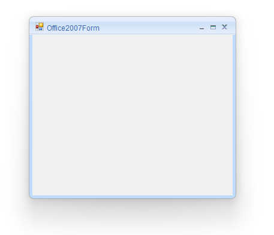

# Customization in Windows Forms Office2007Form

The Form caption can be aligned to the left, right or center by using the [CaptionAlign](https://help.syncfusion.com/cr/windowsforms/Syncfusion.Windows.Forms.Office2007Form.html#Syncfusion_Windows_Forms_Office2007Form_CaptionAlign) property.





this.CaptionAlign = System.Windows.Forms.HorizontalAlignment.Center;





Me.CaptionAlign = System.Windows.Forms.HorizontalAlignment.Center 





## Caption font

Office2010Form's caption Font can be customized through [CaptionFont](https://help.syncfusion.com/cr/windowsforms/Syncfusion.Windows.Forms.Office2007Form.html#Syncfusion_Windows_Forms_Office2007Form_CaptionFont) property.





this.CaptionFont = new System.Drawing.Font("Comic Sans MS", 15F, System.Drawing.FontStyle.Bold, System.Drawing.GraphicsUnit.Point, ((byte)(0)));





Me.CaptionFont = New System.Drawing.Font("Comic Sans MS", 15F, System.Drawing.FontStyle.Bold, System.Drawing.GraphicsUnit.Point, CByte((0))) 





## Caption fore color

The color of the caption text can be customized using the [CaptionForeColor](https://help.syncfusion.com/cr/windowsforms/Syncfusion.Windows.Forms.Office2007Form.html#Syncfusion_Windows_Forms_Office2007Form_CaptionForeColor) property.





// Applies the color to caption text.

this.CaptionForeColor = Color.Pink;





‘Applies the color to caption text.

Me.CaptionForeColor = Color.Pink





## Caption bar height

This property helps to customize the CaptionBar height.





this.CaptionBarHeight = 50;





Me. CaptionBarHeight = 50





### Retain the caption bar height on maximized mode

By Default, the height of the caption bar will be reduced when the form is in maximized state. It can be retained same in both normal and maximized state by setting the property [Office2007Form.CaptionBarHeightMode](https://help.syncfusion.com/cr/windowsforms/Syncfusion.Windows.Forms.Office2007Form.html#Syncfusion_Windows_Forms_Office2007Form_CaptionBarHeightMode) as `SameAlwaysOnMaximize`





this.CaptionBarHeightMode = Syncfusion.Windows.Forms.Enums.CaptionBarHeightMode.SameAlwaysOnMaximize;





Me.CaptionBarHeightMode = Syncfusion.Windows.Forms.Enums.CaptionBarHeightMode.SameAlwaysOnMaximize
 




## Help button support

[HelpButton](https://help.syncfusion.com/cr/windowsforms/Syncfusion.Windows.Forms.Localization.Localizer.EditResourceIdentifiers.LanguageColoringConfigurationDialog.html#Syncfusion_Windows_Forms_Localization_Localizer_EditResourceIdentifiers_LanguageColoringConfigurationDialog_HelpButton) property is used to show the `HelpButton` in the caption box of the Form.





// Displays the HelpButton in the caption box of the Form.

 this.HelpButton = true;





‘Displays the HelpButton in the caption box of the Form.

 Me.HelpButton = true





## Right to left

Right to left support can be enabled using below properties in Office2007Form.





this.RightToLeftLayout = true;
 
this.RightToLeft = System.Windows.Forms.RightToLeft.Yes;





Me.RightToLeftLayout = true
 
Me.RightToLeft = System.Windows.Forms.RightToLeft.Yes 





## Rounded corner

Rounded corners for `Office2007Form` can be enabled by using the [AllowRoundedCorners](https://help.syncfusion.com/cr/windowsforms/Syncfusion.Windows.Forms.Office2007Form.html#Syncfusion_Windows_Forms_Office2007Form_AllowRoundedCorners) property. Rounded corners are not supported in OS versions lower than Windows 11. Enabling `AllowRoundedCorners` property will have no effect on those operating systems. 

N> When the rounded corners are enabled, the border and shadow of the Form are drawn by the operating system.





this.AllowRoundedCorners = true;





Me.AllowRoundedCorners = true
 




## Disabling Office2007Style

Office2007 look and feel can be disabled using `DisableOffice2007Style` property.





this.DisableOffice2007Style = true;





Me.DisableOffice2007Style = true
 




