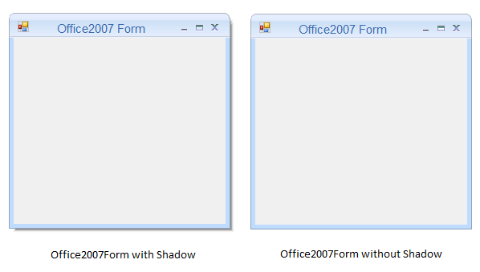

# How to Enable Shadow in Windows Forms Office2007Form

Shadow of the WinForms Office2007Form can be enabled or disabled using the [DropShadow](https://help.syncfusion.com/cr/windowsforms/Syncfusion.Windows.Forms.Office2007Form.html#Syncfusion_Windows_Forms_Office2007Form_DropShadow) property.





this.DropShadow = false;





 Me.DropShadow = false 
 




 
