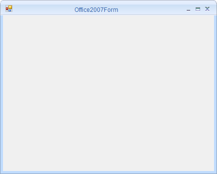

# Getting Started with Windows Forms Office2007Form

This section describes how to configure `Office2007Form` control in a Windows Forms application.

## Assembly deployment

Refer [control dependencies](https://help.syncfusion.com/windowsforms/control-dependencies#office2007form) section to get the list of assemblies or NuGet package needs to be added as reference to use the control in any application.

Please find more details regarding how to install the nuget packages in windows form application in the below link:
 
[How to install nuget packages](https://help.syncfusion.com/windowsforms/visual-studio-integration/nuget-packages)

## Creating simple application with Office2007Form

You can create the Windows Forms application with Office2007Form control as follows:

1. [Creating the project](#creating-the-project)
2. [Configure Office2007Form](#configure-office2007form)

### Creating the project

Create a new Windows Forms project in the Visual Studio to change the standard form into Office2007Form.

### Configure Office2007Form

`Office2007Form` is an advanced standard Form, we can configure it by following the given steps:

**Step 1:** Add the following required assembly references to the project:

* Syncfusion.Shared.Base.dll	

**Step 2:** Include the namespaces **Syncfusion.Windows.Forms**.





using Syncfusion.Windows.Forms;





Imports Syncfusion.Windows.Forms




   
**Step 3:** Change the class to inherit `Office2007Form` instead of the standard form.





public partial class Form1 : Office2007Form 
{
	public Form1()
    {

		this.Text = "Office2007Form";
		
	}
}





Partial Public Class Form1 Inherits Office2007Form

Public Sub New()

Me.Text = "Office2007Form"

End Sub

End Class
 


 
   

