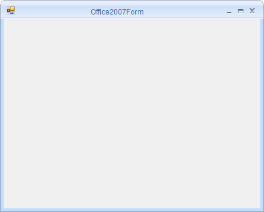

# Getting Started with Windows Forms Office2007 Form

This section describes how to configure the `Office2007Form` control in a Windows Forms application.

## Prerequisites

Before using the Office2007Form control, ensure the following are available:

* Visual Studio 2015 or later with the Windows Forms development workload.
* A Windows Forms application targeting .NET Framework 4.5+ or .NET 6.0+ (Windows).
* A valid [Syncfusion license](https://www.syncfusion.com/sales/communitylicense) registered in your project.

## Table of contents

* [Assembly deployment](#assembly-deployment)
* [Creating simple application with Office2007Form](#creating-simple-application-with-office2007form)
  * [Creating the project](#creating-the-project)
  * [Configure Office2007Form](#configure-office2007form)
* [Troubleshooting](#troubleshooting)

## Assembly deployment

Refer to the [control dependencies](https://help.syncfusion.com/windowsforms/control-dependencies#office2007form) section for the list of assemblies and NuGet packages that must be added as references to use the control. The required assembly is `Syncfusion.Shared.Base.dll` (`Syncfusion.Shared.Base` NuGet package):

```
PM> Install-Package Syncfusion.Shared.Base
```

For more details on installing NuGet packages in a Windows Forms application, see [How to install nuget packages](https://help.syncfusion.com/windowsforms/installation/install-nuget-packages).

## Creating simple application with Office2007Form

You can create the Windows Forms application with the Office2007Form control as follows:

1. [Creating the project](#creating-the-project)
2. [Configure Office2007Form](#configure-office2007form)

### Creating the project

Create a new Windows Forms project in Visual Studio to use the standard form with Office2007 styling.

### Configure Office2007Form

`Office2007Form` is an advanced standard `Form`. Configure it by following the given steps:

**Step 1:** Add the following required assembly reference to the project:

* `Syncfusion.Shared.Base.dll`

**Step 2:** Include the `Syncfusion.Windows.Forms` namespace.





using Syncfusion.Windows.Forms;





Imports Syncfusion.Windows.Forms





**Step 3:** Change the class to inherit `Office2007Form` instead of the standard form.





public partial class Form1 : Office2007Form
{
    public Form1()
    {
        this.Text = "Office2007Form";
    }
}





Partial Public Class Form1
    Inherits Office2007Form

    Public Sub New()
        Me.Text = "Office2007Form"
    End Sub
End Class







## Troubleshooting

| Issue | Possible cause | Resolution |
|---|---|---|
| `Office2007Form` does not compile – "type or namespace not found". | The `Syncfusion.Shared.Base` assembly is not referenced. | Add the `Syncfusion.Shared.Base` NuGet package or reference the assembly as described in [Assembly deployment](#assembly-deployment). |
| Form opens but shows the standard Windows caption instead of Office 2007 styling. | The form's base class is still `System.Windows.Forms.Form`, or the licensing was not registered. | Inherit from `Office2007Form` in Step 3 and ensure a valid Syncfusion license is registered. |
| Caption appears in the wrong language or with default text. | Localization was not configured. | Configure the `LocalizationProvider` and set the desired culture at application startup. |

## See also

* [About the Office2007Form control](Overview.md)
* [Configure Color Schemes in Windows Forms Office2007Form](Color-Schemes.md)
* [Office2007Form Customization in Windows Forms](Customization.md)
* [How to Enable Shadow in Windows Forms Office2007Form](FAQ/How-to-enable-shadow-of-the-Office2007Form.md)
* [Office2007Form API reference](https://help.syncfusion.com/cr/windowsforms/Syncfusion.Windows.Forms.Office2007Form.html)
