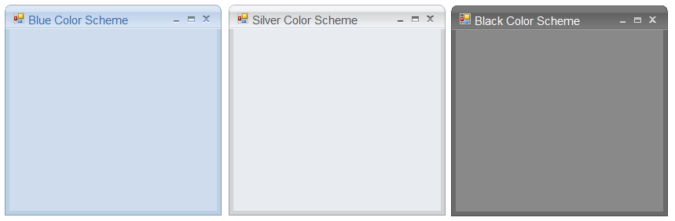

# Color Schemes in Windows Forms Office2010Form

Office2010Form supports following office color schemes which can be edited through `ColorScheme` property.

* Blue
* Silver
* Black
* Managed





//To set Blue color scheme.

this.ColorScheme = Office2010Theme.Blue;





'To set Blue color scheme.

Me.ColorScheme = Office2010Theme.Blue





  
  
To apply the Managed color scheme `ApplyManagedColors` function from Office2010Colors is used as in the below code snippet.





//To set Managed color scheme.

this.ColorScheme = Office2010Theme.Managed;

Office2010Colors.ApplyManagedColors(this, Color.DarkMagenta);





'To set Managed color scheme.

Me.ColorScheme = Office2010Theme.Managed

Office2010Colors.ApplyManagedColors(this, Color.DarkMagenta);





  

## Background color for Office2010 Form

The background of the Office2010 Form can be same, as the color scheme applied to the form. `UseOffice2007SchemeBackColor` property has to `true`, to make this effective.





this.UseOffice2010SchemeBackColor = true;





Me.UseOffice2010SchemeBackColor = True





  
  
## Applying color schemes

Office2010Form now have the option to apply the Aero theme on forms, which provides a glassy effect. This can be done through the [ApplyAeroTheme](https://help.syncfusion.com/cr/windowsforms/Syncfusion.Windows.Forms.Office2010Form.html#Syncfusion_Windows_Forms_Office2010Form_ApplyAeroTheme) property.

Aero theme support is available for Office2010Form when used on Windows Vista machines. Previously, ColorSchemes could not be applied to the Office2010Form when the Aero theme was enabled. Now, ColorSchemes can be applied by disabling the Aero theme on Office2010Form.





// Disables Aero Theme on Office2010 Form.

this.ApplyAeroTheme = false;





‘Disables Aero Theme on Office2010 Form.

Me.ApplyAeroTheme = false;




