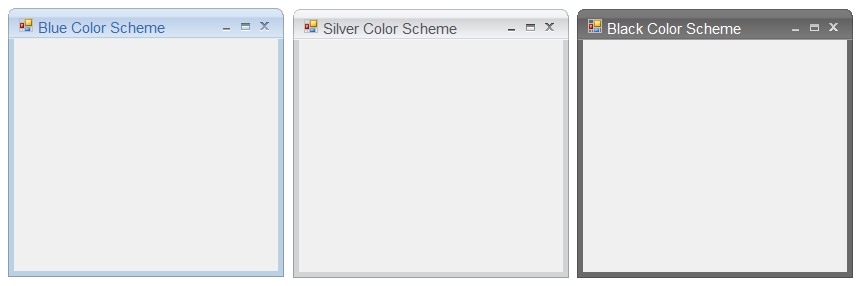
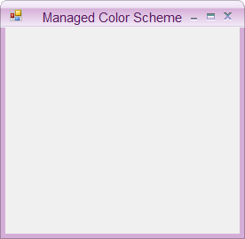
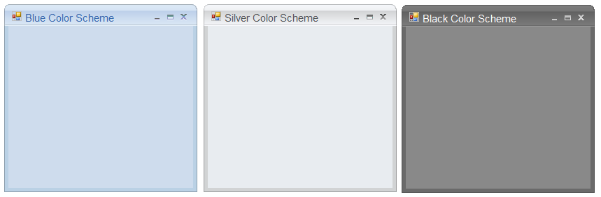

---
layout: post
title: Configure Color Schemes in Windows Forms Office2010Form | Syncfusion®
description: Color schemes support Office-inspired themes, managed colors, Aero theme integration, and background color customization.
platform: WindowsForms
control: Office2010 Form
documentation: ug
---

# Configure Color Schemes in Windows Forms Office2010Form

The `Office2010Form` supports the following Office color schemes, which can be set through the [ColorScheme](https://help.syncfusion.com/cr/windowsforms/Syncfusion.Windows.Forms.Office2010Form.html#Syncfusion_Windows_Forms_Office2010Form_ColorScheme) property.

| Color scheme | Description |
|---|---|
| `Blue` (default) | The default Office 2010 blue accent. |
| `Silver` | A light-gray Office 2010 accent. |
| `Black` | A dark Office 2010 accent. |
| `Managed` | Uses a custom accent color supplied through `Office2010Colors.ApplyManagedColors`. |





// Set the Blue color scheme.
this.ColorScheme = Office2010Theme.Blue;





' Set the Blue color scheme.
Me.ColorScheme = Office2010Theme.Blue





  

To apply the Managed color scheme, use the `ApplyManagedColors` method of the `Office2010Colors` class (in the `Syncfusion.Windows.Forms` namespace). The first argument is the form to apply the colors to, and the second argument is the accent color.





using Syncfusion.Windows.Forms;

// Set the Managed color scheme and apply a custom accent color.
this.ColorScheme = Office2010Theme.Managed;
Office2010Colors.ApplyManagedColors(this, Color.DarkMagenta);





Imports Syncfusion.Windows.Forms

' Set the Managed color scheme and apply a custom accent color.
Me.ColorScheme = Office2010Theme.Managed
Office2010Colors.ApplyManagedColors(Me, Color.DarkMagenta)





  

## Background color for the Office2010Form

The background of the Office2010Form (client area) can be set to match the active color scheme. Set the [UseOffice2010SchemeBackColor](https://help.syncfusion.com/cr/windowsforms/Syncfusion.Windows.Forms.Office2010Form.html#Syncfusion_Windows_Forms_Office2010Form_UseOffice2010SchemeBackColor) property to `true` to make this effective. The `ColorScheme` property must be set before this property takes effect.





// Apply the active color scheme to the form's background.
this.UseOffice2010SchemeBackColor = true;





' Apply the active color scheme to the form's background.
Me.UseOffice2010SchemeBackColor = True





## Aero theme integration

The Office2010Form can opt in to the Windows Aero glass effect through the [ApplyAeroTheme](https://help.syncfusion.com/cr/windowsforms/Syncfusion.Windows.Forms.Office2010Form.html#Syncfusion_Windows_Forms_Office2010Form_ApplyAeroTheme) property. The glass effect is only rendered on supported Windows versions; on other operating systems, the property has no effect. Note that when `ApplyAeroTheme` is `true`, the active `ColorScheme` is not applied to the caption bar.

| Windows version | Aero effect | Color scheme behavior |
|---|---|---|
| Windows Vista / Windows 7 | Glass effect visible when `ApplyAeroTheme = true`. | Color scheme is not applied to the caption while Aero is enabled. |
| Windows 8 / Windows 8.1 | No Aero glass; `ApplyAeroTheme` is a no-op. | Color scheme is always applied. |
| Windows 10 / Windows 11 | No Aero glass; `ApplyAeroTheme` is a no-op. | Color scheme is always applied. |





// Disable the Aero Theme on the Office2010Form (default).
this.ApplyAeroTheme = false;





' Disable the Aero Theme on the Office2010Form (default).
Me.ApplyAeroTheme = false





## Troubleshooting

| Issue | Likely cause | Fix |
|---|---|---|
| The active color scheme is not visible on the caption bar. | `ApplyAeroTheme` is `true` and the host OS renders the Aero glass effect. | Set `this.ApplyAeroTheme = false;` to disable Aero. |
| The form background does not change when switching color schemes. | `UseOffice2010SchemeBackColor` is `false`, or the property is being set before `ColorScheme`. | Set `this.UseOffice2010SchemeBackColor = true;` after assigning the `ColorScheme`. |
| The Managed color scheme uses the default blue accent. | `Office2010Colors.ApplyManagedColors` was never called. | Call `Office2010Colors.ApplyManagedColors(this, Color.DarkMagenta);` after setting `ColorScheme = Office2010Theme.Managed;`. |
