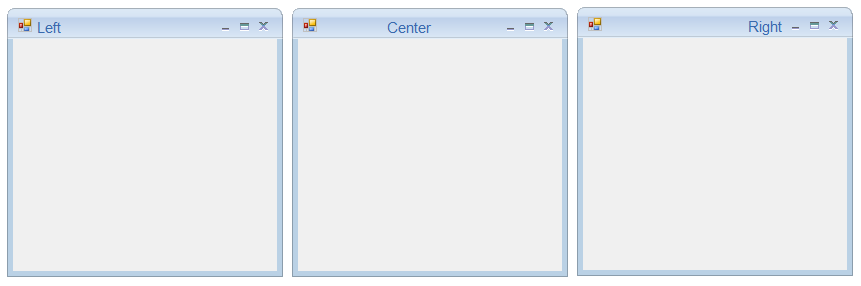
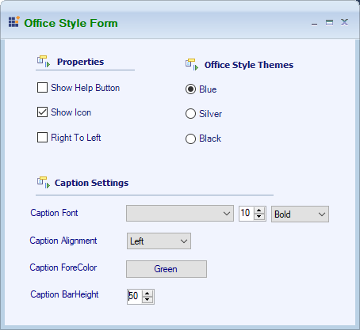
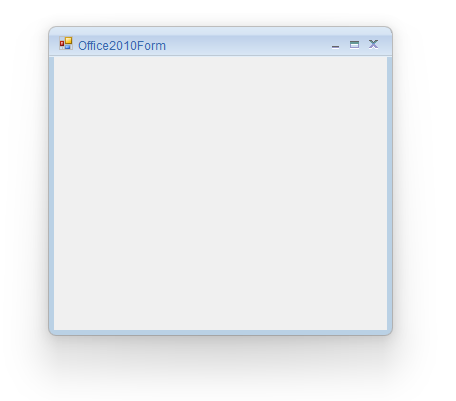

# Caption alignment in WinForms Office2010Form

The Form caption can be aligned to the left, right or center by using the [CaptionAlign](https://help.syncfusion.com/cr/windowsforms/Syncfusion.Windows.Forms.Office2010Form.html#Syncfusion_Windows_Forms_Office2010Form_CaptionAlign) property.





this.CaptionAlign = System.Windows.Forms.HorizontalAlignment.Center;





Me.CaptionAlign = System.Windows.Forms.HorizontalAlignment.Center 





## Caption font

Office2010Form's caption Font can be customized through [CaptionFont](https://help.syncfusion.com/cr/windowsforms/Syncfusion.Windows.Forms.Office2010Form.html#Syncfusion_Windows_Forms_Office2010Form_CaptionFont) property.





this.CaptionFont = new System.Drawing.Font("Comic Sans MS", 15F, System.Drawing.FontStyle.Bold, System.Drawing.GraphicsUnit.Point, ((byte)(0)));





Me.CaptionFont = New System.Drawing.Font("Comic Sans MS", 15F, System.Drawing.FontStyle.Bold, System.Drawing.GraphicsUnit.Point, CByte((0))) 





## Caption fore color

The color of the caption text can be customized using the [CaptionForeColor](https://help.syncfusion.com/cr/windowsforms/Syncfusion.Windows.Forms.Office2010Form.html#Syncfusion_Windows_Forms_Office2010Form_CaptionForeColor) property.





// Applies the color to caption text.

this.CaptionForeColor = Color.Pink;





‘Applies the color to caption text.

Me.CaptionForeColor = Color.Pink





## Caption bar height

This property helps to customize the CaptionBar height.





this.CaptionBarHeight = 50;





Me. CaptionBarHeight = 50





## Help button support

[HelpButton](https://help.syncfusion.com/cr/windowsforms/Syncfusion.Windows.Forms.Localization.Localizer.EditResourceIdentifiers.LanguageColoringConfigurationDialog.html#Syncfusion_Windows_Forms_Localization_Localizer_EditResourceIdentifiers_LanguageColoringConfigurationDialog_HelpButton) property is used to show the `HelpButton` in the caption box of the form.





// Displays the HelpButton in the caption box of the Form.

 this.HelpButton = true;





‘Displays the HelpButton in the caption box of the Form.

 Me.HelpButton = true





## Right to left

Right to left support can be enabled using below properties in Office2010Form.





this.RightToLeftLayout = true;
 
this.RightToLeft = System.Windows.Forms.RightToLeft.Yes;





Me.RightToLeftLayout = true
 
Me.RightToLeft = System.Windows.Forms.RightToLeft.Yes 





## Rounded corner

Rounded corners for `Office2010Form` can be enabled by using the [AllowRoundedCorners](https://help.syncfusion.com/cr/windowsforms/Syncfusion.Windows.Forms.Office2010Form.html#Syncfusion_Windows_Forms_Office2010Form_AllowRoundedCorners) property. Rounded corners are not supported in OS versions lower than Windows 11. Enabling `AllowRoundedCorners` property will have no effect on those operating systems. 

N> When the rounded corners are enabled, the border and shadow of the Form are drawn by the operating system.





this.AllowRoundedCorners = true;





Me.AllowRoundedCorners = true
 




## Disabling Office2010Style

Office2010 look and feel can be disabled using `DisableOffice2010Style` property.





this.DisableOffice2010Style = true;





Me.DisableOffice2010Style = true
 




