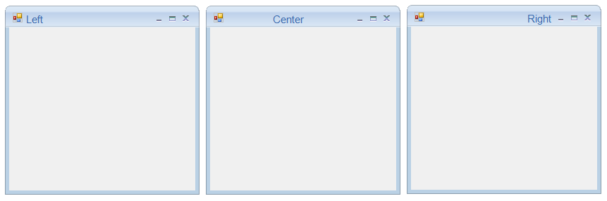
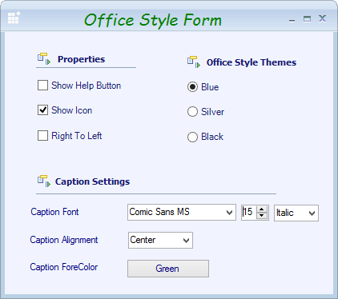
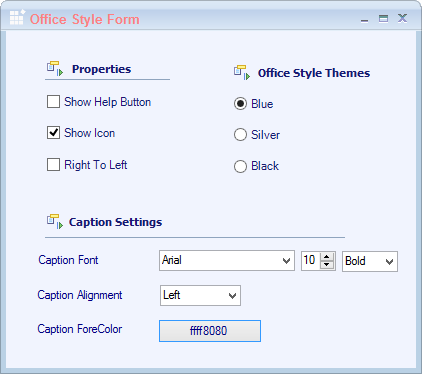
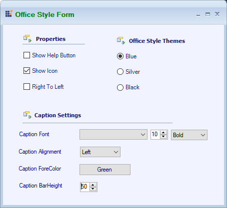
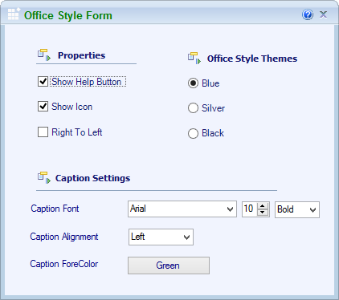
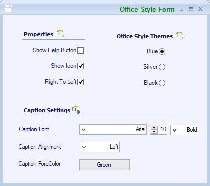
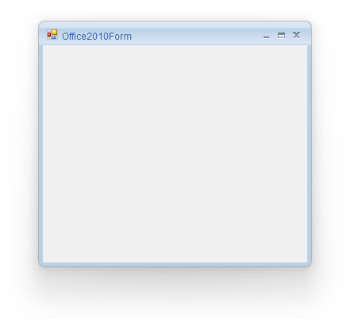
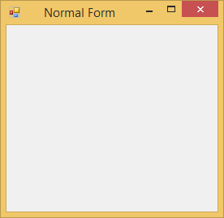

# Office2010Form customization in Windows Forms

The Office2010Form exposes a number of properties to customize the caption bar and the form's layout. The following topics describe the supported properties.

## Caption alignment

The form caption can be aligned to the left, right, or center by using the [CaptionAlign](https://help.syncfusion.com/cr/windowsforms/Syncfusion.Windows.Forms.Office2010Form.html#Syncfusion_Windows_Forms_Office2010Form_CaptionAlign) property. The accepted values come from the `System.Windows.Forms.HorizontalAlignment` enumeration (`Left`, `Right`, `Center`); the default is `Left`.





this.CaptionAlign = System.Windows.Forms.HorizontalAlignment.Center;





Me.CaptionAlign = System.Windows.Forms.HorizontalAlignment.Center 





## Caption font

The Office2010Form's caption font can be customized through the [CaptionFont](https://help.syncfusion.com/cr/windowsforms/Syncfusion.Windows.Forms.Office2010Form.html#Syncfusion_Windows_Forms_Office2010Form_CaptionFont) property. Set this property in the form constructor or the `Load` event handler; changing it after the form is shown may not take effect until the form is redrawn.





this.CaptionFont = new System.Drawing.Font("Comic Sans MS", 15F, System.Drawing.FontStyle.Bold, System.Drawing.GraphicsUnit.Point, ((byte)(0)));





Me.CaptionFont = New System.Drawing.Font("Comic Sans MS", 15F, System.Drawing.FontStyle.Bold, System.Drawing.GraphicsUnit.Point, CByte((0))) 





## Caption fore color

The color of the caption text can be customized using the [CaptionForeColor](https://help.syncfusion.com/cr/windowsforms/Syncfusion.Windows.Forms.Office2010Form.html#Syncfusion_Windows_Forms_Office2010Form_CaptionForeColor) property.





// Applies the color to the caption text.
this.CaptionForeColor = Color.Pink;





' Applies the color to the caption text.
Me.CaptionForeColor = Color.Pink





## Caption bar height

The [CaptionBarHeight](https://help.syncfusion.com/cr/windowsforms/Syncfusion.Windows.Forms.Office2010Form.html#Syncfusion_Windows_Forms_Office2010Form_CaptionBarHeight) property customizes the height of the caption bar in pixels. The default is the system caption bar height.





this.CaptionBarHeight = 50;





Me.CaptionBarHeight = 50





## Help button support

The [HelpButton](https://help.syncfusion.com/cr/windowsforms/Syncfusion.Windows.Forms.Office2010Form.html#Syncfusion_Windows_Forms_Office2010Form_HelpButton) property displays a help button (`?`) in the caption box of the form. The help button is only visible when both `MaximizeBox` and `MinimizeBox` are set to `false`, and `ControlBox` is `true`.





// Displays the help button in the caption box of the form.

 this.HelpButton = true;





' Displays the help button in the caption box of the form.

 Me.HelpButton = true





## Right-to-left layout

Right-to-left support is enabled by setting the two properties below. Set both before the form is shown so child controls inherit the layout. `RightToLeftLayout` is the Syncfusion property that mirrors the layout of the caption bar, while `RightToLeft` is the base `Control` property that controls text direction.





this.RightToLeftLayout = true;
this.RightToLeft = System.Windows.Forms.RightToLeft.Yes;





Me.RightToLeftLayout = True
Me.RightToLeft = System.Windows.Forms.RightToLeft.Yes





## Rounded corners

Rounded corners for the `Office2010Form` can be enabled by setting the [AllowRoundedCorners](https://help.syncfusion.com/cr/windowsforms/Syncfusion.Windows.Forms.Office2010Form.html#Syncfusion_Windows_Forms_Office2010Form_AllowRoundedCorners) property to `true`. Rounded corners are only supported on Windows 11 (build 22000 and later); setting the property to `true` on earlier Windows versions is a silent no-op.

N> When rounded corners are enabled, the border and shadow of the form are drawn by the operating system.





this.AllowRoundedCorners = true;





Me.AllowRoundedCorners = true




## Disabling the Office2010 style

The Office2010 look and feel can be disabled using the [DisableOffice2010Style](https://help.syncfusion.com/cr/windowsforms/Syncfusion.Windows.Forms.Office2010Form.html#Syncfusion_Windows_Forms_Office2010Form_DisableOffice2010Style) property. When set to `true`, the form reverts to the standard Windows Forms appearance; the color scheme, caption font, and other Office2010-specific customizations are not applied.





this.DisableOffice2010Style = true;





Me.DisableOffice2010Style = true





## Troubleshooting

| Issue | Likely cause | Fix |
|---|---|---|
| Form renders with the standard Windows look after changing the inherited class. | The class does not inherit from `Office2010Form`, or `DisableOffice2010Style` is `true`. | Ensure `Form1 : Office2010Form` (or `Inherits Office2010Form` in VB) and that `DisableOffice2010Style` is `false`. |
| Caption bar changes have no effect. | `ApplyAeroTheme` is `true` on a supported OS, or the form has not been redrawn. | Set `this.ApplyAeroTheme = false;` and call `this.Refresh();`. |
| Rounded corners are not visible. | The host OS is older than Windows 11. | Upgrade to Windows 11 build 22000 or later; the property is a no-op on older OS versions. |
| The help button does not appear in the caption. | `MaximizeBox` or `MinimizeBox` is `true`, or `ControlBox` is `false`. | Set `this.MaximizeBox = false; this.MinimizeBox = false; this.ControlBox = true;`. |
