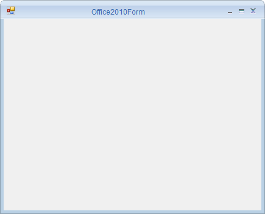

# Getting Started with Windows Forms Office2010 Form

This section describes how to configure the `Office2010Form` control in a Windows Forms application.

## Assembly deployment

The following assemblies (or the equivalent `Syncfusion.Shared.Base.WinForms` NuGet package) should be added as a reference to use the `Office2010Form` in any application:

* `Syncfusion.Shared.Base`

Refer to the [control dependencies](https://help.syncfusion.com/windowsforms/control-dependencies#office2010form) section for the full list of dependencies.

For more information about how to install NuGet packages in a Windows Forms application, see [How to install NuGet packages](https://help.syncfusion.com/windowsforms/installation/install-nuget-packages).

## Creating a simple application with Office2010Form

You can create a Windows Forms application with the Office2010Form control as follows:

1. [Create the project](#create-the-project)
2. [Configure Office2010Form](#configure-office2010form)

### Create the project

Create a new Windows Forms project in Visual Studio to host the Office2010Form.

### Configure Office2010Form

`Office2010Form` is an advanced standard Form. You can configure it by following the steps below.

**Step 1:** Add the required assembly references listed in [Assembly deployment](#assembly-deployment).

**Step 2:** Add the `Syncfusion.Windows.Forms` namespace.




using Syncfusion.Windows.Forms;





Imports Syncfusion.Windows.Forms




   
**Step 3:** Change the class to inherit `Office2010Form` instead of the standard form.





public partial class Form1 : Office2010Form 
{
	public Form1()
    {

		this.Text = "Office2010Form";
		
	}
}





Partial Public Class Form1 Inherits Office2010Form

Public Sub New()

Me.Text = "Office2010Form"

End Sub

End Class
 


 
   

