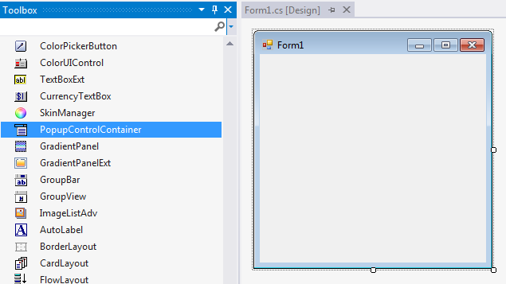
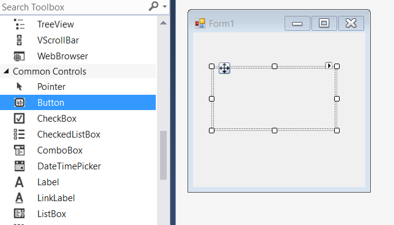
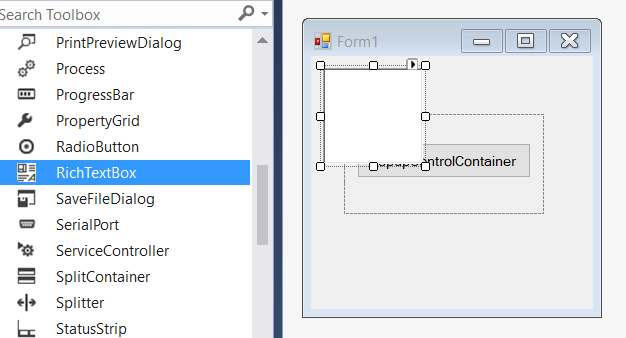
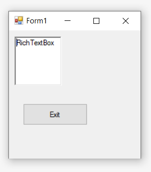
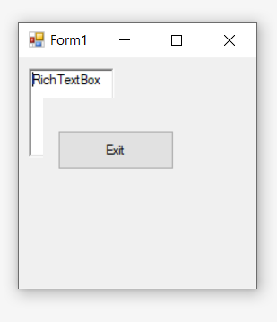

# Getting Started

>**Important**
Starting with v16.2.0.x, if you refer to Syncfusion assemblies from trial setup or from the NuGet feed, include a license key in your projects. Refer to this [link](https://help.syncfusion.com/common/essential-studio/licensing/license-key) to learn about registering Syncfusion license key in your Windows Forms application to use our components.

This section provides a quick overview for working with the **PopupControlContainer** control in a WinForms application.

## Dependent Assemblies

**Syncfusion.Shared.Base** needs to be added as reference to use the control in an application.

## Adding PopupControlContainer through designer

The PopupControlContainer control can be added through designer by following the below steps.

1. Drag and drop the PopupControlContainer control from the toolbox (under the section "Syncfusion Windows **Visual Studio Version** Toolbox **Essential Studio Version**") into the designer page.

   

2. Now the PopupControlContainer control will be successfully added into the application along with the required dependent assemblies.

   

3. We can add child controls like Button, Label, TextBox, ColorPicker, etc... to the PopupControlContainer. In this illustration, we have used Button as child control.

   

   

4. Once child control is added, we can associate it as a popup for other controls like RichTextBox, Label, Button, etc... In this illustration, we have used RichTextBox as parent control for mapping the pop-up container. 

   

5. Associate the RichTextBox instance in the **Properties** panel of PopupControlContainer under **ParentControl**.

   

   

6. To display the Popup at a desired location, handle the [`Click`](https://docs.microsoft.com/en-us/dotnet/api/system.windows.forms.control.click?view=netframework-4.7.2) event of RichTextBox and call [`ShowPopup()`](https://help.syncfusion.com/cr/windowsforms/Syncfusion.Shared.Base~Syncfusion.Windows.Forms.PopupControlContainer~ShowPopup.html) method of PopupControlContainer. The appropriate code to do the same is explained in the immediate section. 

## Adding PopupControlContainer through code

The PopupControlContainer control can be added through code by following the below steps.

1. Add the following dependency assembly references to the project.

   * Syncfusion.Shared.Base.dll
   * Syncfusion.Licensing.dll

   >**NOTE**     
   You can get these assemblies by browsing to the default assembly location.
{System Drive}: \Program Files (x86) \ Syncfusion\Essential Studio\ {Platform} \ {Build Version Number} \ precompiledassemblies \ {Framework Version Number}

2. The below code snippets adds a PopupControlContainer control to the application.

   
   

   //Declaration 
   private Syncfusion.Windows.Forms.PopupControlContainer popupControlContainer1;
   private System.Windows.Forms.Button button1;
   private System.Windows.Forms.RichTextBox richTextBox1;

   //Initializing 
   this.popupControlContainer1 = new Syncfusion.Windows.Forms.PopupControlContainer();
   this.button1 = new System.Windows.Forms.Button();
   this.richTextBox1 = new System.Windows.Forms.RichTextBox();

   // popupControlContainer1
   this.popupControlContainer1.Controls.Add(this.button1);
   this.popupControlContainer1.Location = new System.Drawing.Point(33, 58);
   this.popupControlContainer1.Name = "popupControlContainer2";
   this.popupControlContainer1.ParentControl = this.richTextBox1;
   this.popupControlContainer1.Size = new System.Drawing.Size(200, 100);

   // button1
   this.button1.Location = new System.Drawing.Point(13, 29);
   this.button1.Name = "button1";
   this.button1.Size = new System.Drawing.Size(174, 35);
   this.button1.Text = "PopupControlContainer";

   // richTextBox1
   this.richTextBox1.Location = new System.Drawing.Point(12, 12);
   this.richTextBox1.Name = "richTextBox1";
   this.richTextBox1.Size = new System.Drawing.Size(100, 96);
   this.richTextBox1.Click += RichTextBox1_Click1;

   // Form1
   this.ClientSize = new System.Drawing.Size(282, 253);
   this.Controls.Add(this.richTextBox1);
   this.Name = "Form1";
   this.Text = "Form1";   

   private void RichTextBox1_Click1(object sender, EventArgs e)
   {
       this.popupControlContainer1.ShowPopup(Point.Empty);
   }

   

   

   'Declaration 
   Private popupControlContainer1 As Syncfusion.Windows.Forms.PopupControlContainer
   Private button1 As System.Windows.Forms.Button
   Private richTextBox1 As System.Windows.Forms.RichTextBox

   'Initializing 
   Me.popupControlContainer1 = New Syncfusion.Windows.Forms.PopupControlContainer()
   Me.button1 = New System.Windows.Forms.Button()
   Me.richTextBox1 = New System.Windows.Forms.RichTextBox()

   ' popupControlContainer1
   Me.popupControlContainer1.Controls.Add(Me.button1)
   Me.popupControlContainer1.Location = New System.Drawing.Point(33, 58)
   Me.popupControlContainer1.Name = "popupControlContainer2"
   Me.popupControlContainer1.ParentControl = Me.richTextBox1
   Me.popupControlContainer1.Size = New System.Drawing.Size(200, 100)

   ' button1
   Me.button1.Location = New System.Drawing.Point(13, 29)
   Me.button1.Name = "button1"
   Me.button1.Size = New System.Drawing.Size(174, 35)
   Me.button1.Text = "PopupControlContainer"

   ' richTextBox1
   Me.richTextBox1.Location = New System.Drawing.Point(12, 12)
   Me.richTextBox1.Name = "richTextBox1"
   Me.richTextBox1.Size = New System.Drawing.Size(100, 96)
   Me.richTextBox1.Click += RichTextBox1_Click1

   ' Form1
   Me.ClientSize = New System.Drawing.Size(282, 253)
   Me.Controls.Add(Me.richTextBox1)
   Me.Name = "Form1"
   Me.Text = "Form1"

   Private Sub RichTextBox1_Click1(ByVal sender As Object, ByVal e As EventArgs)
	   Me.popupControlContainer1.ShowPopup(Point.Empty)
   End Sub

   
   

   
   
   
We can also display the PopupControlContainer as a popup at particular location.




this.popupControlContainer1.ShowPopup(new Point(700, 600));





Me.popupControlContainer1.ShowPopup(New Point(700, 600))




   

## Adding PopupControlContainer through NuGet package

Refer [control dependencies](https://help.syncfusion.com/windowsforms/control-dependencies#popupcontrolcontainer) section to get the list of assemblies or NuGet package needs to be added as reference to use the control in any application.

Find more details regarding how to install the NuGet packages in WinForms application in the following link: [Steps to install NuGet packages](https://help.syncfusion.com/windowsforms/nuget-packages).