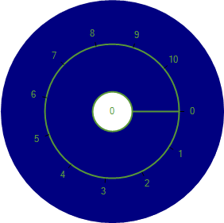
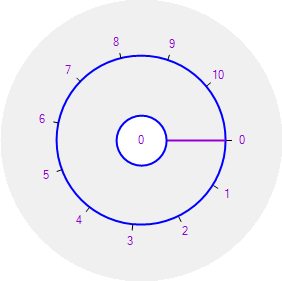
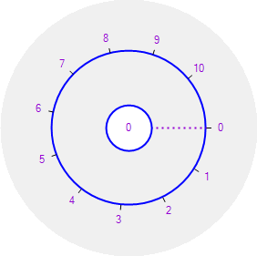

# Slider customization

## Slider background color

The background color for the radial slider can be customized using the [BackgroundColor](https://help.syncfusion.com/cr/windowsforms/Syncfusion.Tools.Windows~Syncfusion.Windows.Forms.Tools.RadialSlider~BackgroundColor.html).





  this.radialSlider1.BackgroundColor = System.Drawing.SystemColors.Control;





 Me.radialSlider1.BackgroundColor = System.Drawing.SystemColors.Control





## Circle color

Circle colors of the radial slider can be customized using the properties [InnerCircleColor](https://help.syncfusion.com/cr/windowsforms/Syncfusion.Tools.Windows~Syncfusion.Windows.Forms.Tools.RadialSlider~InnerCircleColor.html) and OuterCircleColor.





    this.radialSlider1.InnerCircleColor = System.Drawing.Color.Pink;

    this.radialSlider1.OuterCircleColor = System.Drawing.Color.Pink;





   Me.radialSlider1.InnerCircleColor = System.Drawing.Color.Pink
   Me.radialSlider1.OuterCircleColor = System.Drawing.Color.Pink





## Needle color

The needle color for the Radial slider can be customized using [SliderNeedleColor](https://help.syncfusion.com/cr/windowsforms/Syncfusion.Tools.Windows~Syncfusion.Windows.Forms.Tools.RadialSlider~SliderNeedleColor.html).





         this.radialSlider1.SliderNeedleColor = System.Drawing.Color.Pink;





         Me.radialSlider1.SliderNeedleColor = System.Drawing.Color.Pink





## Fore color

The foreground color for the Radial slider can be customized using [ForeColor](https://docs.microsoft.com/en-us/dotnet/api/system.windows.forms.control.forecolor?view=netframework-4.7.2).





this.radialSlider1.ForeColor = System.Drawing.Color.BlueViolet;





Me.radialSlider1.ForeColor = System.Drawing.Color.BlueViolet





## Needle type

The needle type for the radial slider can be customized using the [NeedleType](https://help.syncfusion.com/cr/windowsforms/Syncfusion.Tools.Windows~Syncfusion.Windows.Forms.Tools.RadialSlider~NeedleType.html) enumeration. Available needle types in the RadialSlider are:

* Straight Line (Default)
* Dotted Line





   this.radialSlider1.NeedleType = Syncfusion.Windows.Forms.Tools.SliderNeedleType.DottedLine;





   Me.radialSlider1.NeedleType = Syncfusion.Windows.Forms.Tools.SliderNeedleType.DottedLine





