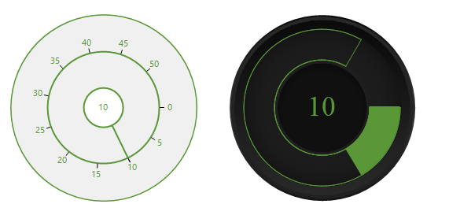
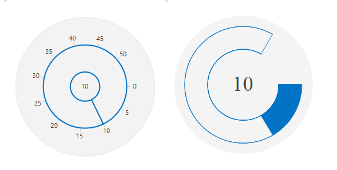

# Slider customization

## Slider background color

The background color for the radial slider can be customized using the [BackgroundColor](https://help.syncfusion.com/cr/windowsforms/Syncfusion.Tools.Windows~Syncfusion.Windows.Forms.Tools.RadialSlider~BackgroundColor.html).





radialSlider1.BackgroundColor = System.Drawing.SystemColors.Navy;





radialSlider1.BackgroundColor = System.Drawing.SystemColors.Navy





## Circle color

The Circle color of the **RadialSlider** can be customized using the properties [InnerCircleColor](https://help.syncfusion.com/cr/windowsforms/Syncfusion.Tools.Windows~Syncfusion.Windows.Forms.Tools.RadialSlider~InnerCircleColor.html) and OuterCircleColor.





radialSlider1.InnerCircleColor = System.Drawing.Color.Blue;
radialSlider1.OuterCircleColor = System.Drawing.Color.Blue;





radialSlider1.InnerCircleColor = System.Drawing.Color.Blue
radialSlider1.OuterCircleColor = System.Drawing.Color.Blue





## Needle color

The needle color of the **RadialSlider** can be customized using [SliderNeedleColor](https://help.syncfusion.com/cr/windowsforms/Syncfusion.Tools.Windows~Syncfusion.Windows.Forms.Tools.RadialSlider~SliderNeedleColor.html).





radialSlider1.SliderNeedleColor = System.Drawing.Color.DarkViolet;





radialSlider1.SliderNeedleColor = System.Drawing.Color.DarkViolet





## Fore color

The foreground color of the **RadialSlider** can be customized using [ForeColor](https://docs.microsoft.com/en-us/dotnet/api/system.windows.forms.control.forecolor?view=netframework-4.7.2).





radialSlider1.ForeColor = System.Drawing.Color.BlueViolet;





radialSlider1.ForeColor = System.Drawing.Color.BlueViolet





## Needle type

The needle type of the **RadialSlider** can be customized using the [NeedleType](https://help.syncfusion.com/cr/windowsforms/Syncfusion.Tools.Windows~Syncfusion.Windows.Forms.Tools.RadialSlider~NeedleType.html) enumeration. Available needle types in the RadialSlider are:

* Straight Line (Default)
* Dotted Line





radialSlider1.NeedleType = Syncfusion.Windows.Forms.Tools.SliderNeedleType.DottedLine;





radialSlider1.NeedleType = Syncfusion.Windows.Forms.Tools.SliderNeedleType.DottedLine





## Visual Style

The **RadialSlider** control has rich set of themes for professional representation. You can easily modify the look and feel of the RadialSlider using the built-in themes.

It has the below themes.

* Default
* Office2016Colorful
* Office2016White
* Office2016DarkGray
* Office2016Black

### Default

This option helps to set the Default theme.





radialSlider1.Style = Syncfusion.Windows.Forms.Tools.RadialSliderStyle.Default;





radialSlider1.Style = Syncfusion.Windows.Forms.Tools.RadialSliderStyle.Default





 

### Office2016Colorful

This option helps to set the Office2016Colorful theme.





radialSlider1.Style = Syncfusion.Windows.Forms.Tools.RadialSliderStyle.Office2016Colorful;





radialSlider1.Style = Syncfusion.Windows.Forms.Tools.RadialSliderStyle.Office2016Colorful





### Office2016White

This option helps to set the Office2016White theme.





radialSlider1.Style = Syncfusion.Windows.Forms.Tools.RadialSliderStyle.Office2016White;





radialSlider1.Style = Syncfusion.Windows.Forms.Tools.RadialSliderStyle.Office2016White





### Office2016DarkGray

This option helps to set the Office2016DarkGray theme.





radialSlider1.Style = Syncfusion.Windows.Forms.Tools.RadialSliderStyle.Office2016DarkGray;





radialSlider1.Style = Syncfusion.Windows.Forms.Tools.RadialSliderStyle.Office2016DarkGray





 

### Office2016Black

This option helps to set the Office2016Black theme.





radialSlider1.Style = Syncfusion.Windows.Forms.Tools.RadialSliderStyle.Office2016Black;





radialSlider1.Style = Syncfusion.Windows.Forms.Tools.RadialSliderStyle.Office2016Black





## Values

The **RadialSlider** control has two types of values.

* **MinimumValue** - The slider initial value depends on its minimum value and the default minimum value is 0. The minimum value can be changed by using the [MinimumValue](https://help.syncfusion.com/cr/windowsforms/Syncfusion.Tools.Windows~Syncfusion.Windows.Forms.Tools.RadialSlider~MinimumValue.html) property.

* **MaximumValue** - The slider end value depends on its maximum value and the default maximum value is 10. The maximum value can be changed by using the [MaximumValue](https://help.syncfusion.com/cr/windowsforms/Syncfusion.Tools.Windows~Syncfusion.Windows.Forms.Tools.RadialSlider~MaximumValue.html) property.





radialSlider1.MinimumValue = 50;
radialSlider1.MaximumValue = 100;
radialSlider1.Value = 50;





radialSlider1.MinimumValue = 50
radialSlider1.MaximumValue = 100
radialSlider1.Value = 50





## Slider Value Changed Event

We can get the current slider value by using the [ValueChanged](https://help.syncfusion.com/cr/windowsforms/Syncfusion.Tools.Windows~Syncfusion.Windows.Forms.Tools.RadialSlider~ValueChanged_EV.html) event.





this.radialSlider1.ValueChanged += new Syncfusion.Windows.Forms.Tools.RadialSlider.ValueChangedEventHandler(radialSlider1_ValueChanged);

private void radialSlider1_ValueChanged(object sender, Syncfusion.Windows.Forms.Tools.RadialSlider.ValueChangedEventArgs args)
{
  this.richTextBox1.SelectionFont = new System.Drawing.Font(Font.Name, (float)this.radialSlider1.Value);
  this.Refresh();
}





AddHandler Me.radialSlider1.ValueChanged, AddressOf Me.radialSlider1_ValueChanged

Private Sub radialSlider1_ValueChanged(ByVal sender As Object, ByVal args As Syncfusion.Windows.Forms.Tools.RadialSlider.ValueChangedEventArgs)
Me.richTextBox1.SelectionFont = New System.Drawing.Font(Font.Name, CType(Me.radialSlider1.Value,Single))
Me.Refresh
End Sub





