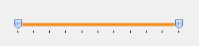
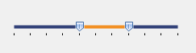

# Getting started

## Assembly deployment

Refer to the [control dependencies](https://help.syncfusion.com/windowsforms/control-dependencies#rangeslider) section to get the list of assemblies or details of NuGet package that needs to be added as reference to use the control in any application.

Click [NuGet Packages](https://help.syncfusion.com/windowsforms/visual-studio-integration/nuget-packages) to learn how to install nuget packages in Windows Forms application.

## Add RangeSlider control via designer

1) Create a new Windows Forms project in Visual Studio to display the RangeSlider control with dual thumb and highlight the selected range.

2) The [RangeSlider](https://help.syncfusion.com/cr/windowsforms/Syncfusion.Tools.Windows~Syncfusion.Windows.Forms.Tools.RangeSlider.html) control can be added to an application by dragging it from the toolbox to a designer view. The following dependent assemblies will be added automatically:

* Syncfusion.Grid.Base
* Syncfusion.Grid.Windows
* Syncfusion.Shared.Base
* Syncfusion.Shared.Windows
* Syncfusion.Tools.Base
* Syncfusion.Tools.Windows

 

## Add RangeSlider control via code

To add the control manually in C#, follow the given steps:

1) Create a C# or VB application via Visual Studio.

2) Add the following references to the project: 

 * Syncfusion.Grid.Base
 * Syncfusion.Grid.Windows
 * Syncfusion.Shared.Base
 * Syncfusion.Shared.Windows
 * Syncfusion.Tools.Base
 * Syncfusion.Tools.Windows

3)	Include the required namespace. 





using Syncfusion.Windows.Forms.Tools;





Imports Syncfusion.Windows.Forms.Tools





4) Create an instance of [RangeSlider](https://help.syncfusion.com/cr/windowsforms/Syncfusion.Tools.Windows~Syncfusion.Windows.Forms.Tools.RangeSlider.html), and add it to the form.





RangeSlider rangeSlider1 = new RangeSlider();
rangeSlider1.ShowLabels = true;
this.Controls.Add(rangeSlider1);





Dim rangeSlider1 As RangeSlider = New RangeSlider
rangeSlider1.ShowLabels = True
Me.Controls.Add(rangeSlider1)





## Minimum and maximum values

You can set the minimum and maximum values programmatically using the [SliderMin](https://help.syncfusion.com/cr/windowsforms/Syncfusion.Tools.Windows~Syncfusion.Windows.Forms.Tools.RangeSlider~SliderMin.html) and [SliderMax](https://help.syncfusion.com/cr/windowsforms/Syncfusion.Tools.Windows~Syncfusion.Windows.Forms.Tools.RangeSlider~SliderMax.html) properties of RangeSlider.




rangeSlider1.SliderMin = 4;

rangeSlider1.SliderMax = 7;




rangeSlider1.SliderMin = 4

rangeSlider1.SliderMax = 7




 

## Horizontal and vertical orientations

You can change the layout of range slider to horizontal or vertical by setting the [orientation](https://help.syncfusion.com/cr/windowsforms/Syncfusion.Tools.Windows~Syncfusion.Windows.Forms.Tools.RangeSlider~Orientation.html) property of RangeSlider.




rangeSlider.Orientation=Orientation.Vertical;




rangeSlider.Orientation=Orientation.Vertical




**Horizontal**

 

**Vertical**

 